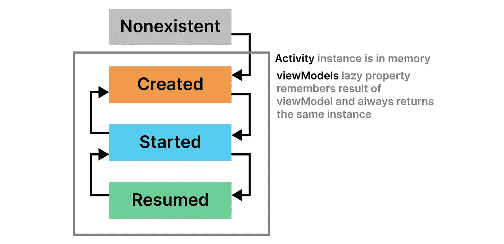

# 视图模型如何知道如何在配置变化中生存？

> 原文：<https://medium.com/codex/how-do-view-models-know-how-to-survive-configuration-changes-66aef641f59c?source=collection_archive---------0----------------------->

如果你关闭一个 Android 应用，你会破坏它的*活动*和*视图模型*。如果你旋转你的设备，你的*活动*将被销毁并重新创建，然而，你的*视图模型*仍然存在。但是在这两种情况下，您的*活动*都被销毁了，那么您的应用程序如何知道何时保留或何时销毁 ViewModel 呢？这就是我们将在下面发现的！

照片由 [cottonbro](https://www.pexels.com/photo/green-and-brown-concrete-blocks-4874228/) 拍摄

# 基本用法

考虑一个简单的应用程序，其中一个`MainActivity`引用了一个`MainViewModel`。像往常一样，我们从`AppCompatActivity`扩展了`MainActivity`，这给了我们一个方便的委托属性来访问我们的视图模型:`viewModels()`。

上面的`viewModels()`委托完成了一个典型的[惰性属性](https://kotlinlang.org/docs/delegated-properties.html)的工作，它确保`MainViewModel`只有在你第一次引用它时才被初始化，并记住结果以备将来使用。

在某种程度上，这描述了我们希望从*视图模型中得到的行为。*只要*活动*存在，我们就不会重新初始化*视图模型。*例如，假设我们第一次打开`MainActivity`，然后在我们的 Android 设备中按下 home 键，然后再次点击打开`MainActivity`。

图片作者[作者](/@joaofoltran)

`MainActivity`将被创建，将进入开始然后恢复状态。按下 home 按钮后，`MainActivity`将被置于 created 状态，但仍将在内存中，这意味着下次我们使用`MainViewModel`时，我们将获得相同的原始引用，从而获得离开活动前存在的任何状态。

# 如果我们关掉整个应用程序呢？

我们对`MainViewModel`的惰性初始化确保了只要`MainActivity`在内存中，我们总是得到相同的*视图模型*引用。但是如果我们手动关闭应用程序，从而从内存中删除`MainActivity`会怎么样呢？

当我们手动关闭应用程序时，`MainActivity`被销毁，活动从内存中删除。正如所料，`MainViewModel`也被从内存中删除，当我们重新打开应用程序时，它将被重新初始化。

这就引出了一个问题:当我们有一个配置改变(例如旋转设备)时，`MainActivity`也被销毁(在被重新创建之前)并且活动被从内存中删除，但是正如我们所知，*视图模型*在配置改变后仍然存在。他们是怎么做到的？

# ViewModelStore 类

要回答这个问题，我们需要深入了解一下`viewModels()` lazy 属性是如何工作的。注意，`viewModels()`是`ComponentActivity`的扩展函数，可从`MainActivity`访问，层次如下:

图片作者[作者](/@joaofoltran)

现在来看看扩展函数本身。为了简单起见，我们将抽象出一些关于其实现的细节。

但是我们讨论的重要部分是该函数返回一个惰性委托来提供对*视图模型*本身*的访问。*这个委托正是我们从`MainActivity`访问*视图模型*的方式，它接收一个`viewModelStore`参数，该参数可从扩展函数访问，因为它是`ComponentActivity`的属性。

现在，`viewModelStore`就像它的名字所暗示的那样:它为它的所有者存储和管理*视图模型*，在本例中就是`MainActivity`本身。简而言之，

> ViewModelStore 为其所有者维护一个 id 到视图模型的 HashMap，它是`ComponentActivity`的子类。ViewModelStore 的实例通过配置更改得以保留，并且如果其所有者被销毁并且不会被重新创建，则清除其视图模型。

# ComponentActivity 类

太好了，我们有一个`viewModelStore`来为我们的`MainActivity`管理*视图模型*。但是管理代码本身是父`ComponentActivity` 类*的一部分。*

从上面的摘录中，您可以看到`ComponentActivity`的构造函数添加了一个生命周期事件侦听器，该侦听器在活动被销毁时执行回调。`getViewModelStore.clear()`调用基本上清除了由`viewModelStore`维护的*散列表*，只有在`onDestroy`不是由于配置改变而被调用时才会发生。

这就结束了，因为如果*活动*由于配置更改而被销毁，上面的行`14`将不会执行，`viewModelStore`也不会被清除，因此*视图模型*将保持其状态。

感谢阅读！如果您喜欢该内容，请不要忘记鼓掌并关注更多内容！