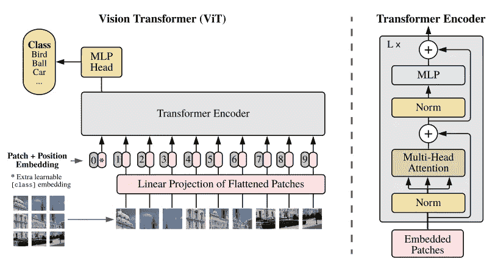
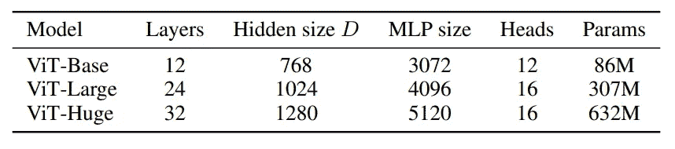
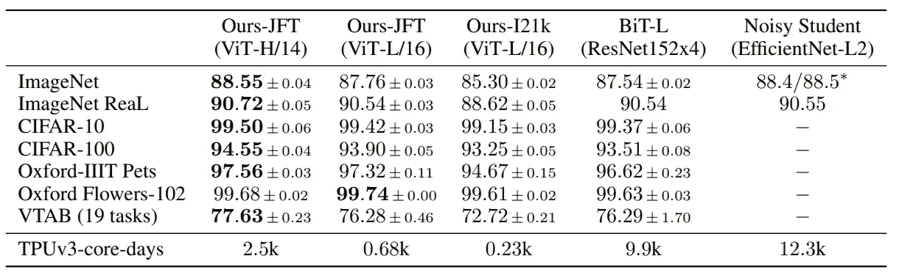
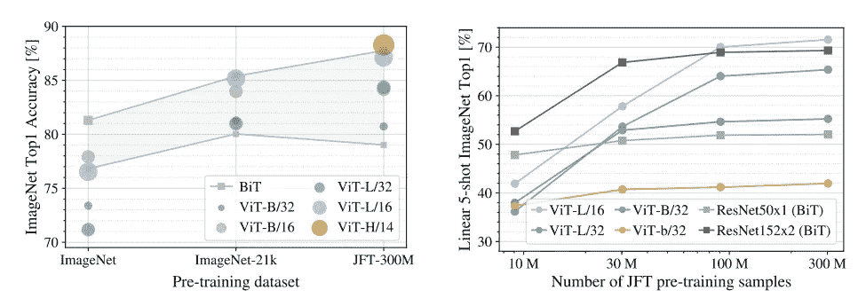
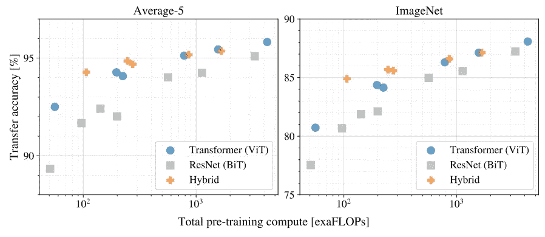

# 视觉变形金刚是如何工作的？一幅图像相当于 16x16 个字

> 原文：<https://medium.com/codex/how-do-vision-transformers-work-an-image-is-worth-16x16-words-df47aed1b634?source=collection_archive---------7----------------------->

阿瑟尼·托古列夫在 [Unsplash](https://unsplash.com?utm_source=medium&utm_medium=referral) 上的照片

变形金刚，一个完全由注意力组成的架构，在发布后已经超越了竞争对手的 NLP 模型。这些强大的模型非常高效，随着最近 GPT-4 的发布，可以扩展到数十亿甚至数万亿个参数。他们受益于不断增长的数据集大小和计算限制。它们也可以很好地推广到其他应用程序，通过预训练的 BERTs 被微调并应用于许多应用程序的巨大成功就可以说明这一点。

然而，先前全注意力网络在大规模计算机视觉中的应用并不成功。主要是因为先前提出的自注意机制在中/大图像中是不可行的，因为复杂度依赖于像素的数量。有些模型用 GPU 加速非常棘手，就像为什么循环模型跟不上变形金刚一样。

向 vision transformer (ViT)问好，它通过将图像拆分为多个补丁，以一种简单的方式将图像应用于变形金刚。视图像补丁为单词，ViT 向转换器提供补丁的嵌入。ViT 在中型数据集(如 ImageNet 和 CIFAR100)中实现了有竞争力的性能。当应用于更大的数据集时，结果甚至会进一步改善，其中 ViT 能够实现类似的结果或在一些基准中击败 CNN。

在这篇文章中，让我们来看看 ViT 是如何工作的，为什么他们在一些问题上有好有坏。该论文可通过以下链接获得。

[一幅图像值 16X16 个字:大规模图像识别的变形金刚](https://arxiv.org/pdf/2010.11929.pdf)

*免责声明:本帖不解释原变形金刚模型的概念，也不解释多头注意力等变形金刚的积木。*

## ViT 架构概述

ViT 概述

输入图像首先被分割成大小为 P×P 的小块。每个小块被展平并线性映射到一个 D 维向量，称为 ViT 中的嵌入阶段。来自原始转换器和类标记的位置嵌入被添加到补丁嵌入中。由于基于 x，y 位置的 2D 位置嵌入对模型没有帮助，因此位置作为一个数字输入。上面的过程将图像补丁转换成令牌。处理后的令牌输入与常规的 NLP 任务没有什么不同。因此，不对编码器变压器模型进行修改。

ViT 还可以结合 CNN 以进一步提高性能。该论文提出了一种混合模型，通过输入由 CNN 计算的特征图来代替输入原始图像。

## 培养

ViT 在大型数据集上进行了预训练，并针对较小的数据集进行了时间调整。由于 ViT 可以接收任意长度的序列，因此面片数量会发生变化，以保持面片大小一致。这样，在数据集之间进行转换时，线性投影和输入图层将保持不变。由于不同的类类型，在更改数据集时，仅替换最终的预测图层。

# 实验

本文展示了基于 BERT 的实验中使用的 ViT 的三种变体。第一个实验改变了网络架构，并在许多数据集上与之前的《SOTA:吵闹的学生》进行了比较。当 ViT-H 模型(ViT-Huge)在大型 JFT-300M 数据集上进行预训练时，它在几乎所有指标上都优于以前的基线。甚至花费更少的时间来训练。下图描述了该实验。

## 大型预训练数据集的需求

所描述的 ViT 架构很少利用图像的 2D 结构。作者认为，这将导致比 CNN 更少的图像特定的归纳偏差，并且该模型必须从头学习空间关系。这自然增加了对更大数据集进行训练/预训练的需求。

上图说明了较大的模型(ViT-H，ViT-L)在相对较小的训练数据集上表现较差。他们似乎很容易过度适应数据集。考虑到大型模型被大量正则化，我们可以看到真正利用虚拟仪器的计算能力所需的图像数量非常大。

## 为更大的变压器缩放模型

另一个实验评估训练计算需求和准确性，通常被称为模型的*帕累托曲线*。在复杂性权衡方面，ViT 总是优于其竞争对手 CNN。当比较利用 CNN 特性的混合模型和不利用 CNN 特性的简单模型时，混合模型在小的设置上似乎确实优于 ViT。然而，经过一些扩展后，性能差距似乎消失了。令人惊讶的是，维生素 t 可能不需要中枢神经系统。另一个发现是，性能图似乎还没有饱和，这与常规 CNN 的帕累托曲线不同。这就留下了进一步扩展以提高性能的可能性。

# 结论

在这篇文章中，我们回顾了最初的视觉转换器架构和从实验中发现的 vit 的属性。ViT 将图像补丁转换为标记，标准转换器直接应用于标记，将它们解释为单词嵌入。实验表明，与 CNN 相比，在图像分类方面取得了令人满意的结果。虽然它们似乎需要大数据集来进行有竞争力的训练和预训练，但它们有潜力进一步扩展。

该论文还指出，ViTs 的另一个挑战是应用于其他计算机视觉任务，如分割和对象检测。对我来说，这些任务不能用将图像裁剪成小块的 ViT 方法来解决。但是变形金刚在视觉上的应用正引起越来越多的兴趣。SOTA 有线电视新闻网在许多领域已经被变压器取代。关注视觉变形金刚的进展。