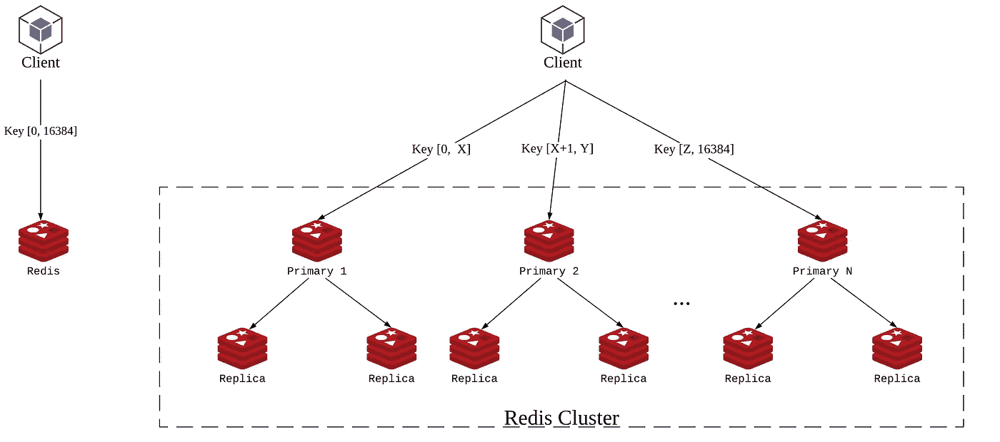
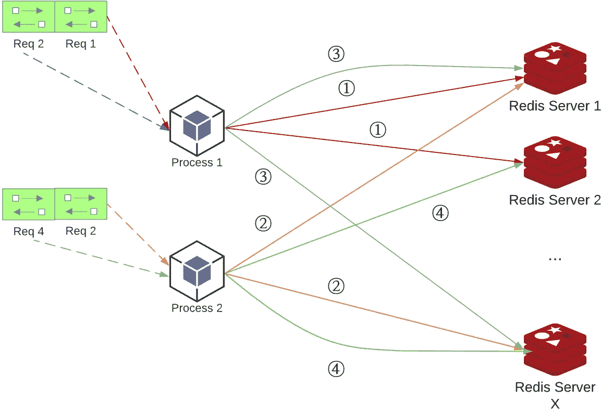
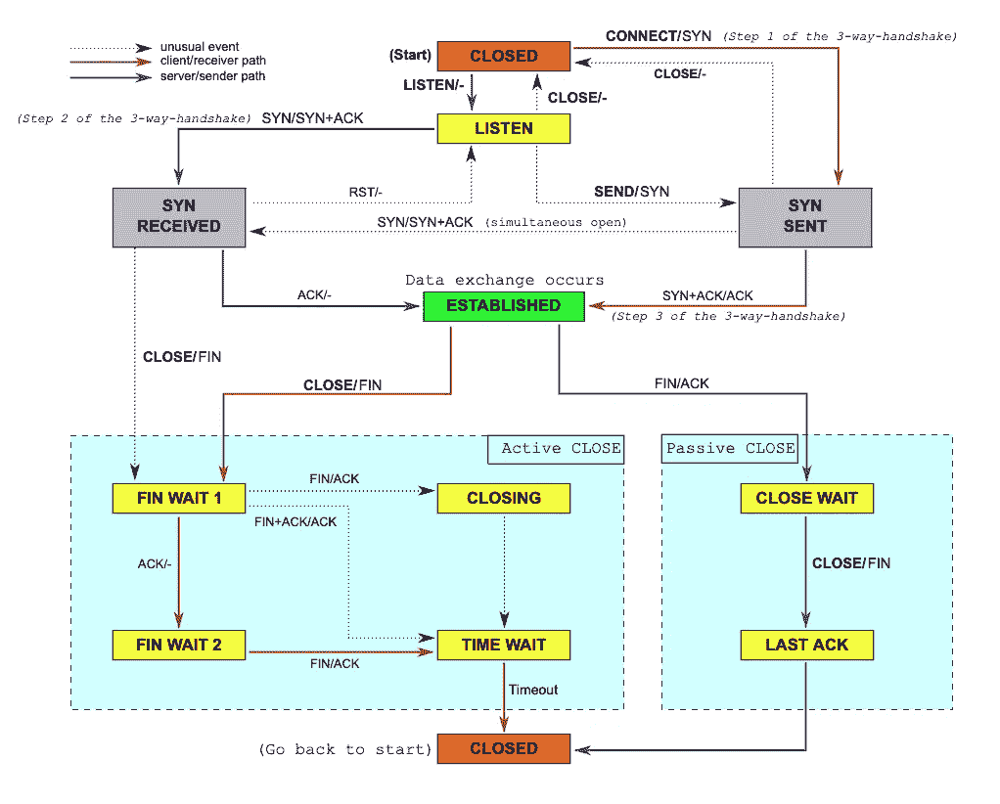
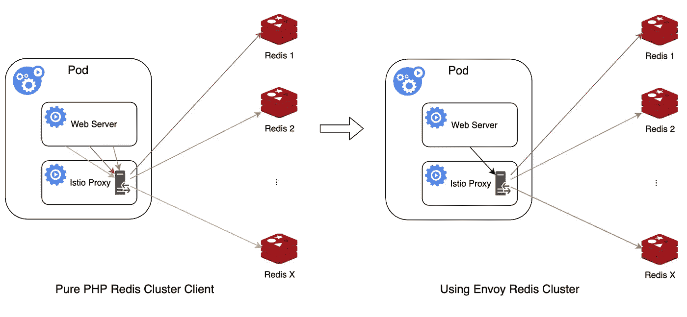

# 我们如何使用 Envoy 来提高 PHP Redis 客户端的性能

> 原文：<https://medium.com/codex/how-do-we-use-envoy-to-improve-php-redis-client-performance-2db81874dc67?source=collection_archive---------7----------------------->

Redis 在 Houzz 的技术堆栈中扮演着非常重要的角色——我们将它用作键值存储、缓存层、队列系统等。

Redis 使用标准的 TCP 协议供客户端连接到它，要连接到单个 Redis 实例，客户端只需与 Redis 服务器建立 TCP 连接，并使用文本发送 raw 命令。您可以使用`telnet`命令轻松测试到 Redis 服务器的连接。

```
bash-3.2$ telnet 127.0.0.1 6379
Trying 127.0.0.1...
Connected to 127.0.0.1.
Escape character is '^]'.
PING
+PONG
```

# Redis 集群

和许多其他存储系统一样，Redis 也有分布式模式——它被称为 Redis 集群。Redis 从一个实例扩展到多个实例的方式依赖于密钥哈希。作为一个键值存储系统，Redis 集群会尝试根据键值的 CRC 哈希将所有的键值分布到不同的实例中。Redis 集群中的每个实例仅存储其自己的槽范围内的键，Redis 集群中的所有实例将覆盖 CRC 散列的整个范围，即[0，16384]。

Redis 还支持主/辅模式，这种模式可以提供数据冗余和独立的读取/更新操作。每个插槽范围可以有 1 个主实例，1 个或多个复制副本实例存储相同的密钥。



Redis 单实例与 Redis 集群

单个 Redis 实例上的操作与 Redis 集群上的不同。要使用单个 Redis 实例，我们只需连接到单个套接字地址，要使用 Redis 集群，我们需要更复杂的逻辑。通常，Redis 集群客户端需要支持以下特性:

1.  自动发现集群拓扑。由于键存储在不同的 Redis 服务器实例中，Redis 集群客户机必须知道哪个槽范围存储在哪个 Redis 服务器实例中(包括主/副本)。Redis cluster 提供了一个`CLUSTER SLOTS`命令，该命令可以返回包含插槽范围和主/副本套接字地址的服务器拓扑。要执行`CLUSTER SLOTS`命令，Redis 集群客户端至少需要知道 Redis 集群拓扑中 1 个节点的地址，这通常是在初始化客户端实例时作为开始探测地址传入的。
2.  按需向 Redis 服务器实例发送命令。当使用 Redis 集群客户端向 Redis 集群发送携带密钥参数的命令时，客户端必须确定该命令应该发送到哪个(哪些)Redis 服务器实例。如何确定它们取决于上一步中的服务器拓扑获取器，计算密钥的 CRC 哈希，然后找到密钥所在的插槽范围，然后根据读/写策略，将命令发送到密钥所属插槽范围的主/副本 Redis 服务器实例。对于一些操作多个键的命令(例如，mget、mset 等)，客户端必须基于键的槽范围组将单个多键命令分成几个批次，并将带有每个组的键的命令发送到相应的 Redis 服务器实例，并合并来自所有实例的结果。一些客户端库没有实现这个“高级”特性，因此他们声明不支持跨插槽的多键命令。

已经有很多用不同语言开发的 [Redis 客户端库](https://redis.io/clients)可以帮助减轻连接到单个 Redis 客户端或 Redis 集群的差异。在大多数场景中，程序员不会注意到使用单个 Redis 实例或 Redis 集群的区别，因为复杂性被客户端库封装了。

# PHP Redis 集群客户端及问题

单个 Redis 实例可以满足小型用例，在支持 Houzz 业务的规模上，我们必须使用 Redis 集群而不是单个 Redis 实例，因为我们已经将 TBs 数据存储在 Redis 中，并且必须将它分布到不同的实例中。

截至 2021 年，我们已经建立了一个包含 200 多个实例的 Redis 集群，启用了主/副本，以确保我们拥有数据冗余和从单个实例故障中恢复的能力。

由于历史原因，Houzz 的主要编程语言是 PHP，它仍然是 web 开发中最流行的编程语言之一。并且我们使用了 [predis](https://github.com/predis/predis) ，一个广泛使用的支持 redis 集群的 PHP Redis 客户端，它提供了自动集群拓扑发现和按需向 Redis 服务器实例发送命令等功能。

就功能性而言，我们对 PHP redis 客户端很满意，但是，PHP 语言本身的特性在性能方面给了我们很大的挑战。

与 Java、Python 或节点服务器应用程序不同，PHP 进程不会在后续请求之间共享数据。一旦 PHP 处理了一个 web 请求，它将在准备好处理下一个请求之前丢弃所有数据。

为什么这会损害 Redis 集群客户端的性能？

首先，集群拓扑不会跨请求共享。假设 predis 首先连接到一个 start probe redis 服务器实例，发送`CLUSTER SLOTS`命令，并在处理一个请求时得到了集群拓扑，这个拓扑通常是嵌套在内存中的`array`不会在下一个请求中使用。因此，在下一个请求中，predis 必须再次连接到其中一个 start 探测器，并再次发送`CLUSTER SLOTS`来获取集群拓扑。这是非常无效的，因为 redis 集群拓扑很少改变(通常只有当我们关闭一些 redis 节点或添加新的 Redis 节点时，它才会改变，这将导致重新平衡)。额外的`CLUSTER SLOTS`命令通常为每个请求增加 4 ~ 5 ms 的 redis 访问时间，如果在请求中，只需要 1 个 redis 操作，那么我们增加了 100%的开销。

PHP 进程的另一个自然行为是，你不能在两个请求之间保持任何 TCP 连接。



如上图所示，假设我们在一台机器上运行 2 个 PHP 进程，每个进程处理 2 个请求，每个请求需要连接到 2 个 Redis 服务器实例。由同一个进程处理的子请求将连接到同一个 redis 服务器实例，但是由于前一个请求的 TCP 连接被关闭，它不能被重用，所以即使它连接到(Redis 服务器实例的)同一个套接字地址，它也必须创建另一个 TCP 连接。

因此，随着 PHP 进程处理越来越多的请求，它会创建/关闭越来越多的到 Redis 集群的 TCP 连接。与可以在此过程中保持持久 TCP 连接的其他语言相比，这已经是一个很大的性能损失。



TCP 连接状态

另一个更关键的问题是，TCP 连接的终止不是直接关闭，也不是立即释放资源。

如上图所示，在主动关闭模式下，当 TCP 连接发起方(在本例中是 PHP redis 集群客户端)开始关闭连接时，它通过 TCP 连接发送一个`FIN`数据包，TCP 连接接收方(redis 集群实例)需要发回`ACK` + `FIN`数据包。由于 TCP 连接的性质，发起方将进入`TIME_WAIT`状态，直到最后超时，连接最终关闭，TCP 连接资源被系统回收。

由于 PHP Redis 集群客户端访问模式，它会不断创建到 PHP Redis 集群实例的新 TCP 连接，并在一个会话结束后立即关闭它们。由于我们的生产流量 QPS 为 1 盒，它在盒中留下了太多的`TIME_WAIT` TCP 连接。一旦`TIME_WAIT` TCP 连接堆积，新的 TCP 连接创建速度变慢，从而使得 Redis 集群客户端变慢，导致 web 请求响应时间增加，更多的请求被卡住。最后，它达到了 Redis 集群客户端未能在超时设置时间(4 秒)内创建 TCP 连接的阈值，并将抛出一个错误，说明 Redis 服务器已关闭。

我们从去年开始就注意到了这个问题，当时我们的访问量显著增加(从商业角度来看，这是一个非常好的迹象！)，而且我们在高峰时段看到了更多抱怨 Redis 服务器停机和性能下降的错误。但是 Redis 服务器实际上一点也不紧张，瓶颈纯粹来自客户端的 TCP 连接。而为了解决这个问题，每次 SRE 团队都要增加我们应用程序盒的实例，这是不必要的，也是对我们计算资源的浪费。

# 寻找解决方案

如果你 google/stackoverflow“太多 TIME_WAIT tcp 连接”关键词，一些博客会引出以下解决方案:启用 tcp resuse 功能以减少`TIME_WAIT` TCP 连接。

```
sysctl -w net.ipv4.tcp_tw_reuse=1
```

我们相信这是可行的，并把这个选项添加到我们生产机器的系统默认设置中，但是，它没有帮助。处于`TIME_WAIT`状态的 TCP 连接仍然很高。

```
root@web-server:/# sysctl net.ipv4.tcp_tw_reuse=1
net.ipv4.tcp_tw_reuse = 1
root@web-server:/# ss -tan state time-wait | grep 6379 | wc -l
70145
```

受[在繁忙的 Linux 服务器上处理 TCP 时间等待状态](https://vincent.bernat.ch/en/blog/2014-tcp-time-wait-state-linux#netipv4tcp_tw_reuse)博客文章的启发，我们认为我们找到了它不起作用的原因。

> *通过启用 net.ipv4.tcp_tw_reuse，如果新的时间戳严格大于为前一个连接记录的最新时间戳，Linux 将为新的传出连接重用处于时间等待状态的现有连接:处于时间等待状态的传出连接可以在一秒钟后重用。*

在“仅仅一秒钟”内，由于盒子的 QPS 在 100 左右，它大概会创建~ 100(avg QPS)* 50(1 个请求中 redis 连接的 avg 数量)= 5000 个新的 TCP 连接，而这 5K 个连接并不能在精确的一秒钟内重用完好无损的`TIME_WAIT`连接。在受益于 tcp 重用机制之前，太多的`TIME_WAIT` TCP 连接阻碍了内核创建新的 TCP 连接，因此这没有多大帮助。

# 特使/特使 Redis 组

自 2020 年起，我们将 Istio 作为我们的服务网格解决方案引入到我们的 Kubernetes 集群中，它开始充当来自/去往我们的 web 应用程序容器的所有网络流量的代理。

作为 Istio 的代理实现，Envoy 提供了许多特性，有助于从应用程序代码中抽象出网络逻辑。

Envoy 在新版本中提供的一个鼓舞人心的功能是 [Redis 集群支持](https://www.envoyproxy.io/docs/envoy/latest/intro/arch_overview/other_protocols/redis#redis-cluster-support-experimental)，这是我们用来解决这个问题的最终解决方案。

> *当使用 Envoy 作为 Redis 集群的 sidecar 代理时，服务可以使用以任何语言实现的非集群 Redis 客户端连接到代理，就像它是单节点 Redis 实例一样。特使代理将跟踪集群拓扑，并根据规范向集群中正确的 Redis 节点发送命令。Envoy 代理还可以添加高级功能，如从副本中读取，而不是更新每种语言的 redis 客户端。*
> 
> *特使代理通过向集群中的随机节点发送周期性集群槽命令来跟踪集群的拓扑，并维护以下信息:*
> 
> *已知节点列表。
> *每个碎片的初选。
> *节点进入或离开集群。

启用该特性后，PHP Redis 客户端的集群相关逻辑将由 Envoy 接管。PHP Redis 客户端只需要创建一个到 Envoy 提供的代理 Redis 实例的连接。

由于缺少提供的示例，我们花了一段时间才弄清楚如何配置 Envoy Redis 集群代理。但是我们终于搞清楚了配置，首先我们需要创建一个后端集群。

```
apiVersion: networking.istio.io/v1alpha3
kind: EnvoyFilter
metadata:
  name: redis-cluster-backend
spec:
  configPatches:
  - applyTo: CLUSTER
    patch:
      operation: INSERT_FIRST
      value:
        cluster_type:
          name: envoy.clusters.redis
          typed_config:
            '@type': type.googleapis.com/google.protobuf.Struct
            value:
              cluster_refresh_rate: 1800s
              cluster_refresh_timeout: 4s
              host_degraded_refresh_threshold: 1
              redirect_refresh_interval: 4s
              redirect_refresh_threshold: 1
        connect_timeout: 4s
        dns_lookup_family: V4_ONLY
        load_assignment:
          cluster_name: custom-redis-cluster
          endpoints:
          - lb_endpoints:
            - endpoint:
                address:
                  socket_address:
                    address: <redis instance 1 ip>
                    port_value: <redis instance 1 port>
            - endpoint:
                address:
                  socket_address:
                    address: <redis instance 2 ip>
                    port_value: <redis instance 1 port>
            - endpoint:
                address:
                  socket_address:
                    address: <redis instance 3 port>
                    port_value: <redis instance 3 port>
        name: redis-cluster-backend
        outlier_detection:
          base_ejection_time: 20s
          consecutive_5xx: 1
          interval: 5s
        upstream_connection_options:
          tcp_keepalive:
            keepalive_interval: 5
            keepalive_probes: 1
            keepalive_time: 30
```

在后端设置中，最重要的设置是`load_assignment`，它基本上描述了 envoy 将发送`CLUSTER SLOTS`命令来获取集群拓扑的 startuo 探测节点。

为了获得更好的性能，肯定有相当多的设置值得调整:

1.  **cluster_refresh_rate** :这是特使向启动探测节点发送`CLUSTER SLOTS`命令的间隔。通常 redis 集群拓扑不会经常改变，所以我们可以将这个值设置得比默认值(5s)长得多
2.  **host _ degraded _ refresh _ threshold**:在触发拓扑刷新请求之前，已降级或不正常的主机数量。这非常有帮助，因为我们会将`cluster_refresh_rate`配置为尽可能长，一旦 redis 集群拓扑在两次刷新之间发生变化，将此配置设置为较低值(1 表示最具攻击性)将立即让 Envoy 发送`CLUSTER SLOS`命令以获取新拓扑，从而将潜在有问题的节点从连接池中删除。
3.  **redirect _ refresh _ threshold**:触发拓扑刷新请求前必须接收的重定向错误数。有时，当我们在 Redis 集群中添加/删除节点时，键会在新的集群实例之间重新平衡，这将导致一些响应成为`MOVED`或`ASK`，在这种情况下，我们应该让 Envoy 发送`CLUSTER SLOS`命令来立即获得新的拓扑。
4.  **离群点检测** : [离群点检测](https://www.envoyproxy.io/docs/envoy/latest/intro/arch_overview/upstream/outlier)是 Envoy 中检测离群上游主机的统一机制。在 Envoy Redis 集群中，上游指拓扑中的 1 个 Redis 集群服务器。假设一个 redis 集群节点突然被关闭，下面对该节点的请求将得到 ERR 响应。`consecutive_5xx`设置是过去`interval`时间内 ERR 响应的阈值，以便认为节点不健康。一旦节点被认为是不健康的，它将被从上游服务器中取出，并在`base_ejection_time`之后试图被放回，并在随后的降级中呈指数后退。
5.  **upstream _ connection _ options**:这主要用于调整 Envoy 和 Redis 集群节点之间 TCP 连接的保持活动设置。如果 PHP 客户端试图向目的节点发送命令，Envoy 将按需连接到 Redis 集群节点，命令发送后，连接保持`ESTABLISED`状态。但是如果连接保持太长时间而没有向 Redis 集群节点发送任何包，它可能会被 Redis 集群节点关闭，为了延长 TCP 连接的寿命，我们可以配置 Envoy 在连接建立后的`keepalive_time`之后向 Redis 集群节点发送 keepalive 包，并将其设置为以`keep_alive`间隔发送`keepalive_probes`次 keepalive 间隔。

我们还需要在 Envoy 中创建一个前端，让主容器中的 PHP 客户端进行连接。

```
apiVersion: networking.istio.io/v1alpha3
kind: EnvoyFilter
metadata:
  name: redis-cluster-frontend
spec:
  configPatches:
  - applyTo: LISTENER
    match:
      context: SIDECAR_OUTBOUND
    patch:
      operation: ADD
      value:
        address:
          socket_address:
            address: 127.0.10.1
            port_value: 6379
            protocol: TCP
        filter_chains:
        - filters:
          - name: envoy.filters.network.redis_proxy
            typed_config:
              '@type': type.googleapis.com/envoy.extensions.filters.network.redis_proxy.v3.RedisProxy
              prefix_routes:
                catch_all_route:
                  cluster: redis-cluster-backend
              settings:
                enable_hashtagging: true
                enable_redirection: true
                op_timeout: 4s
                read_policy: PREFER_REPLICA
              stat_prefix: redis_proxy
        name: redis-cluster-frontend
```

上面的配置在`127.0.10.1:6379`上创建了一个 Redis 代理前端。除了 istio-proxy 之外，其他容器也可以使用该地址。最重要的配置是`prefix_routes.catch_all_route`到`redis-cluster-backend`群集，这正是我们之前创建的后端群集。代理前端的配置相对简单，可以调整的设置较少，一个重要的设置是`read_policy`，我们选择了`PREFER_REPLICA`来实现与原始 PHP Redis 集群客户端逻辑相同的功能——当从 redis (get、mget 等)读取时，总是尝试从副本节点读取，只有当插槽的所有副本节点都不可用时才从主节点读取。



上图直接展示了使用 Envoy Redis 集群代理可以节省 TCP 连接的神奇之处。

之前，假设在 1 个请求处理过程中 PHP Redis 客户端需要连接到 X 个 Redis 集群实例，它必须创建从主 web 服务器容器到 istio-proxy 容器的 X 个 TCP 连接，envoy 必须创建从 istio-proxy 容器到 Redis 集群实例的相应 X 个 TCP 连接。

使用 Envoy Redis 集群代理后，PHP 客户端只需要连接到 istio-proxy 容器中的前端代理，Envoy 就会“智能”地将命令调度到代理后端，并创建到 X Redis 集群服务器的连接。

我们为 PHP 进程处理的一个请求保存了 X-1 个 TCP 连接。此外，在 Envoy Redis 集群代理后端和真正的 Redis 集群服务之间创建的 X 连接是持久连接，它们不会在 PHP 进程处理完一个请求后关闭。此外，由主 web 服务器容器中的其他 PHP 进程处理的其他请求也可以重用连接，因为前端和后端是分离的。这些都导致了 TCP 连接的巨大节省。

```
root@web-server:/# ss -tan state time-wait | grep 6379 | wc -l
3108
```

通过这样做，我们打破了 PHP 语言的自然限制，我们减少了 95%的 tcp 连接！

此外，我们看到每个请求的平均 redis 连接时间大大减少，从大约 5 毫秒减少到近 0 毫秒！这是由以下因素促成的:

1.  由于所有的命令都由 PHP 客户端发送到同一个前端代理，因此只需要建立一个连接。
2.  到前端的连接是通过本地网络(从主容器到 istio-proxy 容器)，这是非常稳定和轻量级的。

我们在生产 k8s 集群上 100%部署了该解决方案，事实上，它解决了`TIME_WAIT` TCP 连接的瓶颈，并使我们的 pod 能够承载更多流量。这也导致 k8s 资源的一些节省。

# 警告

虽然我们谈到了 Envoy Redis 集群代理的所有优点，但使用它肯定有一些注意事项。

# 读/写性能下降

我们在上一章提到平均 TCP 连接时间从大约 5 毫秒减少到将近 0 毫秒。但是对于读/写 redis 操作，性能有所下降。这个很好理解。Envoy 仍然需要创建到 Redis 集群节点的 TCP 连接，并且仍然需要向节点发送命令包，并接收响应，甚至添加了更多的逻辑来将命令分派到正确的节点，并聚合来自多个节点(例如 mget、mset)的响应。当代理后端中的 TCP 连接重用没有带来太多好处时，这种退化对于稀疏请求来说更加明显。

我们注意到了这种持续的性能下降，但我们最终接受了它——与 PHP 代码逻辑的其余部分相比，总体平均读/写时间足够快了。

# 缺乏重试逻辑

在旧的 PHP Redis 集群客户端中有一个非常重要的特性，那就是自动重试逻辑。

通常，对于 Redis 集群的每个碎片，它由 1 个主节点和 2 个副本节点组成。当 PHP Redis 集群客户端发送 read 命令时，它将首先随机选择一个副本来发送命令，如果命令由于网络通信问题而失败，它将重试向另一个副本节点发送命令，如果仍然失败，它将最终向主节点发送命令。

这个逻辑很简单，对于减少停机时间非常有帮助。假设我们正在对整个 Redis 集群进行滚动重启，通常我们将一次重启一个节点，重试逻辑将确保请求仍然可以得到正确处理。

不幸的是，内置重试逻辑仍然在 2021 年中期[计划的未来功能列表](https://www.envoyproxy.io/docs/envoy/latest/intro/arch_overview/other_protocols/redis)中，当我们测试在 1 个碎片中放置 1 个副本节点时，我们注意到当我们看到来自特使的“没有上游主机”的客户端错误时，有大约 10 秒的停机时间。可以通过调整`outlier_detection`设置来减少停机时间，当节点停机时，对特定节点的后续请求将出错，在`outlier_detection.interval`时间之后，它将从上游中移除，并且特使将停止向该节点发送任何命令。

目前没有好的方法来绕过这个问题。即使我们在 PHP 客户端重试，PHP 客户端也无法决定 Envoy 将连接哪个 Redis 集群节点。

我们忍受着缺乏重试逻辑，并依靠`outlier_detection`机制来减少停机时间，我们真的希望内置的重试逻辑可以很快得到支持。

# 太多已建立的连接

这是我们预见到的一个问题，在我们的 PHP 客户端创建到 Redis 集群节点的 TCP 连接之前，会在请求被处理后很快断开连接。“来来去去”模式实际上有一个好处，即整个 Redis 集群节点没有太多来自客户端的`ESTABLISHED`连接。

自从我们开始使用 Envoy Redis 集群代理进行测试以来，我们立即注意到来自 Redis 服务器节点的`ESTABLISHED`连接急剧增加。增加的持久连接已经影响了连接性能-如果一个 Redis 集群节点已经被太多的客户端连接，新的连接将很难建立。

为了改善这一点，我们在 redis 服务器端将 redis.conf 中的`timeout`设置从 300 秒调至该值的一半，这有助于减少我们工作负载中 30%的`ESTABLISHED`连接。`timeout`设置让 Redis 服务器端在客户端长时间空闲后关闭连接。然而，总有一个折衷——我们配置的`timeout`设置越短，Envoy 就越有可能频繁地连接到 Redis 集群节点，从而影响 Redis 客户端的整体性能。

另一个解决方案是增加 Redis 集群节点数量，这样到 1 个 Redis 集群节点的平均连接将会下降，但是，如果每个节点上的 Redis 工作负载不高，这将导致不必要的资源浪费。