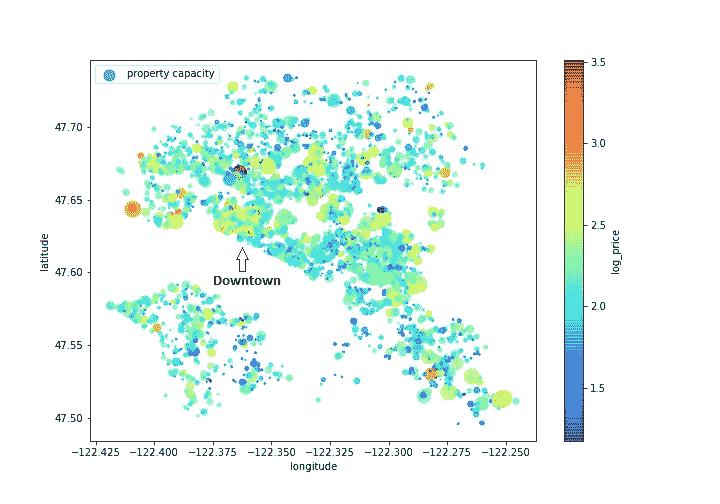
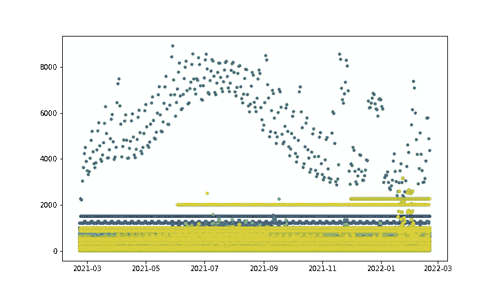
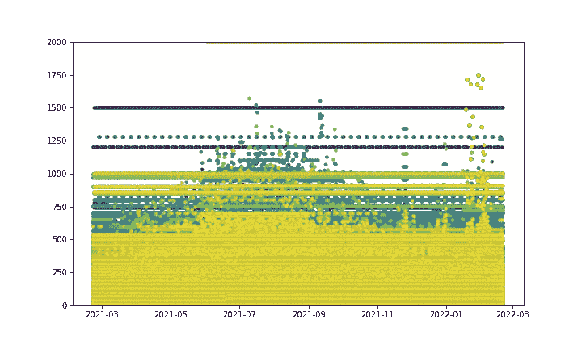
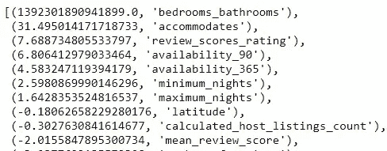
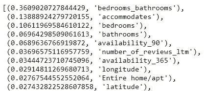

# 你如何决定 Airbnb 西雅图的住宿价格

> 原文：<https://medium.com/codex/how-do-you-determine-lodging-price-on-seattle-airbnb-820897532c7e?source=collection_archive---------28----------------------->

## [法典](http://medium.com/codex)

# 介绍

你呆在家里太久了？从 2021 年开始，自从我们得知病毒的消息以来，这是艰难的一年。据新闻媒体报道，随着经济开始复苏，旅游和休闲业正在复苏。

你可能想知道，“现在的旅行费用是多少？”或者“当地城市的旅游和休闲业务如何？”。


今天，我们从各种来源接收各种信息。如果我们能看到真实的数据并让数据与我们对话，这不是很酷吗？我从 Airbnb 内部下载了 Airbnb 西雅图的最新数据，这是一个非商业网站，提供描述 Airbnb 房源活动的数据集。

我使用的数据集是包含 3356 个不同房源信息的房源数据集，以及包含数据收集日期(即 2021 年 2 月 21 日)房源价格和可用性的日历数据集。

# 第 1 部分:位置对价格有影响吗？

挑 Airbnb 的时候我们问的第一个问题通常是地点。在这里，我们通过散点绘制经度和纬度来研究列表数据集，从而得到一个粗略的西雅图地图。圆圈的颜色代表价格差异，圆圈越大，一个楼盘能容纳的人就越多。



*注:颜色栏实际显示的是 log_price。来自列表数据集的价格数据是重尾分布的(一小部分价格比其余部分高得多)。因此，我对价格取了以 10 为底的对数，这样可视化显示了明显的价格差异。*

我们可以看到市中心区房源密集，但没有明显的模式显示密集区的房源相对昂贵。高价的 Airbnb 实际上洒在地图上，用橙色和红色的圆圈表示。事实上，大圆通常比小圆贵，所以当主人决定住宿价格时，房产大小确实很重要。

# 第二部分:来年价格是否存在季节性？

我们转向日历数据集，看看未来一年的价格和可用性。这是另一个以日期为 x 轴，价格为 y 轴的散点图。每个点都显示了 Airbnb 房源在特定日期的价格。每种颜色代表一个不同的列表。



日历数据集中有 4196 个唯一的 Airbnb 房源。

一份清单清楚地显示了季节性，比如它的价格在夏季达到峰值，在冬季假期飙升，但一份清单不足以得出季节性也适用于其他清单的结论。让我们放大来看看 2000 美元以下的物品。



基本上，该图显示了两组列表——一组是全年价格稳定的直线，另一组是我们在上面看到的类似的季节性模式。虽然没有明确的界限，但直线组通常更接近价格范围的低端，季节性组相对更贵。

# 第 3 部分:构建预测价格的模型

既然我们已经看了一些关于数据的探索，让我们试着建立预测模型。在我们对数据集做任何事情之前，重要的是将数据集分成训练集和测试集，并确保我们的模型在我们完成模型构建之前不会“看到”测试集。我们将使用测试集来评估我们的模型的性能。

对于这一部分，使用列表数据。我通过清理、聚集和编码特征来准备列表数据集，以便将它们输入到我们的模型中。

然后，我在线性回归和随机森林模型上使用 10 倍交叉验证，均方根误差(RMSE)结果分别为 94.24 和 87.66。RMSE 越低，性能越好。随机森林看起来在这里表现更好。

我们可以使用 Scikit-Learn 工具中的 RandomizedSearchCV 进一步优化随机森林模型，以微调超参数。结果如下:

```
RMSE: 92.44 
Parameters: {'max_depth': 44, 'max_features': 18, 'min_samples_leaf': 18, 'n_estimators': 141}
```

现在，我们已经完成了模型的构建，我们来看看它们在测试集上的表现。线性回归得出 RMSE 为 63.73，随机森林得出 RMSE 为 62.04。令人惊讶的是，两个结果相差不远。线性回归等简单模型也适用于该数据集。

# 特征重要性

现在让我们来看看影响这两个模型价格预测的主要特性。列表是经过排序的，所以最上面的功能更有影响力。



**线性回归模型**的系数。这里我们将系数视为特征重要性。

“住宿”、“卧室”和“浴室”出现在顶部。它们都与房产大小有关，这证实了我们在上面西雅图地图中的发现。



**随机森林模型**的特征重要性

亚军的特点是可用性和评论，所以长期或受欢迎的小屋可能会更贵。在这里看到经度和纬度很有意思，但是它们没有上面讨论的特性那么有影响力。

# 结论

我们对 2021 个 Airbnb 西雅图数据集进行了探索性的数据分析和建模。

1.  当游客或居民选择 Airbnb 时，物业位置是一个重要的考虑因素，但在其他因素中，**位置**与价格没有很大关系。
2.  季节性是一些高价 Airbnb 的明显模式。价格适中的酒店全年价格稳定。
3.  **Airbnb 房产的大小**是价格的首要决定因素。从本质上来说，多少人的财产可以容纳影响住宿价格最大。

我们可以从 Airbnb 的数据中获得更多见解，比如评论。如果你对 Airbnb 的数据感兴趣，这里是 Airbnb 内部的链接:[http://insideairbnb.com/index.html](http://insideairbnb.com/index.html)

要了解本文中的数据准备和建模，请点击这里查看我在 GitHub 上的代码。