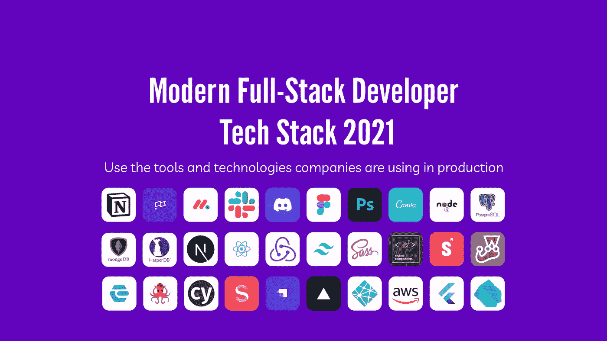
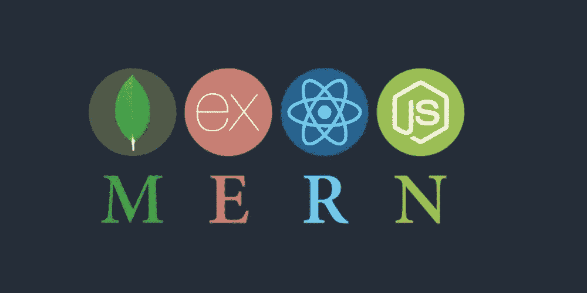
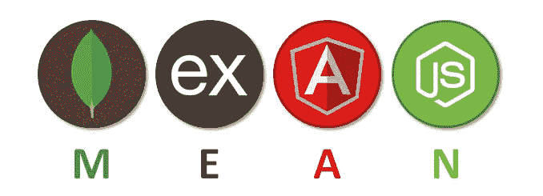
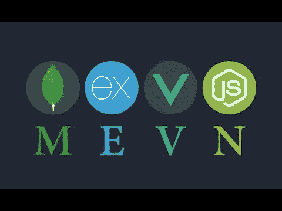
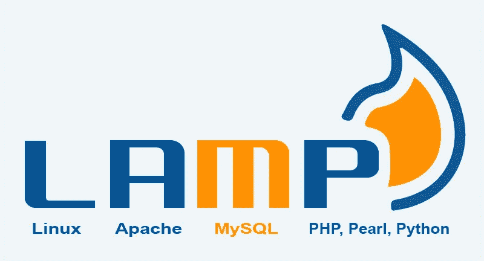
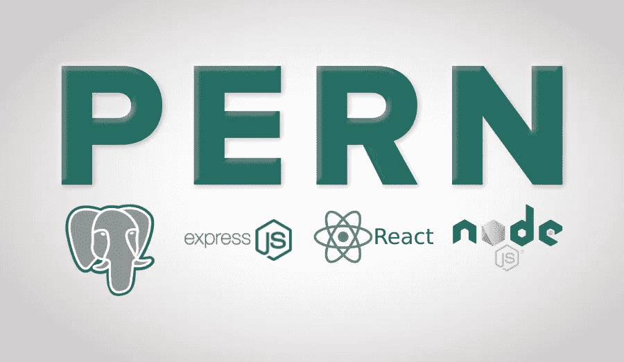

# 你的筹码是多少？

> 原文：<https://medium.com/codex/how-do-you-stack-up-f9280ff4636f?source=collection_archive---------7----------------------->

## 2021 年流行的技术堆栈

当选择一个特定的框架和技术生态系统用于一个项目或开发一个平台或服务时，有太多的选择。最终结果被称为技术堆栈、软件堆栈或开发堆栈。它由处理前端、后端和数据库任务的东西组成。

# **注意事项**

很可能大多数人将不得不适应他们公司已经在使用的任何堆栈。但是，如果您想开始自己的事业或做一些兼职，在选择特定的堆栈之前，您可能需要考虑以下几点:

1.  你的软件的功能
2.  可量测性
3.  服务器功能
4.  未来软件功能
5.  数据存储
6.  表演
7.  安全性
8.  维护

即使有众多的选择，奶油自然会上升到顶部。一些堆栈已经变得更加流行和广泛使用。以下是一些最新的趋势。

# MERN

一个 Javascript 堆栈，功能强大，用于构建动态网站和应用程序。它是初创企业的首选堆栈，因为它非常用户友好。React 在前端越来越受欢迎，这可能是这个栈成为最受欢迎的栈的原因。

## 数据库:

*   MongoDB

## 前端:

*   反应
*   JavaScript 或类型脚本

## 后端:

*   节点. js
*   表达

# 意思是

另一个基于 JavaScript 的技术栈是开源的，可以免费使用。它将允许您使用内置服务器创建针对简化的云部署而优化的可扩展应用程序。主要用于云就绪应用程序。它有一个强大的用例来管理并发用户的能力。

## **数据库:**

*   MongoDB

## 前端:

*   有角的
*   以打字打的文件

## 后端:

*   节点. js
*   表达

# 梅文

又一个基于 JavaScript 的软件栈。你看到这里的模式了吗？它与前两个堆栈基本相同，但使用 Vue.js 而不是 React。在所有这些中，您可以插入任何您喜欢使用的基于 JavaScript 的前端。这个堆栈的优点是使用 Vue 更快更容易学习。

## 数据库:

*   MongoDB

## 前端:

*   某视频剪辑软件
*   Javascript 或类型脚本

## 后端:

*   节点. js
*   表达

# 灯

这个经过时间考验的栈是第一批开源的栈之一。它仍然被广泛使用，有些人认为它是构建定制 web 应用程序的首选堆栈。值得注意的是，Wordpress 是在 LAMP 上运行的。

## 发展:

*   Linux 操作系统
*   街头流氓
*   服务器端编程语言（Professional Hypertext Preprocessor 的缩写）
*   珍珠
*   计算机编程语言

## 数据库:

*   我的 SQL

# 蜂鹰

PERN 栈是对 MERN 栈的另一种改进，用 PostgreSQL 代替了 MongoDB 数据库功能。它是可扩展的，具有许多特性，可以安全地存储和扩展一些最复杂的工作负载。

## 数据库:

*   一种数据库系统

## 前端:

*   反应
*   JavaScript 或类型脚本

## 后端:

*   节点. js
*   表达

# 结论

最后，选择使用哪种堆栈可能取决于您和您的开发团队对什么满意。一定要对类似的项目进行研究，看看哪些项目成功了，哪些失败了。

希望这有助于任何人决定哪种堆栈适合他们。请随意查看我的其他博客，在 LinkedIn 上与我联系，或者来查看我的[网站](http://jamondixon.com)。干杯！

 [## Jamon Dixon -熨斗学校-德克萨斯州奥斯汀大都会区| LinkedIn

### 全栈式 web 开发人员，对事物的工作原理充满好奇，并具有解决问题的能力。拥有强大的…

www.linkedin.com](https://www.linkedin.com/in/jamondixon/)