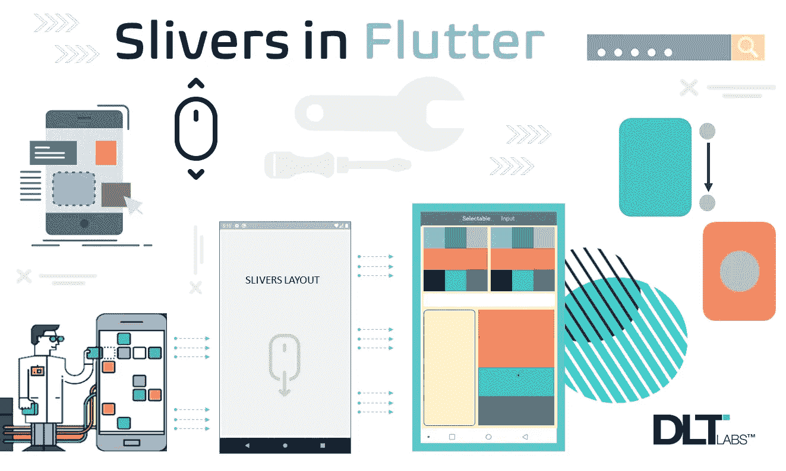

# 你如何在颤动中使用棉条？

> 原文：<https://medium.com/codex/how-do-you-use-slivers-in-flutter-318d9fb16dd4?source=collection_archive---------0----------------------->

## [法典](http://medium.com/codex)

# 介绍

一个*窗口小部件*是 Google UI toolkit Flutter 中的一个基本实体，通过它可以创建任何 UI 元素。用户与该小部件交互来执行一些动作。例如，按钮是一个小部件，用户单击按钮可以在移动或 web 平台上创建一些事件。