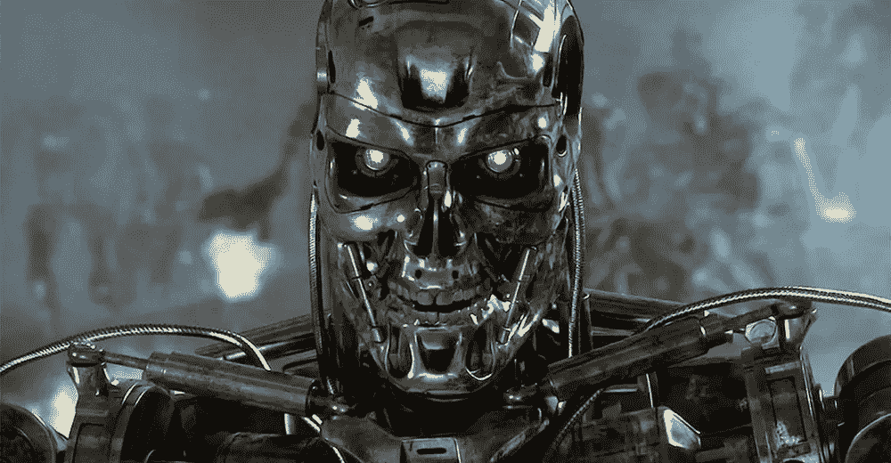
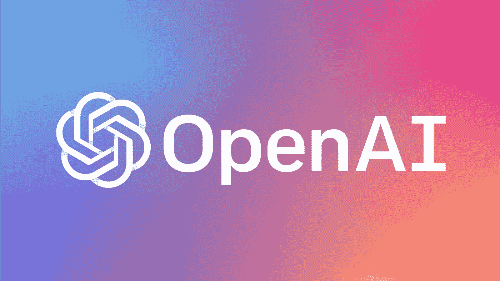

# AI 到底是怎么工作的！？

> 原文：<https://medium.com/codex/how-does-ai-even-work-788230ace9dc?source=collection_archive---------9----------------------->

我们知道它是做什么的…但是怎么做的🤷‍♂️(大部分时间专注于 ML)

图片来源:短路

众所周知，人们对人工智能软件(AI)的兴趣和利用率绝对大幅上升。我们可以责怪 ChatGPT 最近以其疯狂的酷功能打破了互联网。但总的来说，人工智能是一个令人着迷的话题，自 1956 年以来(在科学家中)一直是人们谈论的话题，并在 21 世纪进一步经历了一个巨大的高峰！

甚至成为一些经典电影的焦点，如《黑客帝国》、《终结者》、《钢铁巨人》等等。这要么让我们对未来产生偏执(以一种娱乐的方式😅)或有益健康的…

但是你有没有想过 AI 实际上是怎么工作的？继续阅读，用最基本的方法找到答案！

## 目录:

*   什么是人工智能🤖？
*   人工智能是如何工作的😮！？
*   人工智能的未来👾…
*   ChatGPT by OpenAI😉。
*   圣诞奖金:问 AI AI 是否能终结人类🎁

## 什么是人工智能🤖？

图片来源:威廉·戈达德——IT 编年史

众所周知，人类有一定的智力水平，允许我们对特定的问题做出反应，学习新的东西，以及其他许多东西。现在，如果我们能建造/编程这个，然后把这个能力给机器人，会怎么样？简而言之，这就是人工智能。

人工智能是“数字计算机或计算机控制的机器人执行通常与智能生物相关的任务的能力。” [—科普兰笔下的艾。](https://www.britannica.com/technology/artificial-intelligence)

## 人工智能是如何工作的😮！？

图片来源:美国国立卫生研究院

人工智能的工作原理是用不同的算法合并庞大的数据集，以便在处理的数据中发现模式。每次计算数据集(由计算机读取)时，人工智能都能够监控自己的性能，并为未来存储这些信息(有点像人类如何学习，但要快得多)。

但是，尽管人类在学习时需要休息(或者如果你喜欢不断学习，就睡觉)，人工智能却不需要。变得非常精通它被编程去做的任务，非常快。

假设你是一个人工智能，我给了你 5 篇不同的关于如何玩游戏的文章。每篇文章都会以不同的方式解释这个任务，或者遗漏或者增加信息。但是……你能够注意到一种模式，一种相似性，这就是游戏规则，不管如何解释。你将能够从一篇文章到下一篇文章填补知识的空白，预测缺失的信息。当然，如果我给你 100 篇文章(数据集)，你的预测会更准确，你的模式也会更精确！

## 人工智能的未来👾…

图片来源:终结者

至少有一件事是肯定的，我们不用担心杀手机器人会很快接管世界……为了实现这一点，人工智能必须达到人类的水平，即人工智能。

一旦达到这一水平(这可能不会发生)，谁能说人工智能有一天会启动并杀死我们所有人，如果它决定帮助人类，并发明我们甚至无法理解的东西来进化我们成为一个文明呢？

“当被问到‘人工智能对人类存在威胁吗’这个问题时，佐治亚理工学院的机器人工程师马修·奥布莱恩(Matthew O'Brien)在 Metafact 上写道:“长期以来寻求的‘通用人工智能’的目标还没有出现。我们只是不知道如何制造一种普遍的适应性智能，也不清楚还需要多少进展才能达到这一点”。

事实是，机器通常按照它们被编程的方式运行，我们距离开发这种“接管”所需的 ASI(人工超级智能)甚至是可行的还有很长的路要走。”[——人工智能能消灭我们吗？太阳](https://www.thesun.co.uk/tech/17703533/artificial-intelligence-wipe-out-humanity/)

## ChatGPT by OpenAI😉。

图片来源:OpenAI

在几秒钟的时间里，ChatGPT 席卷了整个行业，每个人和他们的朋友都听说过它，并且正在追踪这个人工智能可以执行的不同任务。从写博客、编诗、完成作业，一直到调试代码片段！

我们都可以看到为什么 ChatGPT 如此受欢迎。但是 ChatGPT 是怎么学习新东西的呢？ChatGPT 不仅接受了来自互联网的海量数据集的训练，还接受了会话数据和使用 RLHF 的训练。

另一件要注意的事情是…软件并不总是准确的。它可以创造出听起来似乎合理但完全不合逻辑的答案。

“在来自互联网的海量数据(包括对话)的训练下，它还使用一种称为人类反馈强化学习(RLHF)的机器学习技术进行了训练，其中人类训练员为模型提供了对话，他们在对话中扮演 AI 聊天机器人和用户。

由于这种学习方法，ChatGPT 的答案听起来很自然，很像人类。这个机器人不仅仅是鹦鹉学舌。根据英国开放大学教育技术教授迈克·夏普勒斯(Mike Sharples)的说法，OpenAI 的语言模型是“创建一种内部表示，不仅仅是表面的文本，而是背后的思想和概念。”—卢克·赫斯特谈 ChatGPT

# 圣诞奖金:问 AI AI 是否能终结人类🎁

这是我送给你(我的读者)的一份圣诞小礼物。

我会问 ChatGPT(AI):AI 会终结人类吗？

在这里查看我最新的博客文章和答案:[问人工智能，人工智能是否会终结人类，以及其他有趣的问题👀。](/@danbaileydwb/asking-ai-if-ai-will-end-humanity-db589946c51b)