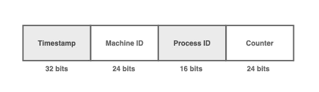

# ID 生成器是如何工作的？

> 原文：<https://medium.com/codex/how-does-an-id-generator-work-fe394be79eb3?source=collection_archive---------4----------------------->

## 实现 ID 生成器的初学者指南


照片由[马体·米罗什尼琴科](https://www.pexels.com/@tima-miroshnichenko/)在[像素](https://www.pexels.com/photo/close-up-shot-of-a-person-holding-a-passport-7010140/)上拍摄

后端系统中的每条记录都需要一个 ID 来唯一标识。

虽然乍听起来似乎微不足道，但在高度分布式的环境中生成一个全局惟一的标识符实际上是一项具有挑战性的任务。

在本文中，我们来看看一些常见的 ID 生成算法。

# 票务服务——中央数据库


ID 是使用自动递增功能生成的

票证服务解决方案利用 SQL 数据库中的自动递增特性来生成唯一的 ID。

使用中央数据库服务器，网络服务器将一条新记录插入数据库以生成一个自动递增的 ID。

```
CREATE TABLE `ID` (
  `id` bigint(20) unsigned NOT NULL auto_increment,
  `stub` char(1) NOT NULL default '',
  PRIMARY KEY  (`id`),
  UNIQUE KEY (stub)
);

REPLACE INTO ID (stub) VALUES ('a');

SELECT LAST_INSERT_ID();
```

我们可以使用`REPLACE INTO`命令来减少数据库中的记录数量，而不是使用`INSERT INTO`命令。


`REPLACE INTO`命令自动就地更新一行，并获得一个自动递增的主 ID，而不创建新记录。

**优点**

*   很容易实现。
*   生成的 ID 是 64 位。
*   ID 是连续的和可排序的。

**缺点**

*   只能使用 1 个表。多个表或数据库将导致 ID 冲突。
*   因为只使用了一个表，所以数据库成为了单点故障。
*   如果每秒的写入次数非常多，将会出现写入瓶颈。

# 票务服务—集群数据库


使用循环法路由请求

我们可以不使用一个数据库，而是使用多个有偏移的数据库来避免单点故障和写瓶颈。

**偏移量**用于防止 ID 冲突。每个数据库的 ID 增加 k，其中 **k 是正在使用的数据库服务器的数量**。

如上所示，如果使用了三个数据库，那么每生成一个 ID，自动递增的 ID 就增加 3。

**优点**

*   实现起来相对容易。
*   生成的 ID 是 64 位。
*   能够在没有单点故障的情况下处理高吞吐量。

**缺点**

*   由于使用了多个数据库，生成的 id 不能保证是可排序的。
*   难以横向扩展。添加新的数据库很棘手，因为它会影响偏移量。

# 推特雪花

雪花方法生成一个 **64 位 ID** 而不依赖于数据库。


64 位 ID 被分成 5 个部分

ID 分为 5 个主要部分

*   时间戳(41 位)
*   数据中心 ID (5 位)
*   机器 ID (5 位)
*   序列号(12 位)
*   符号位(1 位)

**时间戳**。自纪元以来的毫秒数。41 位大约会在 70 年内溢出，这对于大多数项目的生命周期来说是安全的。

**数据中心 ID** 。服务器所在的数据中心。如果两台服务器同时收到相同的请求，这可以防止 ID 冲突。

**机器 ID** 。机器的 ID。如果两台服务器在相似的数据中心同时收到相同的请求，这可以防止冲突。

**序号**。对于在同一台服务器上生成的每个 ID，序列号增加 1，并在每毫秒重置为 0。这可以防止同一服务器上的 ID 冲突。

**优点**

*   ID 大致排序。
*   能够在没有单点故障的情况下处理高吞吐量。
*   能够在机器之间不协调的情况下生成 ID。
*   能够水平缩放。

**缺点**

*   ID 不是完全有序的。
*   未来的身份证是可以预测的。对于要求安全性的应用程序来说，这可能并不理想。
*   需要一个动物园管理员来跟踪机器 id。

# MongoDB ObjectID

MongoDB 为每个新文档创建一个惟一的对象 ID。

对象 ID 由 **MongoDB 驱动程序而不是数据库**生成。这意味着可以在服务器上生成对象 ID，而不依赖于 MongoDB 数据库。



MongoDB 对象 ID 是一个 96 位的 ID

与雪花方法类似，MongoDB 对象 ID 被分成 4 个部分。objectID 是一个 96 位的 ID。

*   时间戳(32 位)
*   机器 ID (24 位)
*   进程 ID (16 位)
*   计数器(24 位)

大多数字段类似于雪花方法中提到的字段。

由于多个线程或进程可以在同一台计算机上运行，因此进程 ID 可以区分同一台计算机在不同进程中生成的 objectID。

**优点**

*   能够在没有单点故障的情况下处理高吞吐量。
*   能够在机器之间不协调的情况下生成 ID。
*   能够水平缩放。

**缺点**

*   依靠第三方数据库解决方案。
*   ID 的长度为 96 位，而不是 64 位，这将占用更多的存储空间。

# UUID(通用唯一标识符)


128 位 UUID 的示例

通用唯一标识符是一个 128 位的数字，包括几个部分，例如时间、节点的 MAC 地址或 MD5 散列名称空间。

有一套标准化的算法来生成 UUID，多年来已经发布了 5 个不同的版本来满足不同的需求。

这些算法相当冗长，因此，我们不会详细讨论它们。我们将更多地关注它的利弊。

**优点**

*   这是一个 128 位的 ID，保证是唯一的。
*   它可以独立生成，不依赖任何第三方服务
*   它是随机和安全的。无法预测下一个 ID。

**缺点**

*   它很大，而且在 MySQL 中索引很差
*   这不是命令。

# 结论


在分布式环境中实现高度可伸缩和可用的 ID 生成器并不简单。

希望这对你有所帮助，我们下一个话题再见！

如果你对这样的文章感兴趣，今天就和我一起报名 Medium 吧！

[](/@nganjason007/membership) [## 通过我的推荐链接加入 Medium—Jason Ngan

### 阅读 Jason Ngan(以及媒体上成千上万的其他作家)的每一个故事。您的会员费直接支持…

medium.com](/@nganjason007/membership)