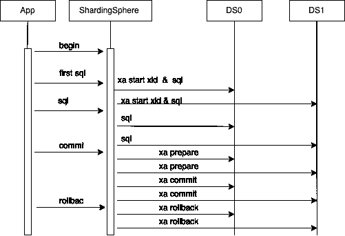
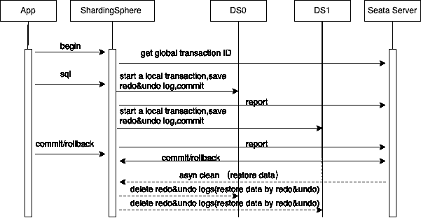

# Apache ShardingSphere 是如何实现分布式事务的？

> 原文：<https://medium.com/codex/how-does-apache-shardingsphere-implement-distributed-transactions-48f9b7cee6d8?source=collection_archive---------8----------------------->

随着数据量的增加和流量负载的增加，业务系统面临着巨大的挑战，对数据库系统的可扩展性有着强烈的需求。传统独立数据库如 [Oracle](https://www.oracle.com/) 、 [MySQL](https://www.mysql.com/) 、 [SQL Server](https://www.microsoft.com/en-us/sql-server/sql-server-downloads) 和 [PostgreSQL](https://www.postgresql.org/) 的在线扩展问题现在比以往任何时候都更加明显。在这种情况下，可以向外扩展的分布式数据库就是为了解决这些扩展挑战而设计的。所有这些都意味着分布式事务是一个必须解决的问题。

在这种情况下，ShardingSphere 提供了一个分布式数据库计算增强引擎，该引擎可以通过一个生态系统来支持分布式事务，该生态系统由于面向插件的架构而易于扩展。

# 交易处理

## **交易属性**

三个属性定义了事务:原子性、持久性、一致性和隔离性。

> ***原子性***

在分布式场景中，事务的操作可能分布在多个物理节点上，确保多个节点上的所有操作成功或失败。

> ***耐久性***

即使断电，提交的事务操作也有效。

> ***一致性***

***提示:*** 这里的“一致性”不同于 CAP 定理中的 C。CAP 中的 C 指的是多个副本之间的数据一致性，但这里指的是不同级别之间的一个抽象概念。

从用户的角度来看，数据从一种状态传输到另一种状态，两种状态都受到一定程度的限制。例如:

银行账户 A 有 500 美元，账户 B 有 500 美元，总计 1000 美元。A 和 B 在一笔交易中执行转账操作后，他们的总金额仍然是 1000 美元。

> **隔离*隔离*隔离**

当事务并发执行时，可以确保数据的正确性。例如，两个事务同时修改相同的数据，以确保这两个事务按照一定的顺序执行，从而保持数据正确。

## **挑战**

与独立事务相比，分布式事务面临以下挑战:

1.  原子性。对于独立事务，使用撤消日志和重做日志可以保证完全提交或完全回滚。然而，分布式事务涉及多个物理节点，每个节点都是不同的。一些节点日志可以成功写入，而另一些则失败。
2.  网络不稳定。对于单机来说，通信是稳定的，任何操作都可以应答，无论成功与否。但是，在分布式场景中，网络是不稳定的，并且操作可能不被应答。因此，如何确保分布式事务的可用性(异常事务的清除和恢复等)。)是个问题。
3.  并发控制。随着 [MVCC](https://www.postgresql.org/docs/7.1/mvcc.html) 的到来，可线性化运营成为刚性需求。在独立数据库中可以很容易地增加全局事务数量，但在分布式场景中却不行。

## **解决方案**

> ***原子提交***

原子性和网络不稳定性问题的主流解决方案是 [2PC(两阶段提交协议)](https://en.wikipedia.org/wiki/Two-phase_commit_protocol)，定义了两个角色，即 TM(事务管理器)和 RM(资源管理器)。

在分布式场景中，事务的操作可以分布在多个节点中。交易包括两个阶段。

**第一阶段:** RM 锁定相关资源并执行特定操作，然后向 TM 返回成功或失败。

**第二阶段:**根据第一阶段 RM 返回的结果，TM 将执行最终的提交操作(事务状态改变、锁状态删除等。)如果所有操作都成功，如果任何操作失败，则回滚。

***注意:*** 当然也有一些需要优化的地方，比如把不涉及多个节点的事务转换成单阶段提交等等。

***注:*** 两阶段提交协议只解决提交问题。提交要么成功，要么失败。没有部分成功的中间状态。这与事务隔离级别没有必然联系。

> ***并发控制***

并发控制是一种确保并发事务在特定隔离级别执行的策略。自从多版本并发控制(MVCC)出现以来，主流数据库在很大程度上放弃了以前的两阶段锁定模型。

并发控制本质上是控制数据读写的并发性。并发控制策略决定了隔离级别，并发控制解决了以下两个问题:

1.  确定并发的粒度。比如 MySQL 有行锁(锁粒度是一行)和表锁(锁粒度是一个表)等等。
2.  三种并发场景:

a.读取并发。不需要特殊处理，因为不涉及数据更改。

b.写并发。不要同时写作。，否则会发生数据损坏。

c.读/写并发。性能优化主要在这个场景中完成。有多种并发控制机制，其中多版本并发控制是最流行的一种。

## **MVCC 模式**

两种主流实现模式:

1.  基于事务 ID 和 ReadView

为每个事务获取事务 ID，以标识事务开始的顺序。通过主动链表获取快照，用事务 ID 存储多个版本的数据，达到并发控制的效果。MySQL 和 [Postgres-XL](https://www.postgres-xl.org) 都采用这种方法。

2.基于时间戳

通过引入时间戳，可见性可以通过向数据添加时间戳相关属性并比较数据的提交(提交时间戳)和快照时间戳来确定，从而实现线性化的并发控制。那就是[扳手](https://research.google/pubs/pub39966/)所做的。

以上两种模式依赖于全局交易号的生成。常见的生成机制有 TrueTime(由 Spanner 使用)、HLC([cocroach db](https://www.cockroachlabs.com)使用有错误的 HLC)、TSO(时间戳 Oracle)。

# ShardingSphere 的事务设计

ShardingSphere 的事务特性建立在存储 DB 的本地事务之上，提供了三种事务模式:`LOCAL`、`XA`和`BASE`。您只需要使用本机事务模式(`begin` / `commit` / `roll-back`)来使用这三种模式，并在一致性和性能之间做出适当的权衡。

**本地**

`LOCAL`模式直接建立在存储数据库的本地事务上。它有最高的性能，尽管原子性有问题。如果你能容忍这个问题，是个不错的选择。

**XA**

在 XA 模式下，XA 协议基于 2PC 定义的一组交互协议。它定义了 `xa start/prepare/end/commit/rollback`接口。常用的实现有 Narayana、Atomics 和 ShardingSphere 集成了 Narayana 和 Atomics 的 XA 实现。

1.  应用程序连接到代理，代理创建一个绑定到连接的会话对象。
2.  应用程序执行`begin`。Proxy 通过 Narayana TM 创建一个逻辑事务，并将其绑定到当前会话。
3.  该应用程序执行特定的 SQL。会话建立到存储数据库的连接，连接可以通过`Transaction.enlistResource ()`接口注册到事务。然后执行`XA START {XID}`启动事务，执行路由覆盖的 SQL。
4.  应用程序运行`commit`命令，为在事务数据库中注册的每个连接执行`xa prepare`，将事务状态更新为`prepared`，并为每个连接执行`xa commit`。如果系统返回 ok，更新交易状态为`Committed`，交易提交成功。如果`prepare`进程失败，您可以运行`rollback`命令回滚数据。如果没有，后台进程将清除数据。
5.  app 运行`rollback`命令，连接存储 DB 的事务中注册的连接分别执行`xa rollback`。



**底座**

[基础(基本可用，柔软状态，最终一致)](https://phoenixnap.com/kb/acid-vs-base)模式。基础交易是 CAP 定理中 C 和 A 平衡的结果。 [Seata](https://seata.io/en-us/) 的 AT 模式是 BASE transaction 的一个实现，ShardingSphere 集成了 Seata 的 AT 实现。

1.  应用程序连接到代理，代理创建一个绑定到连接的会话对象。
2.  应用程序执行`begin`。代理通过 Seata TM 创建一个逻辑事务，将其绑定到当前会话，并向 Seata 服务器注册。
3.  应用程序执行逻辑 SQL。会话建立到存储数据库的连接。每个连接都是 Seata 的一个`ConnectionProxy`实例。然后解析被路由覆盖的`actual sql`并执行拦截。例如，如果是修改操作，执行`begin`获取本地锁，执行`SQL`查询，执行`commit`释放本地锁，将分支交易结果上报给 Seata 服务器。
4.  app 运行`commit`命令后，Seata TM in Proxy 通知 Seata 服务器，直接返回 app。Seata 服务器与代理异步交互来删除事务日志。
5.  应用程序运行`rollback`命令。代理中的 Seata TM 通知 Seata 服务器后，代理直接返回 app。Seata 服务器与代理异步交互，执行补偿操作，并删除事务日志。



# 例子

## **安装包准备**

以一个集成了 Narayana 实现的具有良好支持能力的 XA 为例。由于 Narayana 许可证问题，它不能直接打包到安装包中，需要添加额外的依赖项。

从官网下载安装包，解压到目录`${ShardingSphere}`，将下面的`jar`包添加到目录`${ShardingSphere}/lib`。

(下载:https://mvnrepository.com/)

```
jta-5.12.4.Final.jar
arjuna-5.12.4.Final.jar
common-5.12.4.Final.jar
jboss-connector-api_1.7_spec-1.0.0.Final.jar                                             | ------------------------------------------------------------------------------------------------------------------------------------
jboss-logging-3.2.1.Final.jar                                                    | ------------------------------------------------------------------------------------------------------------------------------------
jboss-transaction-api_1.2_spec-1.0.0.Alpha3.jar                                           | ------------------------------------------------------------------------------------------------------------------------------------
jboss-transaction-spi-7.6.0.Final.jar
mysql-connector-java-5.1.47.jar                                                   | ------------------------------------------------------------------------------------------------------------------------------------
narayana-jts-integration-5.12.4.Final.jar
shardingsphere-transaction-xa-narayana-5.1.1-SNAPSHOT.jar
```

## **MySQL 实例准备**

1.  准备两个 MySQL 实例:127.0.0.1:3306 和 127.0.0.1:3307。
2.  为每个 MySQL 实例创建密码为 12345678 的用户 root。
3.  为每个 MySQL 实例创建一个测试库。

## **ShardingSphere 代理配置**

修改`server.yaml`的交易配置

```
rules:
  - !AUTHORITY
    users:
      - root@%:root
      - sharding@:sharding
    provider:
      type: ALL_PRIVILEGES_PERMITTED
  - !TRANSACTION
    defaultType: XA
    providerType: Narayana
```

修改`conf/conf-sharding.yaml`

```
dataSources:
  ds_0:
    url: jdbc:mysql://127.0.0.1:3306/test?serverTimezone=UTC&allowPublicKeyRetrieval=true&useSSL=false
    username: root
    password: 12345678
    connectionTimeoutMilliseconds: 30000
    idleTimeoutMilliseconds: 60000
    maxLifetimeMilliseconds: 1800000
    maxPoolSize: 50
    minPoolSize: 1
  ds_1:
    url: jdbc:mysql://127.0.0.1:3307/test?serverTimezone=UTC&allowPublicKeyRetrieval=true&useSSL=false
    username: root
    password: 12345678
    connectionTimeoutMilliseconds: 30000
    idleTimeoutMilliseconds: 60000
    maxLifetimeMilliseconds: 1800000
    maxPoolSize: 50
    minPoolSize: 1

rules:
  - !SHARDING
    tables:
      account:
        actualDataNodes: ds_${0..1}.account${0..1}
        tableStrategy:
          standard:
            shardingColumn: id
            shardingAlgorithmName: account_inline
        keyGenerateStrategy:
          column: id
          keyGeneratorName: snowflake
    defaultDatabaseStrategy:
      standard:
        shardingColumn: id
        shardingAlgorithmName: database_inline
    defaultTableStrategy:
      none:

    shardingAlgorithms:
      database_inline:
        type: INLINE
        props:
          algorithm-expression: ds_${id % 2}
      account_inline:
        type: INLINE
        props:
          algorithm-expression: account${id % 2}

    keyGenerators:
      snowflake:
        type: SNOWFLAKE
        props:
          worker-id: 123
```

## **启动 ShardingSphere-Proxy**

通过运行以下命令启动代理:

```
cd ${ShardingSphere}
./bin/start.sh
```

## **使用 ShardingSphere-Proxy**

使用 MySQL 客户端连接 shardingSphere-Proxy 进行测试，参考以下命令。

```
mysql -h127.0.0.1 -P3307 -uroot -prootmysql> use sharding_db;
Database changed
mysql> create table account(id int, balance float ,transaction_id int);
Query OK, 0 rows affected (0.12 sec)

mysql> select * from account;
Empty set (0.02 sec)

mysql> begin;
Query OK, 0 rows affected (0.09 sec)

mysql> insert into account(id, balance, transaction_id) values(1,1,1),(2,2,2);
Query OK, 2 rows affected (0.53 sec)

mysql> select * from account;
+------+---------+----------------+
| id  | balance | transaction_id |
+------+---------+----------------+
|  2 |   2.0 |       2 |
|  1 |   1.0 |       1 |
+------+---------+----------------+
2 rows in set (0.03 sec)

mysql> commit;
Query OK, 0 rows affected (0.05 sec)

mysql> select * from account;
+------+---------+----------------+
| id  | balance | transaction_id |
+------+---------+----------------+
|  2 |   2.0 |       2 |
|  1 |   1.0 |       1 |
+------+---------+----------------+
2 rows in set (0.02 sec)
```

# 未来计划

目前，ShardingSphere 的分布式事务集成了第三方的 2PC 实现方案，以保证原子性。隔离依赖于存储数据库的隔离保证，提供可用的事务功能。

基于全局时间戳并结合 2PC 的 MVCC 的未来实现将为事务隔离语义提供更好的支持。

# Apache ShardingSphere 项目链接:

[ShardingSphere Github](https://github.com/apache/shardingsphere/issues?page=1&q=is%3Aopen+is%3Aissue+label%3A%22project%3A+OpenForce+2022%22)

[ShardingSphere Twitter](https://twitter.com/ShardingSphere)

[切割球松弛](https://join.slack.com/t/apacheshardingsphere/shared_invite/zt-sbdde7ie-SjDqo9~I4rYcR18bq0SYTg)

[投稿指南](https://shardingsphere.apache.org/community/cn/contribute/)

# 作者

**卢敬尚**

> [Apache ShardingSphere](https://shardingsphere.apache.org) 提交者&基础设施研发工程师 [SphereEx](https://www.sphere-ex.com) 。
> 
> 热衷于开源和数据库技术。
> 
> 专注于开发 Apache ShardingSphere 事务模块。

