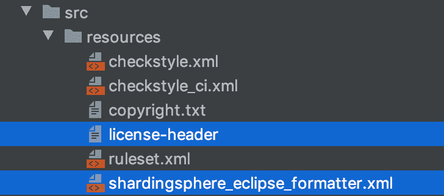
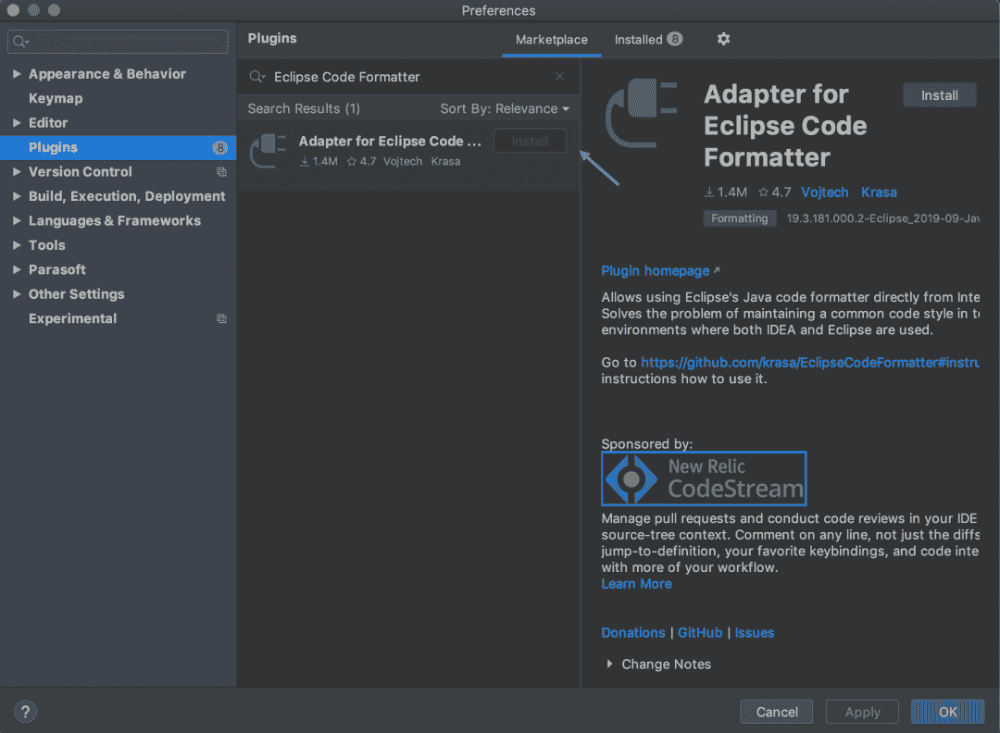
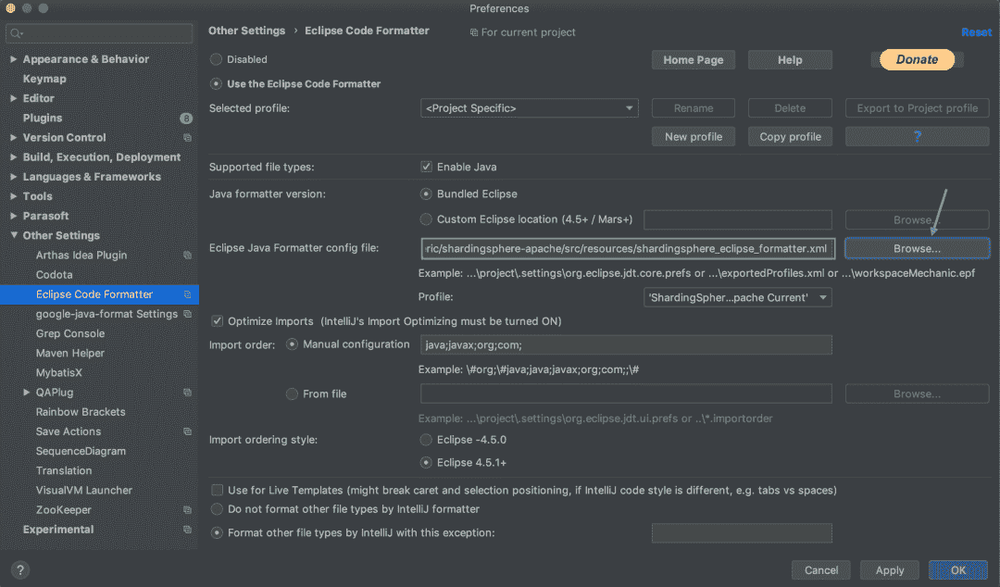

# Apache ShardingSphere 如何标准化和格式化代码？我们使用一尘不染

> 原文：<https://medium.com/codex/how-does-apache-shardingsphere-standardize-and-format-code-we-use-spotless-caf09403de6a?source=collection_archive---------7----------------------->

为什么我们需要格式化代码？简单地说，就是让代码更容易阅读、理解和修改。

作为顶级的 Apache 开源项目， [ShardingSphere](https://shardingsphere.apache.org/) 到目前为止已经有 400 个贡献者。由于大多数开发人员没有相同的编码风格，因此在 GitHub 开放协作模型中标准化项目的整体代码格式并不容易。为了解决这个问题，ShardingSphere 使用[完美的](https://github.com/diffplug/spotless/tree/main/plugin-maven)来统一代码格式。

## 什么是一尘不染？

纤尘不染是一个多语言代码格式化工具，支持 [Maven](https://maven.apache.org/) 和 [Gradle](https://gradle.org/) 用插件构建。

开发人员可以通过两种方式来使用 Monica:检查代码中与格式相关的问题，以及格式化代码。

> ShardingSphere 社区使用 Maven 来构建它的项目——而 Monica 使用 Maven 进行演示。

## 怎么用？

让我们来看看下面的官方演示:

```
user@machine repo % mvn spotless:check[ERROR]  > The following files had format violations:[ERROR]  src\main\java\com\diffplug\gradle\spotless\FormatExtension.java[ERROR]    -\t\t····if·(targets.length·==·0)·{[ERROR]    +\t\tif·(targets.length·==·0)·{[ERROR]  Run 'mvn spotless:apply' to fix these violations.user@machine repo % mvn spotless:apply[INFO] BUILD SUCCESSuser@machine repo % mvn spotless:check[INFO] BUILD SUCCESS
```

当你用 `mvn spotless:check`检查项目代码时，出现错误，然后用`mvn spotless:apply`格式化代码。一旦你再次检查，格式错误已经神奇地消失了。

## 1.准备您的环境

ShardingSphere 使用 Monica 来添加 Java 文件`licenseHeader`和格式化 Java 代码。

纤尘不染有几种 Java 代码格式化方法，比如:`googleJavaFormat`、`eclipse`、`prettier`等。

出于定制的原因，我们选择`eclipse`进行 Java 代码格式化。



**a)根据项目要求**添加 `**licenseHeader**`

```
/** Licensed to the Apache Software Foundation (ASF) under one or more* contributor license agreements.  See the NOTICE file distributed with* this work for additional information regarding copyright ownership.* The ASF licenses this file to You under the Apache License, Version 2.0* (the "License"); you may not use this file except in compliance with* the License.  You may obtain a copy of the License at**     [http://www.apache.org/licenses/LICENSE-2.0](http://www.apache.org/licenses/LICENSE-2.0)** Unless required by applicable law or agreed to in writing, software* distributed under the License is distributed on an "AS IS" BASIS,* WITHOUT WARRANTIES OR CONDITIONS OF ANY KIND, either express or implied.* See the License for the specific language governing permissions and* limitations under the License.*/
```

****注意:**记得在`licenseHeader`的末尾加一个空格。否则`licenseHeader`和包装之间将没有空间。**

****b)添加****

```
?xml version="1.0" encoding="UTF-8" standalone="no"?> <profiles version="13"> <profile kind="CodeFormatterProfile" name="'ShardingSphere Apache Current'" version="13"> <setting id="org.eclipse.jdt.core.compiler.source" value="1.8"/>
        <setting id="org.eclipse.jdt.core.compiler.compliance" value="1.8"/> <setting id="org.eclipse.jdt.core.compiler.codegen.targetPlatform" value="1.8"/> <setting id="org.eclipse.jdt.core.formatter.indent_empty_lines" value="true"/> <setting id="org.eclipse.jdt.core.formatter.tabulation.size" value="4"/> <setting id="org.eclipse.jdt.core.formatter.lineSplit" value="200"/> <setting id="org.eclipse.jdt.core.formatter.comment.line_length" value="200"/> <setting id="org.eclipse.jdt.core.formatter.tabulation.char" value="space"/> <setting id="org.eclipse.jdt.core.formatter.indentation.size" value="1"/> <setting id="org.eclipse.jdt.core.formatter.comment.format_javadoc_comments" value="false"/> <setting id="org.eclipse.jdt.core.formatter.join_wrapped_lines" value="false"/> <setting id="org.eclipse.jdt.core.formatter.insert_space_before_colon_in_conditional" value="insert"/> <setting id="org.eclipse.jdt.core.formatter.insert_space_before_colon_in_default" value="do not insert"/> <setting id="org.eclipse.jdt.core.formatter.alignment_for_enum_constants" value="16"/> <setting id="org.eclipse.jdt.core.formatter.insert_space_before_colon_in_labeled_statement" value="do not insert"/> <setting id="org.eclipse.jdt.core.formatter.insert_space_before_colon_in_case" value="do not insert"/> <setting id="org.eclipse.jdt.core.formatter.alignment_for_conditional_expression" value="80"/> <setting id="org.eclipse.jdt.core.formatter.alignment_for_assignment" value="16"/> <setting id="org.eclipse.jdt.core.formatter.blank_lines_after_package" value="1"/> <setting id="org.eclipse.jdt.core.formatter.continuation_indentation_for_array_initializer" value="2"/> <setting id="org.eclipse.jdt.core.formatter.alignment_for_resources_in_try" value="160"/> <setting id="org.eclipse.jdt.core.formatter.alignment_for_throws_clause_in_method_declaration" value="10"/> <setting id="org.eclipse.jdt.core.formatter.alignment_for_parameters_in_method_declaration" value="106"/> <setting id="org.eclipse.jdt.core.formatter.alignment_for_parameters_in_constructor_declaration" value="106"/> <setting id="org.eclipse.jdt.core.formatter.alignment_for_throws_clause_in_constructor_declaration" value="106"/> <setting id="org.eclipse.jdt.core.formatter.alignment_for_arguments_in_explicit_constructor_call.count_dependent" value="16|5|80"/> </profile></profiles>
```

**关于 ShardingSphere 的最新规则，请参见`[shardingsphereeclipseformatter.xml](https://github.com/apache/shardingsphere/blob/master/src/resources/shardingsphere_eclipse_formatter.xml)`。如需参考，请查看`[eclipse-java-google-style.xml](https://github.com/google/styleguide/blob/gh-pages/eclipse-java-google-style.xml)` 文件。**

**`shardingsphereeclipseformatter.xml`的内容是按照 ShardingSphere 代码规范量身定制的，可以灵活更改。**

****c)添加 Maven 插件****

```
<plugin> <groupId>com.diffplug.spotless</groupId> <artifactId>spotless-maven-plugin</artifactId> <version>2.22.1</version> <configuration> <java> <eclipse
                 <file>${maven.multiModuleProjectDirectory}/src/resources/shardingsphere_eclipse_formatter.xml</file> </eclipse> <licenseHeader> <file>${maven.multiModuleProjectDirectory}/src/resources/license-header</file> </licenseHeader> </java> </configuration></plugin>
```

**一尘不染支持指定的格式化目录和排除指定的目录。更多信息，请参见`[plugin-maven#java](https://github.com/diffplug/spotless/tree/main/plugin-maven#java)`。如果没有指定，当执行`check`或 `apply`时，默认情况下所有的项目代码都会受到影响。**

****d)执行代码格式化****

**在执行以上三个步骤之后，您可以在项目中执行命令来检查 Java 代码是否符合规范，以及代码格式化特性。**

```
user@machine repo % mvn spotless:apply[INFO] BUILD SUCCESSuser@machine repo % mvn spotless:check[INFO] BUILD SUCCESS
```

## **2.绑定 Maven 生命周期**

**在实际的 ShardingSphere 应用程序中，您可以选择将 pinpoint`apply` 绑定到编译阶段，以便在本地执行 mvn 安装时自动格式化。**

```
<plugin> <groupId>com.diffplug.spotless</groupId> <artifactId>spotless-maven-plugin</artifactId> <version>2.22.1</version> <configuration> <java> <eclipse>                <file>${maven.multiModuleProjectDirectory}/src/resources/shardingsphere_eclipse_formatter.xml</file> </eclipse> <licenseHeader> <file>${maven.multiModuleProjectDirectory}/src/resources/license-header</file> </licenseHeader> </java> </configuration> <executions> <execution> <goals> <goal>apply</goal> </goals> <phase>compile</phase> </execution> </executions></plugin>
```

## **3.想法格式**

**如果您想在编写代码时检查单个文件的一致性，执行`mvn spotless:check`或`mvn spotless:apply`会有点麻烦，因为默认情况下格式化范围是整个项目。**

**IntelliJ IDEA 的原生格式化功能可以用`shardingsphereeclipseformatter.xml`代替。**

**这样，您可以在编写过程中随时格式化代码，从而显著提高效率。**

**IDEA 版本:2019.3.4**

****a)安装插件 Eclipse 代码格式化程序****

****

****b)选择** `**shardingsphereeclipseformatter.xml**` **作为默认格式模板****

****

**使用 IDEA 代码格式化快捷方式可以实现完美的代码格式化。**

# **常见问题解答**

## **1.一尘不染和方格风格之间的冲突**

**[Checkstyle](https://github.com/checkstyle/checkstyle) 是一个检查 Java 源代码是否符合代码标准或一组验证规则(最佳实践)的工具。**

**在极端情况下，完美的格式化代码无法通过 Checkstyle 检查。**

**根本原因是检查机制和两者设置的格式配置之间的冲突。例如，一尘不染格式的新行缩进 16 个空格，而 Checkstyle 检查 12 个空格的新行。**

```
private static Collection<PreciseHintShadowValue<Comparable<?>>> createNoteShadowValues(final ShadowDetermineCondition shadowDetermineCondition) { // format that can pass Checkstyle return shadowDetermineCondition.getSqlComments().stream().<PreciseHintShadowValue<Comparable<?>>>map( each -> new PreciseHintShadowValue<>(tableName, shadowOperationType, each)).collect(Collectors.toList()); // After being formatted by Spotless return shadowDetermineCondition.getSqlComments().stream().<PreciseHintShadowValue<Comparable<?>>>map( each -> new PreciseHintShadowValue<>(tableName, shadowOperationType, each)).collect(Collectors.toList());}
```

**这种情况需要开发者权衡利弊。有两种解决方案:修改无污点的格式规则，或修改 Checkstyle 的检查规则。**

****2。CRLF & LF** 之间的格式冲突**

**参见 https://github.com/diffplug/spotless/issues/1171 的**

# **摘要**

**Apache ShardingSphere 使用 pineagle 来格式化遗留代码，以及随后的代码格式标准化，这有助于保持项目代码的整洁。**

**当然，fispot 不限于 Java 代码格式化，还包括`Pom`、`Markdown`等文件类型的格式化，很快就会在 ShardingSphere 中应用。**

# **作者**

****龙泰****

**[**Github ID**](https://github.com/longtai-cn)**:**longtai-cn**

**[*Apache sharding sphere*](https://shardingsphere.apache.org/)*贡献者；hippo4j 作者(2.2K GitHub stars)。***