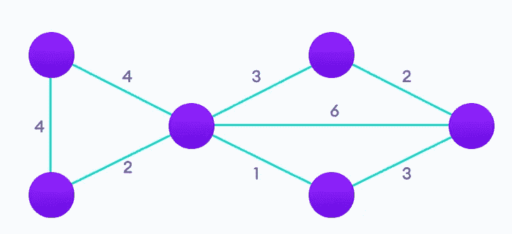

# Dijkstra 的算法是如何工作的？不到 5 分钟的简单解释

> 原文：<https://medium.com/codex/how-does-dijkstras-algorithm-work-easy-explanation-in-less-than-5-minutes-e27f46795c18?source=collection_archive---------0----------------------->


目前，我正在完成我的计算机科学学位。如果我想获得我的头衔，我必须通过的科目之一是“**非线性数据结构**”。在这个主题中，我学习了**树**和**图**以及一些与两者相关的算法(Dijkstra、Floyd、Prim 和 Kruskal)。老实说，我一直认为我的教授用一种非常复杂的方式解释这些算法。由于这个原因，我在课堂上从来没有正确理解过它们，我不得不在业余时间大量学习来理解这些算法。

为了纠正我过去收到的不好的解释，今天我将**以一种非常非常简单的方式**解释 Dijkstra 算法。如果你知道什么是图，你就会理解这个算法。所以，如果你想**找到一个图的两个顶点之间的最短路径**，这篇文章就是为你准备的。

**免责声明在阅读** : *在这篇文章里面，你会找到关于一个图算法的信息。我假设你知道什么是图，以及图的元素，并且你有关于图和数据结构的最低限度的知识。如果你没有，不用担心，我以后会把这些概念都解释清楚。*

## 这个算法的真实例子

我不喜欢解释任何人需要的东西。出于这个原因，让我向您展示一个 Dijkstra 算法的真实例子，让您想了解它。

假设你是谷歌地图开发项目中的一名谷歌工程师。您想要部署一个包含在**模式中的新特性，在该模式中，用户可以找到两个城市之间的最短路线**。


谷歌地图示例

为了在地图上表示所有的城市，你可以使用一个**图**(因为城市之间没有等级或顺序)。实现这个新特性的问题是如何找到用户选择的两个城市之间的最短路线。为此，您将使用 **Dijkstra 的算法**。

# Dijkstra 的算法是什么？

首先，我们必须知道这个算法是什么，它的目的是什么。

**Dijkstra 算法**是一种在**图**中使用的算法(一组我们可以给出问题解决方案的指令)。它是埃德格在 1956 年构思的。w Dijkstra解决图中节点间最短路径的问题。



[编程加权图](https://www.programiz.com/dsa/dijkstra-algorithm#:~:text=Dijkstra's%20Algorithm%20works%20on%20the,between%20vertices%20B%20and%20D.&text=Djikstra%20used%20this%20property%20in,vertex%20from%20the%20starting%20vertex.)

如今，这种算法有多种变体。最初的目的是我之前提到的，但是常见的变体(我今天将解释)**将单个节点固定为*起点*，并且它在图中找到从该起点到所有其他节点的最短路径**。

这样，例如，如果我们只想走去一个城市的最短路径，我们只需访问数据结构中用于表示算法返回的元素。如果我们使用一个数组，我们可以用最小距离[A]获得原点和 A 之间的最短路径。

# 算法的伪代码

```
**function** Dijkstra(*Graph*, *source*)     
     **for each** vertex *v* in *Graph.Vertices*:
         dist[*v*] ← INFINITY
         prev[*v*] ← UNDEFINED
         add *v* to *Q*
     dist[*source*] ← 0

     **while** *Q* is not empty:
          *u* ← vertex in *Q* with min dist[u]
          remove u from *Q*

          **for each** neighbor *v* of *u* still in *Q*:
              *alt* ← dist[*u*] + Graph.Edges(*u*, *v*)
              **if** *alt* < dist[*v*]:
                  dist[*v*] ← *alt*
                  prev[*v*] ← *u*

      **return** dist[], prev[]
```

该算法使用一种 [**贪婪方法**](https://www.programiz.com/dsa/greedy-algorithm#:~:text=A%20greedy%20algorithm%20is%20an,if%20the%20choice%20is%20wrong.) (因此在负权重下无法正确工作)来获得最佳解决方案。

你可以用很多不同的方法实现它:返回一个数组，使用一个优先级队列，优化无限图，只获得到一个指定顶点的距离…

# Dijkstra 的算法是如何工作的？

概括地说，该算法…

1.  **从我们作为参数给出的节点**开始，它**将返回该节点和图中所有其他节点**(或顶点)之间的最短路径。
2.  **计算从每个节点到源节点的最短距离，如果发现比之前保存的路径更短的路径，则保存该值**。它计算一个节点和源节点之间的距离，如果这个距离小于它以前保存的距离，新的最小距离将是新的距离。
3.  一旦 Dijkstra 的算法找到了源节点和另一个节点之间的最短路径，**它将该节点标记为已访问过**(如果没有找到，该算法将进入无限循环)。
4.  **重复步骤 2 和 3，直到访问完所有节点**。这样，我们已经访问了所有节点，并保存了到达每个节点的最短路径。

如果你想知道如何用特定的语言实现这个算法，你可以在互联网上搜索。算法在[很多网站](https://www.programiz.com/dsa/dijkstra-algorithm#:~:text=Dijkstra's%20Algorithm%20works%20on%20the,between%20vertices%20B%20and%20D.&text=Djikstra%20used%20this%20property%20in,vertex%20from%20the%20starting%20vertex.)上实现(以优化和未优化的方式)。

# Dijkstra 算法复杂性

虽然复杂度可以根据实现来提高，但是看到我上面提供的伪代码，算法的时间复杂度是 **O(n )** 是 n 个顶点。以及空间复杂度 **O(n)。**

综上所述， **Dijkstra 的算法取一个原始节点，并返回该节点与图中其他节点之间的最短路径(可以用向量、树……来表示)**。我们已经基本理解了这个算法是如何工作的，我们知道使用它的目的。如果我们想实现它，我们可以在互联网上搜索代码，或者我们可以尝试自己实现它(我不建议这样做，这太痛苦了)。如果你有任何疑问，请在下面的评论中告诉我。

*你以前知道这个算法吗？你在任何时候都使用图表吗？*