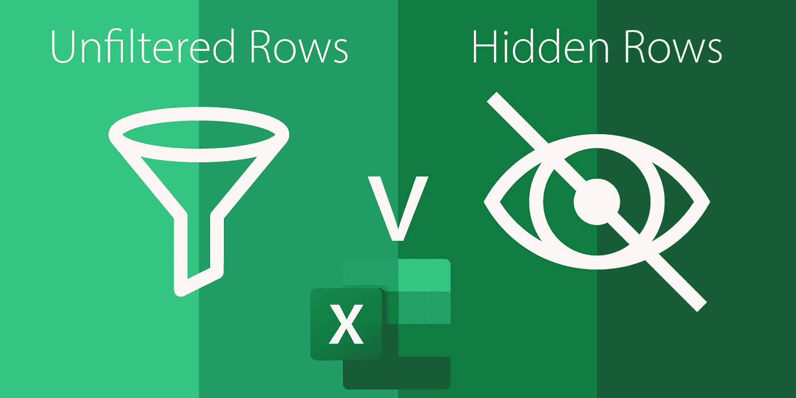

# Excel 如何处理未筛选和隐藏的行？

> 原文：<https://medium.com/codex/how-does-excel-handle-unfiltered-and-hidden-rows-d65b3bf516a9?source=collection_archive---------0----------------------->

## 可能会发生意外的计算

您知道过滤表格或隐藏行会影响您的 Excel 计算吗？

这是一个你很可能用肯定回答的问题。但是如果我深入探究，我知道你们中的许多人不会告诉我总和、小计和合计之间的区别…