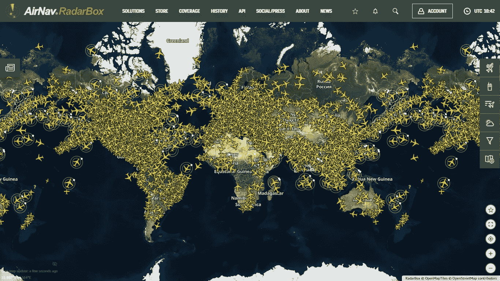
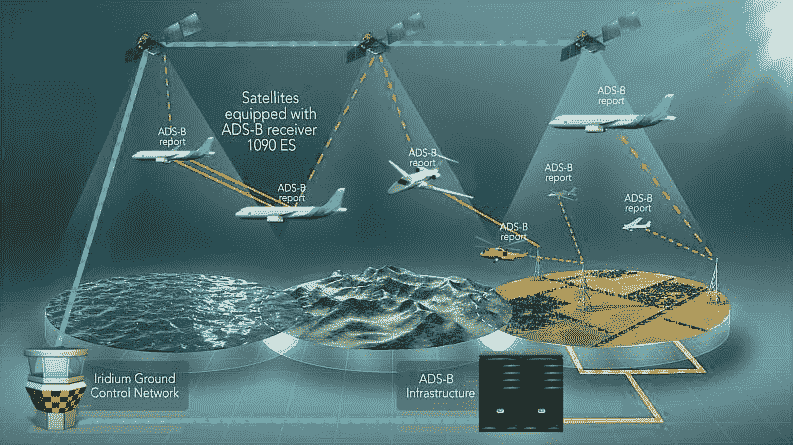
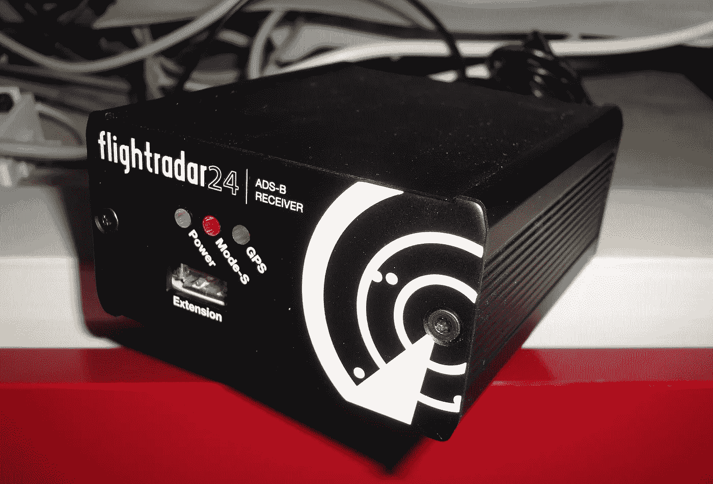
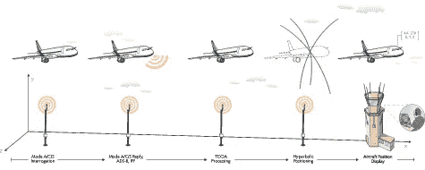

# 航班追踪网站是如何工作的？

> 原文：<https://medium.com/codex/how-does-flight-tracking-websites-work-5c624748500c?source=collection_archive---------9----------------------->

你有没有想过航班追踪网站是如何工作的？他们是如何获得如此准确的航班信息的？合法吗？

> 在我们进入之前，我请求你加入我的时事通讯。我保证你将来会有深刻的见解。让我们用惊人的内容来满足我们饥饿的头脑，你甚至可以亲自给我发消息来学习和写一些东西或你对它的看法。

 [## Niraaj 的时事通讯

### 喂养饥饿的心灵。点击阅读 Niraaj 的时事通讯，作者 Niraaj Ojha，是一个子堆栈出版物。启动 4 天…

niraajojha.substack.com](https://niraajojha.substack.com/) 

航班跟踪服务和网站给航空业带来了激动人心和有价值的变化。这些提供实时和历史的飞行信息，包括飞机的详细资料，路线，位置，速度，高度和方向。

雷达和机载应答机是让管制员看到飞机的主要方法。但是，其他人通常无法访问这些数据。自动相关监视广播(ADS-B)改变了这一点，飞机通过 1090 MHz 使用未加密信号广播数据。事实上，任何人只要有接收器和合适的天线就能接收到数据。

这是一个相对较新的方法，但它已经成为主流。飞机通过与卫星通信来确定自己的位置，然后将此广播给空中交通管制，以实现跟踪。ADS-B 还将传输飞机识别信息、高度和速度。它还可以接收天气更新、空域信息或其他 ADS-B 飞机报告等信息。

雷达跟踪仍然是长期以来飞机跟踪的全球标准方法，但 ADS-B 正在取代它。在美国和欧洲，所有商用飞机现在都被要求安装 ADS-B 技术。两个地区的空管升级项目都在进行中——美国的下一代空中运输系统和单一欧洲空中交通管理研究(SESAR)项目。ADS-B 将最终改变空中交通管制和飞机跟踪的工作方式，在以前受到限制的地区扩大覆盖范围。这也将允许更有效的飞机航线和间隔。这项技术还使飞机数据可供空管以外的来源使用，这就是航班跟踪网站获取数据的方式。

事实上，大多数商用飞机现在都在广播 ADS-B 数据。FlightRadar24.com 估计，现在 70%的商业交通都有 ADS-B 转发器，而且这个数字还会继续增加。但是这个数据是需要收集的。

这主要是通过志愿者来主持和操作 ADS-B 接收器，并将数据提供给跟踪网站来完成的。

这些大多是航空爱好者同意安装一个接收器，或天线，并将其连接到互联网。然后将该区域的数据提供给服务提供商。

对于完全的全球覆盖，需要一个巨大的网络，因为每个接收器将覆盖所有方向约 250-450 公里(150-250 英里)。FlightRadar24.com 声称目前有一个由 20，000 多个这种接收器组成的网络。该网站声称，它现在可以覆盖欧洲和美国 100%的巡航高度以上的空域，这在许多其他地区正在增加。安全和法律影响当然是一个问题，因此来自某些飞机或运营商的数据被阻止显示。

虽然 ADS-B 为飞行跟踪提供了主要的数据来源，但多边定位(MLAT)是一种使用来自几个接收器的数据来计算没有 ADS-B 转发器的飞机位置的技术。通过测量多个接收器之间标准转发器信号接收的时间差，可以跟踪飞机位置。FlightRadar24.com 覆盖了大部分欧洲和美国的领空，与 MLAT 的距离在 3000 英尺到 10000 英尺之间。传统的雷达源也可以用于某些领域。FlightRadar24.com 目前为北美以及大西洋和太平洋部分地区的商业交通提供标准雷达数据。

有许多航班跟踪网站，一些流行的有:

*   [Flightradar24](https://stfly.me/flightradar24)
*   [FlightAware](https://stfly.me/flightaware)
*   [寻面器](https://stfly.me/planefinder)
*   [飞行跟踪器](https://stfly.me/flightstats)
*   [导航雷达箱](https://stfly.me/radarbox)