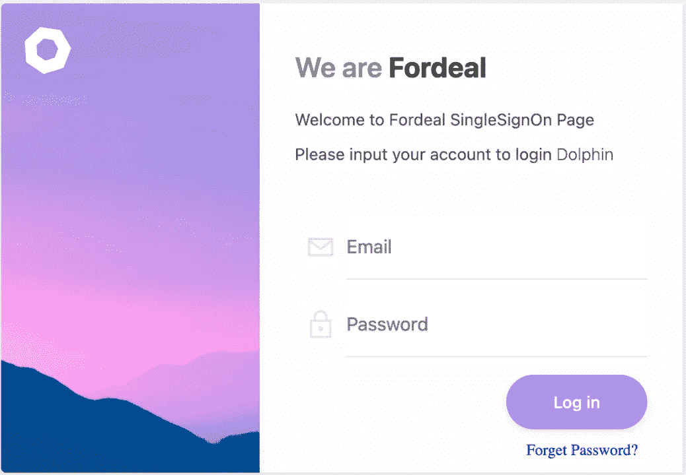

# Fordeal 数据平台调度器如何从 Azkaban 顺利迁移到 Apache DolphinScheduler？

> 原文：<https://medium.com/codex/how-does-fordeal-data-platform-scheduler-migrate-from-azkaban-to-apache-dolphinscheduler-smoothly-b00bbd7ac586?source=collection_archive---------24----------------------->

> Fordeal 的数据平台调度器之前是在 Azkaban 上搭建的，用于二次开发，但是无论是用户层面还是技术层面都很难使用。例如，它缺乏必要的功能，如任务可视化编辑界面和补充号码，这使得用户很难开始使用。在技术层面，架构已经过时，很难迭代。在这种情况下，经过对产品的对比研究，新版本的 Fordeal 数据平台决定对基于 Apache DolphinScheduler 的系统进行升级和迁移。
> 
> 开发人员如何顺利过渡到新系统，在整个迁移过程中做了哪些努力？
> 
> 在 5 月的 Apache dolphin scheduler online meetup 上，来自 Fordeal 的大数据开发人员鲁东分享了他在平台迁移方面的实践经验。

# 演讲者介绍

鲁东|来自 Fordeal 的大数据开发人员

5 年数据开发工作经验，目前就职于 Fordeal，主要从事数据技术包括数据湖和仓库集成、MPP 数据库、数据可视化等。

本演示包括四个部分。

*   福迪尔数据平台调度器的需求分析
*   如何适应向 Apache DolphinScheduler 的迁移
*   如何增强改编后的功能
*   未来规划

# 01 需求分析

## 背景

Fordeal 数据平台调度程序最初是基于阿兹卡班开发的。虽然它几乎不能充分支持机器分组、SHELL 动态参数和依赖性检测，但它很难处理日常使用中的以下三个问题，分别是用户级、技术级和 O&M 级。

首先，在用户层面，缺乏可视化编辑、补号等必要功能。它只适用于技术人员，而非非技术人员。阿兹卡班的错误报告模式也只允许开发者进行有针对性的修改。

其次，在技术层面，Fordeal 数据平台调度器的技术架构已经过时，前后端没有分离，所以增加一个特性或者重新开发都非常困难。

第三，操作和维护是最大的绊脚石。有时，系统会卡在流执行中。要处理这个问题，需要登录数据库，删除执行流中的 id，重启 worker 和 API 服务，非常繁琐。

## 02 研究

因此，当 2019 年 Apache DolphinScheduler 开源时，我们及时对它产生了兴趣，并开始了解是否有可能迁移到它上面。当时，我们基于我们的五个主要需求，对 Apache Dolphin Scheduler、Azkaban 和 Airflow 进行了比较。

*   基于 JVM 的语言是首选。这是因为基于 JVM 的语言在线程和文档开发方面更加成熟。气流是基于 Python 的，不适合我们非技术人员。
*   分布式架构，支持高可用性。Azkaban 的工作不是分布式的，web 和 master 服务是耦合的，所以是单个节点。
*   工作流必须支持 DSL 和可视化编辑。这确保了技术人员可以用 DSL 编写，而用户可以在可视化环境中编写。
*   前端和后端分离，采用主流架构。所以前端和后端可以分开开发，分离时耦合度降低。
*   社区活动。这是最后一个但并非最不重要的需求，因为留下来修复旧的 bug 会大大降低开发效率。

## 03 重构架构

带*的项目代表重新开发

我们今天的数据架构如上所示，Apache Dolphin 调度程序接管了从 HDFS 和 S3 收割到 K8S 计算的整个生命周期，然后是基于 Spark 和 Flink 的开发。左右两边的 DolphinScheduler 和 Zookeeper 都是作为基础架构使用的。我们的调度信息如下:Master x2，Worker x6，API x1(承载接口等。)，目前处理日均 3.5k 工作流实例，日均 15k+任务实例。(下图显示了 1.2.0 版本的架构)

# 02 适应和迁移

## 01 内部系统接口

Fordeal 的内部系统需要联机以向用户提供访问，并且必须连接几个内部服务以减少用户的启动成本和维护工作。其中包括以下三个系统。

*   单点登录系统。

基于 JWT 实现的单点登录系统，一次登录授权所有人。

*   工单系统。

DS 授权访问项目的工作订单，以避免人工操作和维护(访问所有授权操作以自动化流程)

*   警报平台。

扩展 DS 报警模式，将所有报警信息发送到内部报警平台，用户可以配置电话、WeCom 等报警模式。

## 02 阿兹卡班的兼容性

Azkaban 的流量管理基于定制的 DSL 配置，每个流量配置包含多达 800+或少至 1 个节点。它以三种方式升级。

1，用户本地保存，压缩，每次修改后上传，用户自己维护信息流。

2，所有的流配置和资源都托管在 git 上，绑定 Azkaban 项目设置中的 git 地址。Git 是我们自己开发的，点击刷新按钮后在页面提交。

3，所有流量托管在配置中心，对接阿兹卡班的上传接口覆盖之前的调度信息。

数据仓库项目的流配置文件

上图显示了一些数据仓库项目的**流配置文件的一部分。为了将 Azkaban 迁移到 Apache DolphinScheduler，我们一共列出了十个要求。**

*   **DS 上传接口需要支持解析流程配置文件，生成工作流**。(应该支持嵌套流。)流配置文件等于一个 Azkaban DAG 文件，这意味着我们必须编写代码来解析配置文件，如果它不匹配，就将流转换为 JSON。
*   DS 资源中心应该支持文件夹(托管阿兹卡班项目下的所有资源)。版本 1.2.0 中没有文件夹功能，而我们的数据仓库中有许多文件夹，所以我们必须支持文件夹。
*   DS 应该为客户端包提供基本的数据结构类和工具类，以便于 API 调用和为工作流生成配置。
*   DS 应该支持工作流的并发控制(并行或跳过)。
*   DS 时间参数需要支持配置的时区(例如 dt=$[ZID_CTT yyyy-MM=dd=1])。尽管我们配置的大多数时区都在海外，但大多数用户更愿意使用北京时区。
*   DS 运行和部署接口应该支持全局变量覆盖。像 complement 这样的一些功能在旧版本中是不可用的，用户需要为运行的工作流设置变量。
*   DS DAG 图应该支持任务多选操作。
*   DS 任务日志要输出最终的执行内容，方便用户查看和调试。
*   DS 应该支持在运行时手动重试失败的任务。通常，一次运行仓库需要几个小时，在此期间，任务可能会由于代码问题而报告错误。我们希望能够在不中断任务流的情况下手动重试任务，并在逐个修改错误的节点后重试，以确保最终状态是成功的。
*   仓库项目需要支持一键迁移，以跟上用户的工作习惯(Jenkins 对接 ds)。

经过与五个以上工作组的不断沟通和修改，我们使这十项要求最终得到满足。

## 03 功能优化总结

从阿兹卡班迁移到 Apache DolphinScheduler 大约花了一年时间。考虑到 API 用户、git 用户和各种函数用户的需求，我们已经提交了 140+次优化提交。

# 03 功能增强

## 01 前端重构

我们的痛点是什么？为什么要重构平台？我们回答这些问题有 6 个原因。

首先，阿兹卡班操作起来很麻烦。当用户想要找到工作流定义时，他们首先必须打开项目，在项目主页上找到工作流列表，然后找到定义；用户看一眼就找不到想要的定义。

其次，我不能通过名称、分组或其他标准来检索工作流定义和实例。

第三，不能通过 URL 共享工作流定义和实例细节。

第四，数据库表和 API 设计不完善，查询卡死，经常出现长事务告警。

第五，界面的一些部分是用死布局写的，比如设置的宽度导致增加的栏目不能很好的适应电脑和手机。

第六，工作流定义和实例不能批量操作。错误在程序中是不可避免的，但是它让用户困惑于如何批量重试任务。

***重构解决方案***

*   基于 AntDesign 库开发一套新的前端接口。
*   削弱了项目的概念，使用户忘记了项目，项目只是作为一个工作流或实例标签。目前电脑版只有四个入口，首页、工作流列表、执行列表、资源中心列表，手机版只有两个入口，工作流列表、执行列表。
*   将工作流列表和执行列表放在第一入口，简化操作步骤。
*   优化查询条件和索引，增加批量操作接口等。添加了联邦索引。
*   完全适配电脑和手机(除了编辑 dag，其他功能都一样)

## 02 相关性计划

**什么是依赖调度？**表示成功的工作流实例或任务实例主动触发下游的工作流或任务运行(执行状态依赖于执行)。**设想以下场景:**下游工作流需要根据上游工作流的调度时间来设置自己的定时；当上游运行失败时，下游计时也会出错；上游只能通知下游所有商家补数。难以调整上下游仓库的定时间隔，计算集群的资源利用率没有最大化(K8S)。这是因为用户没有持续提交。

***依赖调度规则***

*   工作流支持时间安排和/或依赖关系的组合。
*   工作流中的任务支持相关性计划(不考虑时间)。
*   依赖关系计划需要设置一个依赖期，只有在此期间内满足所有依赖关系时，才会触发依赖期。
*   依赖调度的最小设置单位是任务，任务支持对多个工作流或任务的依赖。
*   工作流只是执行树中的一个组概念，这意味着它不限制任务。

移动设备上的工作流依赖关系详细信息

## 03 任务扩展

扩展更多任务类型，抽象常用功能，提供编辑界面，降低使用成本。我们扩展了以下任务。

*   **数据开放平台(DOP)。**

主要提供数据导入导出功能(支持 Hive、Hbase、Mysql、ES、Postgre、Redis、S3)

*   **数据质量:**基于 Deequ 开发的数据验证。

用户使用的数据抽象。

*   **SQL-Prest 数据源:** SQL 模块支持 Presto 数据源
*   **数据沿袭集合**:内置于所有任务中，任务公开沿袭所需的所有数据。

## 04 监控警报

服务监控在 Java + Spring 架构下，一组通用的 Grafana 监控板可以显示细节，监控数据存储在 Prometheus 中。我们的原则是在不监控内部服务的情况下公开数据，避免重新发明轮子。转换列表如下所示。

*   API、Master 和 Worker 服务访问 micrometer-registry-Prometheus，收集公共数据，并公开 Prometheus 收集接口。
*   收集主线程池和工作线程池的状态数据，例如主线程池和工作线程池正在运行的工作流实例、数据库等。，用于后续的监控优化和报警。
*   Prometheus 端配置了服务状态异常告警，如工作流实例运行少于 n(阻塞)一段时间，服务内存& CPU 告警等。

# 04 计划

## 01 保持社区特色

Fordeal 大数据平台是基于第一个 Apache 版本的社区(1.2.0)二次开发运行的，我们通过监测发现了几个问题。

*   高数据库压力和高网络 IO 成本
*   Zookeeper 充当队列，导致磁盘 IOPS 不时出现峰值，带来潜在风险
*   命令消耗和任务分配模型相对简单，导致机器负载不均衡
*   这种调度模型使用了大量的轮询逻辑(Thread.sleep)，使得调度消耗、分发、检测等。无能的

社区发展很快，用现在合理易用的架构解决了很多问题。我们最近比较关注 Master 直接给 Worker 分配任务，减轻 Zookeeper 这种方便后续扩展的任务类型插件的压力。主配置或定制分配逻辑的优化，以使机器的复杂性合理化。更完善的容错机制和运维工具(优雅的上线或下线)。目前，工作人员无法优雅地上线或下线，这需要切断流量，等到线程池归零，然后更安全地上线或下线。

## 02 优化数据同步

目前只提供了相对粗粒度的工作流实例的执行统计。随后，需要支持更精细的统计，比如依赖于**任务过滤的统计分析、执行树、最耗时的执行路径**等。

除此之外，还应该增加更多的数据同步功能，比如增加执行统计的同步、链阈值告警等。，基于工作流警报。

## 03 连接到其他系统

当调度迭代稳定后，将逐渐作为基础组件，提供更便捷的接口和可嵌入的窗口(iframe)以允许更多上层数据应用(如 BI 系统、预警系统)等。以对接并提供基本的调度功能。

以上就是我要分享的，感谢阅读！

# 加入社区

参与 DolphinScheduler 社区并为其做出贡献的方式有很多，包括:

文档、翻译、问答、测试、代码、文章、主题演讲等。

我们假设第一个 PR(文档、代码)是简单的，应该用来熟悉提交过程和社区协作风格。

所以社区整理了以下适合新手的问题列表:【https://github.com/apache/dolphinscheduler/issues/5689

非新手问题列表:【https://github.com/apache/dolphinscheduler/issues? q = is % 3A open+is % 3A issue+label % 3A % 22 volunteer+wanted % 22

如何参与投稿:[https://dolphin scheduler . Apache . org/en-us/community/development/contribute . html](https://dolphinscheduler.apache.org/en-us/community/development/contribute.html)

GitHub 代码库:[https://github.com/apache/dolphinscheduler](https://github.com/apache/dolphinscheduler)

官方网站:[https://dolphinscheduler.apache.org/](https://dolphinscheduler.apache.org/)

邮件列表:戴夫@[dolphinscheduler@apache.org](mailto:dolphinscheduler@apache.org)

推特:[@海豚时间表](https://dev.to/dolphinschedule)

YouTube:[https://www.youtube.com/channel/UCmrPmeE7dVqo8DYhSLHa0vA](https://www.youtube.com/channel/UCmrPmeE7dVqo8DYhSLHa0vA)

松弛:[https://s.apache.org/dolphinscheduler-slack](https://s.apache.org/dolphinscheduler-slack)

投稿指南:[https://dolphin scheduler . Apache . org/en-us/community/index . html](https://dolphinscheduler.apache.org/en-us/community/index.html)

你的项目之星很重要，不要犹豫，点亮阿帕奇海豚调度❤️之星