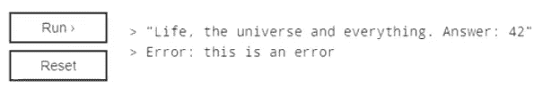
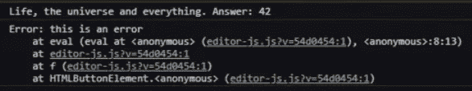

# MDN 如何拦截` console.log `？

> 原文：<https://medium.com/codex/how-does-mdn-intercept-console-log-27ef015f6dd4?source=collection_archive---------8----------------------->

## 这是魔法还是诡计？

[本帖视频版](https://www.youtube.com/watch?v=VBUEoOSj4OE)

[在上一篇文章](/codex/how-i-shared-my-websites-code-b35ae397ddfc)中，我们看到:

*   从 WebStorm 上传到 GitHub
*   语义版本控制
*   常规提交

在这篇文章中，我们想继续开发我们的代码编辑器。基本目标是创建一个框，用户可以输入一些代码，并通过触摸按钮，可以看到他们的代码的结果。

# 首次迭代行为


第一个实现是围绕`eval`函数设计的，其结果将显示在结果窗格中。输入字符串“hello”将导致显示`hello`。此外，分配一个变量，然后将该变量单独放在最后一行，结果窗格会显示该变量的值。

相反，使用`console.log`会更直观，MDN 在他们的交互式例子中就是这么做的。

# 第二次迭代的背景

在 NodeJS 中，可以读取`process.stdout`流，或者用自定义流创建一个新的记录器。因此，我寻找关于如何挂钩浏览器的`console.log`输出的资源。据我所知，没有办法在浏览器中获得`console`语句的输出。

但是，调用时可以截取`console.log`的参数。[一个 StackOverflow 答案有解](https://stackoverflow.com/questions/19846078/how-to-read-from-chromes-console-in-javascript)。通过将原来的`console.log`语句重新分配给一个新变量，我们可以将自己的自定义函数分配给`console.log`。注意，这并不截取日志语句的输出，而只是截取参数。

# MDN 是怎么做到的？

MDN 似乎具有读取控制台输出的能力，但进一步检查后，MDN 的交互式编辑器输出与浏览器的控制台不同。这意味着他们必须自己处理格式化。



查看 MDN 的简化的`editor-js`代码，使用了`new Function(t)()`而不是`eval(t)`来解析和运行输入。还有一个`try-catch`块来处理错误。

```
!function(t) {
  d.classList.add("fade-in");
  try {
    new Function(t)()
  } catch (t) {
    d.textContent = "Error: " + t.message
  }
  d.addEventListener("animationend", function() {
    d.classList.remove("fade-in")
  })
}(e.getDoc().getValue())
```

在查找`console.log`赋值时，在同一个文件中发现了以下代码:

```
var e = t("./console-utils")
  , n = console.log
  , r = console.error;
console.error = function(t) {
  e.writeOutput(t),
  r.apply(console, arguments)
},
console.log = function() {
  for (var t = [], r = 0, i = arguments.length; r < i; r++) {
    var o = e.formatOutput(arguments[r]);
    t.push(o)
  }
  var a = t.join(" ");
  e.writeOutput(a),
  n.apply(console, arguments)
}
```

这段代码非常符合 StackOverflow 的答案。每个参数都被迭代和格式化，然后连接在一起。原始参数也被传递回原始的`console.log`。

# 寻找源代码

经过一番侦查，我发现了 [MDN 的比特建造者(BoB)](https://github.com/mdn/bob) 。它是负责 MDN 上交互式示例的存储库。Mozilla 还慷慨地给了 repo 一个 MIT 许可。

例如，[这是上面](https://github.com/mdn/bob/blob/afa4e2fcb37725072d9f7b8a9a816c5c8af25f17/editor/js/editor-libs/console.js)的缩小代码块的原始源代码:

```
module.exports = function() {
    'use strict';var consoleUtils = require('./console-utils');
    var originalConsoleLogger = console.log; // eslint-disable-line no-console
    var originalConsoleError = console.error;console.error = function(loggedItem) {
        consoleUtils.writeOutput(loggedItem);
        // do not swallow console.error
        originalConsoleError.apply(console, arguments);
    };// eslint-disable-next-line no-console
    console.log = function() {
        var formattedList = [];
        for (var i = 0, l = arguments.length; i < l; i++) {
            var formatted = consoleUtils.formatOutput(arguments[i]);
            formattedList.push(formatted);
        }
        var output = formattedList.join(' ');
        consoleUtils.writeOutput(output);
        // do not swallow console.log
        originalConsoleLogger.apply(console, arguments);
    };
};
```

好奇的朋友，负责格式化 MDN 日志的文件在这里:[https://github . com/MDN/bob/blob/master/editor/js/editor-libs/console-utils . js](https://github.com/mdn/bob/blob/master/editor/js/editor-libs/console-utils.js)。当本地`toString()`方法的输出不够时，它有一些负责格式化日志行的规则。

# 寻找其他选择

安装了`mdn-bob`之后，我认为这个库对于 MDN 的用例来说太具体了。例如，库包含了我不需要的 CSS 样式。我只需要代码中的一小部分，格式化程序。

NodeJS 本身有一个[原生](https://nodejs.org/api/util.html#util_util_inspect_object_options) `[util](https://nodejs.org/api/util.html#util_util_inspect_object_options)` [库，这个库有一个](https://nodejs.org/api/util.html#util_util_inspect_object_options) `[inspect](https://nodejs.org/api/util.html#util_util_inspect_object_options)` [方法](https://nodejs.org/api/util.html#util_util_inspect_object_options)，可以格式化任何东西。在 NPM 上搜索了一下`util.inspect`的浏览器端口后，我选择了`[object-inspect](https://github.com/inspect-js/object-inspect)`。

尽管输出可能与浏览器不同，但我认为这种便利是一种合理的妥协。如果我的代码很整洁，将来换一个更好的库应该很容易。

# 构建第二次迭代

结合 StackOverflow 的答案和 MDN BoB 的答案，我从分配原始控制台语句开始。

```
*const* originalConsoleLogger = console.log;
*const* originalConsoleError = console.error;
```

注意，由于调用的是`console.log`而不是`window.console.log`，我们应该不会遇到服务器端渲染(SSR)的问题。

我将`console.log`和`console.error`重新分配给我各自的自定义功能。这些最终需要进入我们的 React 组件，因为处理参数的结果应该是组件状态的更新。

```
console.error = function () {
  // handle arguments
  originalConsoleError.apply(console, arguments)
}console.log = function () {
  // handle arguments
  originalConsoleLogger.apply(console, arguments)
}
```

我注意到我们可以通过使用箭头函数以及使用 rest 参数而不是`arguments`将它转换成 ES6 语法。[MDN](https://developer.mozilla.org/en-US/docs/Web/JavaScript/Reference/Functions/arguments#description)建议采用这种方法。为了保持函数参数和执行原始控制台函数之间的对称性，我选择使用`.call`而不是`.apply`。

```
console.error = (...args) => {
  // handle arguments
  originalConsoleError.call(console, ...args)
}console.log = (...args) => {
  // handle arguments
  originalConsoleLogger.call(console, ...args)
}
```

然后，参数将需要由`object-inspect`库进行处理。我没有使用`for`循环，而是选择使用`Array.reduce`。尽管多年的 ESLint 训练我不要使用`any`类型，但我认为在这种情况下这是可以接受的，因为`objectInspect`期望`any`作为输入。有这么多的“参数”,这无疑是一个盗版者最喜欢的功能。

```
*import objectInspect from* "object-inspect";/* ... */*const* reduceArgs = (formattedList: *any*[], arg: *any*) => [
  ...formattedList,
  *objectInspect*(arg),
];

*const* formatArgs = (args: *any*[]) => args.reduce(reduceArgs, []).join(" ");
```

# 使用函数代替 Eval

基于 MDN 的建议，使用`Function`比`eval`更快更安全。请注意，在大多数情况下，使用这两种方法都不安全。在这种情况下，代码是由用户在他们自己的浏览器中提供的，而不是在其他任何地方存储或重用。

```
*try* {
  *new* Function(code)();
} *catch* (e) {
  console.error(e);
}
```

# 让它起反应

所有需要做的就是在与`setResult`和`setError`状态相同的范围内移动每个函数，并使用`formatArgs`的输出更新状态。

```
*const StringPage* = () => {
  *const* [result, setResult] = *React*.*useState*("");
  *const* [error, setError] = *React*.*useState*("");
  const codeRef = React.useRef<HTMLTextAreaElement>(null); console.log = (...args: *any*[]) => {
    *const* formattedLog = formatArgs(args);
    setResult(formattedLog);
    originalConsoleLogger.call(console, ...args);
  };

  console.error = *function* (...args: *any*[]) {
    *const* formattedError = formatArgs(args);
    setError(formattedError);
    originalConsoleError.call(console, ...args);
  }; *const* evaluateCode = () => {
    *if* (codeRef.current === *null*) *return*;
    *const* code = codeRef.current.value;
    if(code.length < 1) return; *try* {
      *new* Function(code)();
    } *catch* (e) {
      console.error(e);
    }
  }; *return* (
    <>
      {/* surrounding JSX removed for clarity */}
      {result}
      {error}
    </>
  );
```

# TL；速度三角形定位法(dead reckoning)

浏览器的`console`输出无法读取。MDN 的交互例子覆盖了`console.log`，格式化了网页的参数，然后调用了原来的`console.log`。我在 React 中创建了一个组件来完成同样的事情。

*最初来自:*

 [## MDN 如何拦截` console.log `？| DevLog 003

### 在上一篇文章中，我们看到了:从 WebStorm 上传到 GitHub 语义版本化常规提交…

www.bayanbennett.com](https://www.bayanbennett.com/posts/how-does-mdn-intercept-console-log-devlog-003) 

这只是为了故事