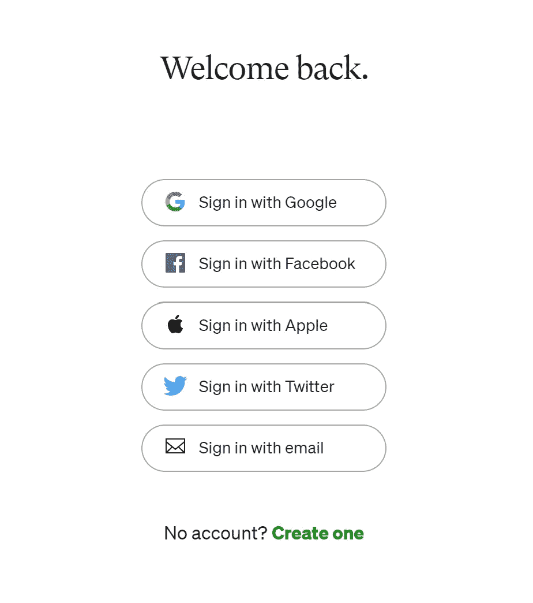

# OAuth 2.0 是如何工作的？

> 原文：<https://medium.com/codex/how-does-oauth-2-0-work-for-user-authorization-b0120504731b?source=collection_archive---------11----------------------->

理解 OAuth 2.0 流程。

# 什么是 OAuth 2.0？

根据官方文档， [OAuth 2.0](https://oauth.net/2/) 是授权的行业标准协议。

你一定在访问 Medium 这样的网站时看到过这个视图。

媒体的登录页面

中型和其他应用程序使用 OAuth 2.0 来帮助您登录并访问他们服务器上的数据…