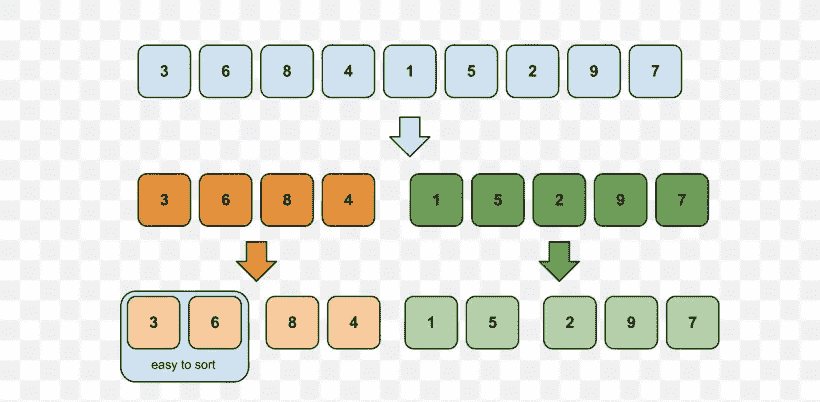

# 软件架构师如何帮助我选择软件模式？

> 原文：<https://medium.com/codex/how-does-software-architect-help-me-to-choose-software-patterns-be20dda7169a?source=collection_archive---------6----------------------->

嘿，又是我来这里问软件架构师一个问题。在我的故事中，大多数情况下，我选择问题作为标题。强调我的写作就足够了。哦，等等，这也是我应用的模式吗？:)

故事标题本身表明我们已经决定在我们的软件项目中使用一个模式。我们真的知道设计模式是什么意思吗？我们如何决定使用选定的 XYZ 模式？我们如何将这描述为一种设计模式？例如，[合并排序](https://en.wikipedia.org/wiki/Merge_sort)可以被认为是一种设计模式吗？让我们找出答案。

作为合并排序的一个例子(几个步骤)

在深入这个话题之前，我们需要找到这个问题的答案，模式是什么？*它为重复出现的设计问题提供了一个有用的解决方案。你知道我们更需要什么吗？太好了，你很擅长这个，一个设计问题。让我们从**确定设计问题开始。***

在应用所选择的 XYZ 模式之前，我们可能需要从优秀的软件架构师那里获得建议。可能会问，“嘿，X，在轻率地应用这个模式之前，你分析过到底需要解决什么吗？哪个范围和哪个领域的？你考虑需求的约束了吗？这种解决方案会有什么后果？”。

正如您所意识到的，一个好的软件架构师甚至在识别阶段就需要很多答案。例如，如果没有很好地解释范围，软件架构师可能会建议使用软件设计模式而不是[架构模式](https://en.wikipedia.org/wiki/Architectural_pattern)，反之亦然。当然，这不是最终决定，可能会被撤销。一个好的软件架构师应该在识别步骤之后问:“我们如何决定使用 XYZ 模式？我们还有其他选择吗？”。新的一章已经上线:**查看可用模式。**

首先，如果有人不知道图案宇宙中的 XYZ 图案，恭喜你，你有了一个新问题！未知的模式或被认为是模式的东西会带来风险。在这种情况下，软件架构师必须时刻保持警惕。为了缓解问题，应该问正确的问题，“*您已经检查过可用的模式了吗？*”。

你认识到 XYZ 模式实际上是众所周知的 XYZ 排序算法。那么，有什么区别呢？作为模式还有用吗？不，请不要这样做。算法给出了如何通过执行小指令一步步解决问题的配方。设计模式就像一个蓝图:一个结构化的对象、关联和动作的集合，用来完成某个目标。

有许多不同的模式，但其中只有少数几种适合您的问题。因此，必须将模式空间缩小为解决问题的有用模式。有许多不同的书籍可以帮助我们选择正确的模式，例如 [GoF 设计模式](https://en.wikipedia.org/wiki/Design_Patterns)或 [POSA 系列。](https://en.wikipedia.org/wiki/Pattern-Oriented_Software_Architecture)

但是，如果我们不能为一个特定的问题找到任何可行的模式，我们该怎么办？*不要强迫自己为每个问题建议一种设计模式。如果没有可用的模式，就提供没有模式的解决方案。* **否则，我们准备分析后果。**

现在，我们有了一个模式的决定，我们知道以正确的方式解决正确的问题。然而，这仍然不是选择模式的最后一步。在软件架构中，质量属性之间可能会有一些折衷。你唯一要做的就是，分析需求和约束，应用正确的设计策略，找到足够的- *不一定是最好的*-解决方案。如果为选择的模式付出的代价没有超过它的好处，我们可以说我们在正确的轨道上。例如，开发人员可能不熟悉异常设计模式。此外，理解模式并应用它可能需要几天时间。在这种情况下，你应该尽可能提出最简单的解决方案。使用罕见的模式并不能让我们成为天才或传奇！完美，现在我们正在**实现所选的模式**阶段。顺便说一下，如果它不适合你的问题，不要强迫其他人使用设计模式。

一个好的架构师不会实现所选择的设计模式，或者他会吗？对我来说，这可能是另一个故事标题，但现在我们必须专注于实施。作为软件架构师，您应该指导开发人员将模式集成到遗留设计中。通过扩展测试场景，确保有了新的模式，一切都如预期的那样运行良好。然而，团队意识到 XYZ 模式是不够的，你可能需要另一种被称为 ABC 的模式。完美，他们的成熟度很高，并且他们立即开始实施。继续努力吧！哦，等等…同时实现两种不同的模式是安全的吗？

该问题可能需要多个模式，但每个模式必须单独应用。从最重要到最不重要对设计问题进行优先级排序。之后，在每次迭代中做同样的事情，直到所有的子问题都以正确的方式被处理到所选择的模式中。组合这些模式值得单独编写一个故事。

在实现阶段，开发人员可能会开始抱怨潜在的解决方案并不是最合适的。为了防止这样的问题，您应该考虑“*模式不是恒定的东西*”。这意味着你可以对它进行裁剪，并根据你的需要调整所选的图案。

所有的事情都完成了，我们应该高兴。我们还需要遵循其他步骤吗？当然，最后一步是“**审查和重构，如果必要的话**”。

到目前为止，我们描述了许多选择正确模式的步骤。即使我们遵守所有的规则或准则，也不要忘记我们是人。我们可能是错误的，或者可能做出错误的决定。我们必须意识到如何减少错误的决策。回顾和重构。如果最合适的模式不适合我们的架构，它会在开发阶段误导我们。你没有迟到，我们有一个回顾和重构的空间。然后，请返回到步骤“**检查可用模式”**，为您的问题找到一个替代模式。再次检查每一步，如果有必要的话，进行修改。

因此，我们必须遵循许多步骤来为我们的问题选择正确的模式。在这个旅程中，软件架构师应该理解为什么您的问题需要一个设计模式，考虑替代模式，必要时建议架构模式，确保模式适合上下文和需求，在实现阶段关注集成设计模式，并在必要时重构它。不要忘记设计模式只是一种工具，而不是需要小心应用的灵丹妙药。