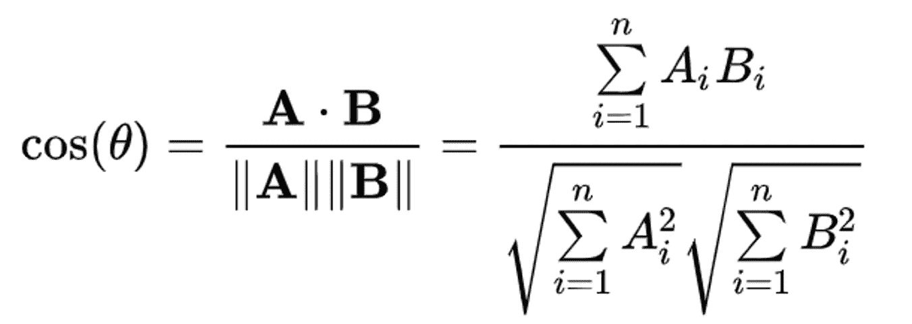

# Spotify 怎么知道你会喜欢什么歌？

> 原文：<https://medium.com/codex/how-does-spotify-know-what-songs-youll-like-17846c357d5c?source=collection_archive---------10----------------------->

## 对 Spotify 推荐算法和个性化内容的简短思考

今天，在回家的出租车上，我像往常一样——享受着四月的雨，播放着我最喜欢的音乐。不太健谈的出租车司机和没有更好的事情可做让我想知道音乐推荐算法到底是如何工作的。Spotify 分析哪些参数？它有检测流派的方法吗？最让我感兴趣的是，它如何知道两首歌是否相同？

由[亚历山大·沙托夫](https://unsplash.com/@alexbemore?utm_source=medium&utm_medium=referral)在 [Unsplash](https://unsplash.com?utm_source=medium&utm_medium=referral) 上拍摄的照片

在本文中，我将尝试回答其中的一些问题，并对 Spotify 算法的魔力提供一些见解。

简单来说，Spotify 使用一种叫做**近似最近邻搜索、**的算法，根据共同的属性或品质将歌曲和用户分组。例如，如果你和我都喜欢听阿黛尔和阿姆，以及其他一些共同的艺术家，我们将被认为属于同一组用户。这意味着，如果我也听 Lil Peep，但你还没有，Spotify 会在你的每日或每周推荐中为你推荐 Lil Peep。

Spotify 分析歌曲的另一种有趣方式是通过 **MUSIG** 系统。这是一种将歌曲分解成各个部分的方法——乐器、歌词、情绪，你明白了。这种方法在日本特别受欢迎，那里有一个跟着唱的功能，可以降低音量，让你跟着自己喜欢的曲调唱。

MUSIG 系统的更多技术概述:[*https://research . atspotify . com/making-sense-of-music-by-extracting-and-analyzing-individual-instruments-in-a-a-song/*](https://research.atspotify.com/making-sense-of-music-by-extracting-and-analyzing-individual-instruments-in-a-song/)

照片由 [Marcela Laskoski](https://unsplash.com/@marcelalaskoski?utm_source=medium&utm_medium=referral) 在 [Unsplash](https://unsplash.com?utm_source=medium&utm_medium=referral) 上拍摄

现在是有趣的部分。我总是喜欢在我连续听了几个月的 10 首歌曲的播放列表中，出现一个新的宝石。一种完全不同的风格，让你着迷和惊喜。Spotify 是如何做到这一点的？

为了探索用户不断变化的口味，Spotify 有时会加入用户不熟悉的探索性内容，并跟踪用户的反应。

本文总结了一般推荐系统中探索和利用算法之间平衡的重要性:

## *但是它怎么知道两首歌是否相似呢？*

*这都归结到一个重要的概念——**余弦相似性。本质上是一种机器理解两个事物有多相似的方法。我们需要一点高中数学知识来理解这一点。***

*当我们有两条相互垂直的线(或向量)时，它们之间的角度是 90 度，这个值的余弦是 0，这意味着我们的 2 个向量非常不同。如果这两个向量是平行的，那么它们之间的角度是 0，这个角度的余弦值是 1，所以它们尽可能的相似。*

**

*对于每个熟悉向量的人来说，余弦相似性公式与向量点积公式是相同的:)*

*我们可以创建不同维度的向量，例如，点击率和排名，可以是定义一首歌的二维向量。*

*然后使用这种计算的方式是通过创建热图——与你的口味非常相似的歌曲，有些相似，有些不相似。Spotify 然后会选择这些歌曲类型的特定比例，并在你的播放列表中加入这些歌曲供你欣赏。*

## *在你走之前…*

> *我很想听听你对 Spotify 算法的看法——你知道有哪些推荐做得更好的应用吗？**祝您愉快，敬请期待更多精彩！***