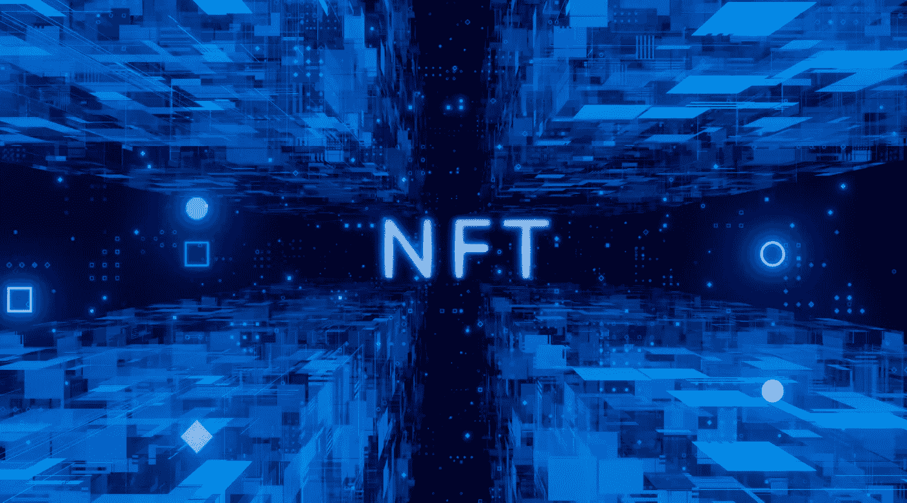
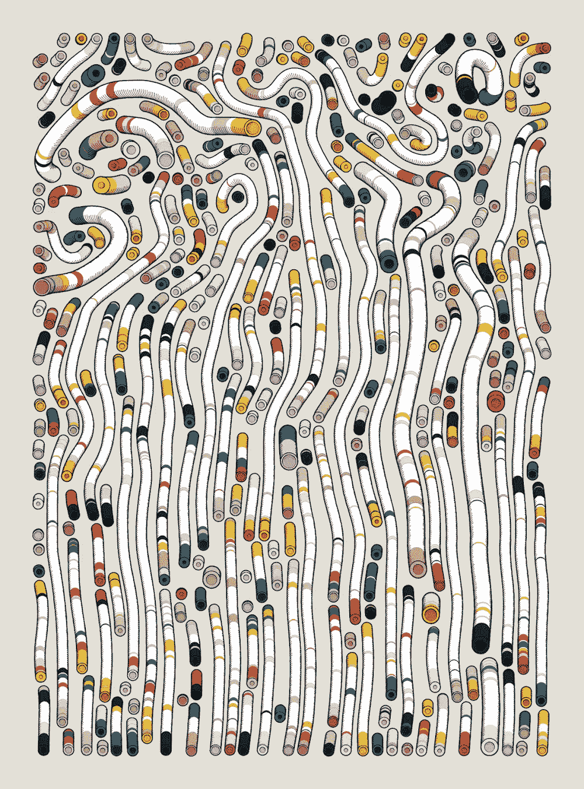

# 每天 10 倍的 NFT 市场如何赚钱和赔钱？

> 原文：<https://medium.com/codex/how-does-the-10x-a-day-nft-market-make-and-lose-money-23608047f179?source=collection_archive---------12----------------------->

来源: [pixabay](https://pixabay.com/photos/nft-non-fungible-token-blockchain-7004985/)

我看到一个群友说他一天到晚 600 个 NFT 白名单，90%都破了！

又是一个不和谐，又是一个电报，又是一个转发，辛辛苦苦拿到了每个项目的白名单，但是坏掉的项目太多了。

刚刚花了 0.1eth 买了第一台 NFT，一眨眼价格就跌到了 0.01eth。

安德烈·梅特列夫在 [Unsplash](https://unsplash.com?utm_source=medium&utm_medium=referral) 上的照片

大部分人的白名单不到 600，没有那么多时间精力去抢白名单。如果你选择买一打或者更多的 NFT，很大概率会归零或者被套。

虽然 NFT 每天都有神话，但都是别人拥有的。有些是项目方宣传发行的需要。只有创造出典型而丰富的神话，才能让人们继续追随并进入市场。

在整个 NFT 市场，短期盈利太难了。

## **1。如何玩 NFT 赚钱？**

目前，NFT 更多的是数字收藏和炒作，具体应用较少。收藏品的价值比较主观。有人买就有价值，没人买就没价值。

比如这只 BAYC Boring Ape #7089 NFT 刚刚在 86 ETH 成交，但是 16 天前的成交价是 110 ETH。

持有人下单卖出，没人买，无法卖出，或者只能低价卖出。

无聊猿#7089 NFT(来源: [opensea.io](https://opensea.io/assets/0xbc4ca0eda7647a8ab7c2061c2e118a18a936f13d/7089) )

去年 5 月份 Boring Ape #7089 的铸造价格仅为 0.06 ETH。按照现在的成交价，9 个月的涨幅是 1433 倍。

如果你当时有眼光，买了这只猴子，现在拿到手，180 美元已经变成 53 万美元了，超高的回报率。

弗兰克·布希在 [Unsplash](https://unsplash.com?utm_source=medium&utm_medium=referral) 上拍摄的照片

还有最近很火的小月系列。志那都红豆#5580 刚刚以 16.8ETH 的价格成交，一个月前铸造于 1ETH，一个月内涨幅近 17 倍。

志那都红豆#5580 NFT(来源: [opensea.io](https://opensea.io/assets/0xed5af388653567af2f388e6224dc7c4b3241c544/5580) )

如果有人认可社群的价值，愿意在社交平台上表明自己的身份，就会形成越来越多的共识。再加上项目方的不断营销，NFT 可能会向更好的方向发展。

如果你能在早期买入并持有，市场有潜力给出非常好的回报。

## **2。玩 NFT 怎么会输钱？**

除了上升的 NFT，其中一些已经打破或归零。比如这款 Mind Gap 系列的 NFTs，地板价格从 3ETH 降到了 1.13ETH。

这张图介意差距#674 是 2 月 6 日 0.15ETH 铸造，8 天前 0.6ETH 卖出，然后 3ETH 卖出，4 天前 1.15ETH 卖出。

短时间内更大的波动也意味着更大的风险。

介意 Gap 系列#674(来源: [opensea.io](https://opensea.io/assets/0x0e42ffbac75bcc30cd0015f8aaa608539ba35fbb/674) )

长期持有可能更有可能增加数倍，更有可能为零。但对于短期持有，你要么会得到一份白名单，要么好处可能不明显。

在 3ETH 买入，在 1.1512 卖出后，4 天损失了 1.8ETH。

如果要快速卖出，要么低于市场价卖出，要么继续持有，不确定性较大。

如果能长期持有，需要付出一定的时间成本才能卖出。

PHANTA BEAR #8686 NFT(来源: [opensea.io](https://opensea.io/assets/0x67d9417c9c3c250f61a83c7e8658dac487b56b09/8686)

还有这只幻熊 PHANTA BEAR #8686，一个月前卖 8.6ETH，5 天前卖 3.9ETH，一个月就跌了 4.7ETH。

幻影熊 NFT 目前的底价是 1.6ETH，首发价是 0.26eth

当然也有可能是幻熊起飞，但是买 NFT 的时候一定要做好长期持有的打算，因为买点就是高点，短期内不一定能卖出。

## **3。NFT 的特点和风险是什么？**

NFT 是不可替代的令牌，每个 NFT 都是不同的，也没有统一的价格。

另外，NFT 的流动性差，买了也不一定能马上卖出去。卖不出去的只是一张图片，只能被套牢。

NFT 可能 2 天翻 10 倍或者 20 倍，也有 90%的概率破。市场没见过这一系列的 NFT，没有价值，不能炒作；

那些被白名单投出去的人将失去他们的投资。

## 结论

NFT 被无声地发出并无声地归零。白名单投放也有风险。有些项目剪了白名单就不玩了，然后就没有了。

NFT 是有风险的，你必须在投资前想好怎么玩。没有知识，就赚不到他们的钱。

> 以上只是我个人的看法和总结，不含投资建议，读者的任何投资行为与作者无关。