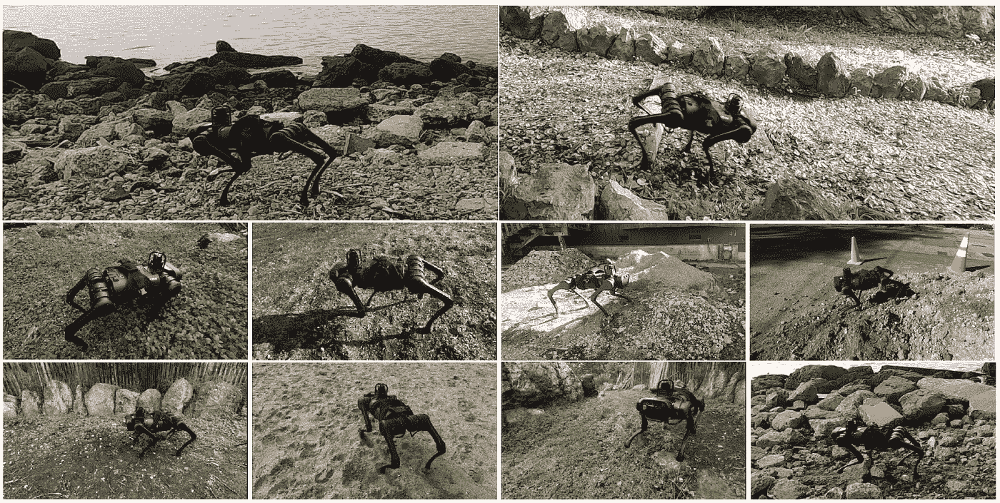
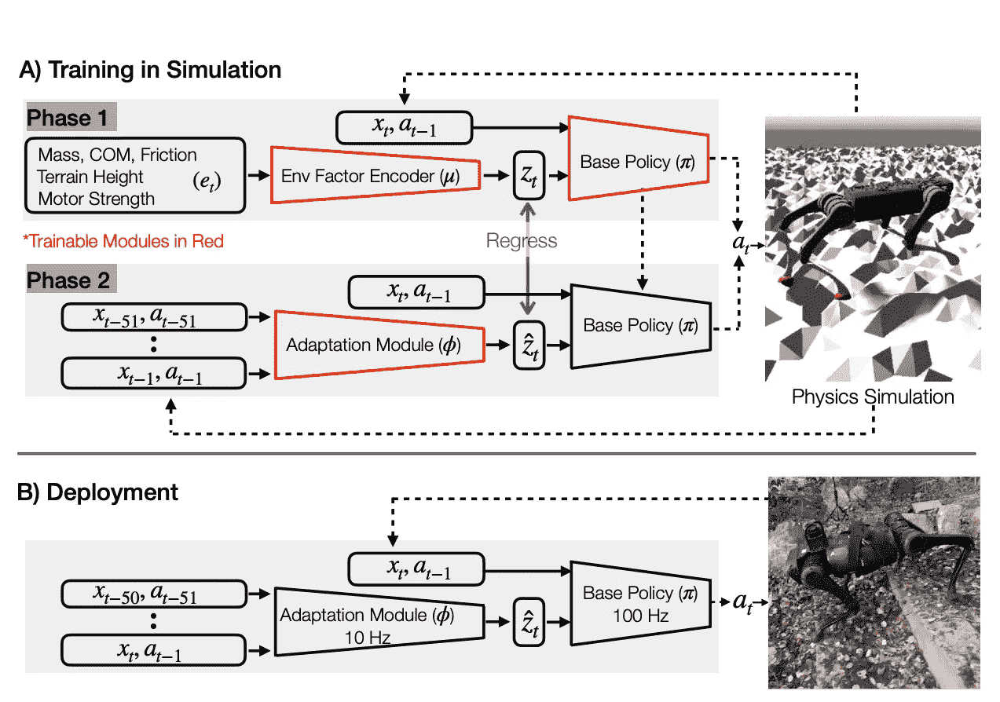
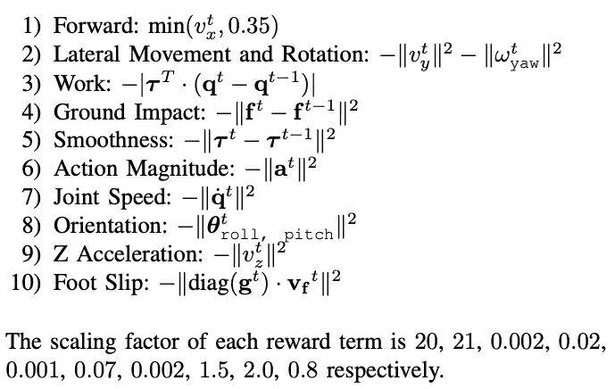
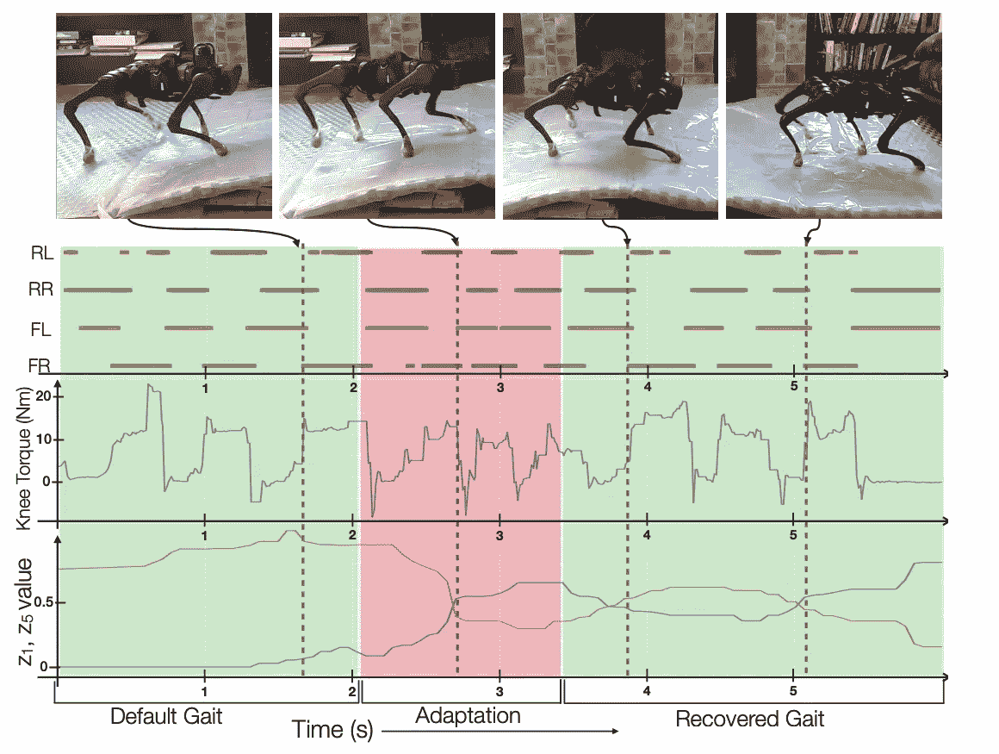
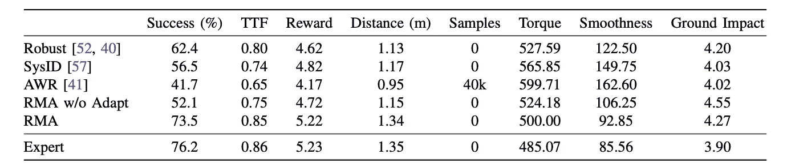

# 一个失明的机器人能走多远？

> 原文：<https://medium.com/codex/how-far-can-a-blind-robot-go-2cd789d3b0fe?source=collection_archive---------9----------------------->

> 这是根据我对这篇论文的理解所做的总结——**RMA:Kumar 等人(2021)在 RSS 21 [ [链接](https://arxiv.org/abs/2107.04034) ][ [视频](https://t.co/WLpVRW5rNK?amp=1) ]上接受的腿式机器人**的快速运动适应。
> 
> **TL；博士**——这篇论文着眼于在模拟中训练“代理人”，并在没有任何微调的情况下将他们部署到现实世界中。在这里，代理被期望根据他们在真实世界中被介绍到的地形/环境的要求来“适应”。这种适应是通过使用一个专门的神经网络来实现的，该网络根据机器人传感器的反馈实时学习环境。为此，军事革命利用一个学习如何行走的基础政策模块和一个学习理解环境动态(摩擦力的变化、重心的移动等)的适应政策模块。这有助于将学习环境物理学与学习执行任务分离开来。
> 
> **优势** —
> 
> 1)该论文基于一种不需要专家监督(模仿学习)或精心创造的启发式(控制理论)的范式。
> 
> 2)进一步，适应模块在线运行，学习应对环境的新变化；从模拟到现实世界有一个平稳的过渡。
> 
> 3)最后，环境的物理参数与状态表示的解耦使得能够分别学习它们并进行更快的适应。
> 
> **注意事项** —机器人(或智能体)完全依赖感官信号——本体感受——无法预见或应对环境中突然的“巨大”变化。例如，机器人从悬崖边滑落！除了这些极端的例子，作者还展示了智能体如何通过快速适应来应对未知和艰难的环境！
> 
> 未来方向——正如作者在结论中提到的，给这个机器人增加视觉输入，并给它们**视觉感受！**此外，这里作者主要关注“一个策略遍历所有策略”，这将是一个有趣的研究，看看“一个策略遍历 *X* ，遍历所有策略”——也就是说，不管代理拓扑如何，它都会学习遍历 *X* 。在模拟环境中，已经有很多这方面的工作，看看它如何应用到现实世界会很有趣。使模型学会行走的基础策略是在近似策略优化(PPO)的帮助下训练的(舒尔曼等人，2017)。看看该模型是否会受益于内在奖励将是有趣的(Pathak 等人，2017；布尔达等人，2018 年)。最后，向代理灌输关于运动、摩擦等基于物理学的先验知识会很有趣。

机器人通过基于环境的适应来导航更困难的、新的地形(代理/机器人在模拟中没有见过的环境)。

对于一个健康的人(甚至是一个孩子)来说，学会穿越不同的地形、避开障碍物、失去平衡时重新保持稳定等等，听起来可能是微不足道的。)，但这对于机车机器人来说并不是那么简单的任务。从根本上说，人类学会了适应性地施加压力，使用其他形式的支撑(我们利用整个身体来平衡自己)，在艰难或光滑的地形上行走时改变脚踝(或其他关节)的位置。我们做出这些选择，部分是因为我们对环境中一些基于物理学的先验知识的隐含理解。

多年来，我们已经看到研究人员致力于将这种能力转移到机器人身上——使它们能够行走、奔跑、移动障碍物等等。广义地说，目前机器人学的大部分成功都是在非常专业的环境中取得的。我们可以在下面的视频中看到，波士顿动力公司的机器人可以轻松地通过艰难的地形，但却无法完成更简单的任务，即在货架上放置物体。

上面的视频只是为了展示制造具体化人工智能的整个领域是多么复杂！回到本文，快速运动适应(RMA)是一种 2 阶段算法，完全在基于物理的模拟器中训练，并部署到现实世界中，目的是*在飞行中学习*！在这里，机器人使用了 Unitree 的 [A1 机器人](https://www.unitree.com/products/a1/)。我们可以从图 1 中看到 RMA 如何使 A1 机器人能够通过它从未见过的表面。作者还进行了广泛的消融研究(注意不要通过部署非常幼稚的策略来损坏机器人),并表明 RMA 在几乎所有情况下都明显优于其他方法。大多数结果可以在下面的视频中更好地可视化！

# 算法

设计该系统时需要考虑的几个问题

1.  我们需要模型是*轻量级的*，以便能够在边缘部署。
2.  很难*估计一个新环境的物理先验*，也就是说，仅仅通过在一个表面上行走来计算它的摩擦力是不简单的。
3.  由于糟糕的政策可能造成的损失成本，*模型必须从模拟*中很好地了解真实世界*！*

在这里，作者利用了一个基于[模型的强化学习](https://bair.berkeley.edu/blog/2019/12/12/mbpo/)算法和模型的简单多层感知器(MLPs)。RMA 算法和大多数其他 ML 算法一样，有两个阶段——训练和测试。

## 培训阶段

RMA 的不同阶段如上所示。有趣的是，基本策略(∏)比适配模块(⦶).)快 10 倍这是因为与基本策略网络相比，适配模块需要看到更长的周期(比如 50 步)。这在部署中工作得很好，因为环境先验的变化不会像状态的变化那样快。

如前所述，整个训练在模拟器中进行，并使用生物能学启发的奖励功能。这个过程可以进一步分为两个阶段。

**第一阶段**

使用*近似策略优化* (PPO)训练基本策略网络(3 层 MLP)。策略的输入是——当前状态( *x (t) ∈ R ⁰* )、先前动作( *a(t-1) ∈ R* )和外部向量( *z(t) ∈ R⁸* )，并输出 a(t)基于策略的最佳动作。现在，更多关于*非本征向量(z(t))* 。一组 17 个环境细节或物理先验( *e(t) ∈ R ⁷* )如地形摩擦、高度、质量等从模拟器中导出，然后通过环境因子编码器*产生 z(t)。*是一个 X 网络。*一个潜在的问题是，为什么我们需要 env 编码器？为什么我们不直接使用身体先验？我们马上就能解决，坚持住！*

现在，使用这种方法，基本策略被训练来很好地导航模拟器。值得注意的是，模拟器创造了多种环境，类似于艰难的地形，不同程度的摩擦等。这使得模型能够看到 z(t)的不同形式。

RL 奖励函数是多个因素的总和，这些因素包括最小速度、角速度、惩罚急动、做功、扭矩等。

***v*** 表示线速度， **θ** 表示方位， **ω** 表示角速度，均在机器人的基坐标系中计算。进一步地， **q** 代表关节角度，**q**关节速度， **τ** 关节扭矩， **f** 脚部地面反作用力，V **𝒻** 脚部速度， **g** 为二进制脚部接触指示向量。在时间 ***t*** 的报酬被定义为这些的加权和。

**二期**

基本策略经过培训可以很好地在模拟环境中导航，我们进入第二阶段的培训。还记得适应模块是如何被强调为这项工作的主要贡献之一的吗？好吧，这就是我们开始明白原因的地方:)

现在，正如我们所知，在测试期间，很难(如果不是不可能的话)访问 e(t)。因此，我们需要一种方法来*学习*这些基于环境的特性。对我们来说好的是，我们仍然在模拟环境中，我们可以访问 e(t)！

我们采用 50 个时间步长的数据(状态，动作对-> x(t)，a(t-1))来训练我们的环境估计器。为了对这对 *{x(t)，a(t-1)}* 进行采样，我们有两个选项，利用学习到的最佳基本策略(∏)，或者为此使用随机初始化的策略网络。我们选择后者，因为我们希望我们的模型学会快速估计环境因素，并且当它受到一组未知的 *{x(t)，a(t-1)}* ！适配模块(⦶)采用这组生成的状态-动作对来估计。在这里，由于我们在模拟中，我们可以访问基本事实 z(t ),因此可以将它作为一个简单的监督学习问题来学习。自适应模块(⦶)利用一维 CNN 来捕获状态-动作对列表中存在的时间相关性。

后退几步，我们讨论了为什么我们需要估计，为什么不直接估计。这变得更加复杂，并且在某种程度上是不必要的。当在表面上行走时，解决估计摩擦力的逆问题并不简单。此外，我们不关心这些参数的确切值，我们更感兴趣的是了解这些变化对我们的基本策略模型的行为的影响。因此，我们学习估计(t ),这是环境参数对基础策略模型的影响的一种更抽象的表示！

## 部署/测试

通过学习适应模型和基本策略模型，我们可以将它们部署到现实场景中，以了解模型的性能。正如我们在早期的视频中看到的，机器人学会了快速适应新的环境，并且表现出优于所有其他使用的方法。在上面的图像中，我们可以看到机器人如何在步态和扭矩输出方面发生突然变化，但很快学会适应它。这种变化是由于遇到了油性表面，但机器人很快恢复了平衡，并穿过床垫！

从下表中，我们可以看到 RMA 模型明显优于其他系统，与专家系统相比仅略差。所有结果都是在分别运行 1000 集的 3 个随机策略后报告的平均值。

**结论**

这篇论文为在模拟环境中向代理注入更好的基于物理的先验知识并在现实世界中部署它们而无需微调开辟了一个强有力的方向。机车机器人的这种零射击适应有一天有助于建造可以帮助灾难恢复、帮助弱势人群等的机器人。此外，该论文指出了一种有效的方法，在没有专家监督的情况下将任务和环境先验解耦，使其可扩展到在广泛的假设下进行研究。一些未来的方向可能是

1.  设计更好的奖励函数、内在动机等等——从根本上尝试改进政策网络，使其更加强健和可扩展
2.  用*“看”*的能力，或感觉来帮助当前具体化的 AI 智能体。
3.  看到训练一个策略完成更多任务——行走、跳跃、闪避——的不同影响了吗？

如果你已经读到这里，非常感谢，希望你能读到一些新的有趣的东西！请查看[原始论文](https://arxiv.org/pdf/2107.04034.pdf)以获得更深入的分析和结果！请随时让我知道你的想法。我是这方面文献的初学者，如有理解上的错误，欢迎随时指出！乐学！

[推特](https://twitter.com/rohanalchemist) | [领英](http://linkedin.com/in/rohan-sukumaran-3271ba145)

PS —所有数字均取自原纸。这些信息图表的所有荣誉归原作者所有。谢谢！