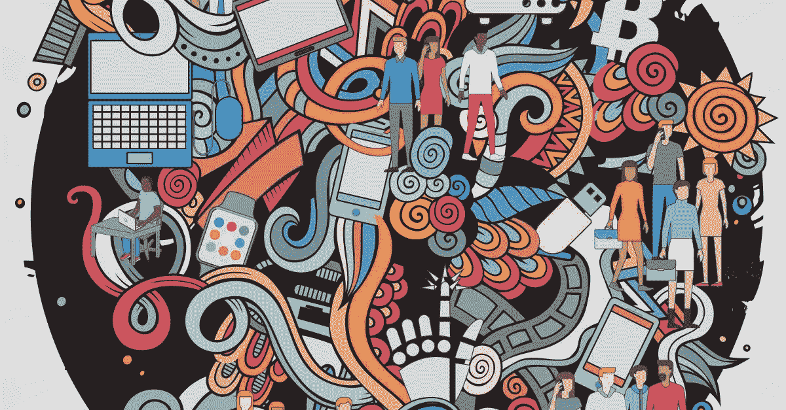
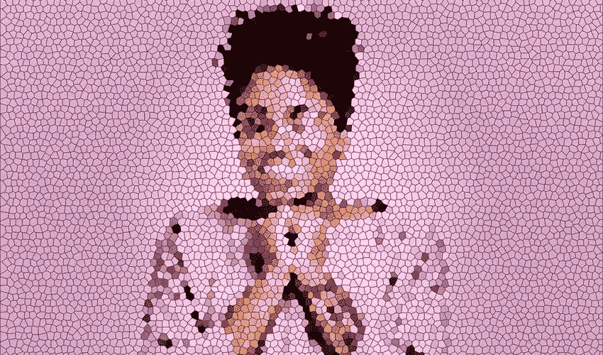
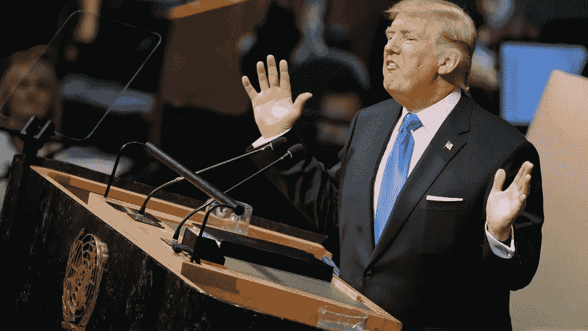

# 人工智能的发展能走多远？

> 原文：<https://medium.com/codex/how-far-the-development-of-artificial-intelligence-can-go-26fcacf57e64?source=collection_archive---------25----------------------->

数字技术的发展日新月异。跨境边界扩张非常迅速，数字边界甚至更快。随着人工智能的快速发展，人们越来越担心其使用和假新闻的制造。众所周知，虚假信息、传播虚假新闻是当今的挑战。但是，当有一天边界被跨越时，我们能做些什么呢？人工智能生成的世界领导人的视频呼吁之一，是否应该公开呼吁战争？

信用:[https://Twitter . com/manpowergrps _ uk/status/959007429341204482](https://twitter.com/manpowergrps_uk/status/959007429341204482)

大多数人已经习惯了多种形式的图像处理:如今，一个智能手机应用程序可以在几分钟内帮助改变照片的任何细节，或者，例如，与任何人交换面孔，包括政治家，并开始代表他们说话。但这些图像(和视频)通常非常容易与真实的图像区分开来，至少因为图像不完美。
然而，人工智能的能力已经达到了能够生成极其逼真的人的照片和视频的水平，其真实性甚至连他自己都难以验证。

鸣谢:[https://specky boy . com/photo-manipulation-Photoshop-tutorials/](https://speckyboy.com/photo-manipulation-photoshop-tutorials/)

“我们经常被告知不要相信我们读到的一切，但很快我们将需要开始怀疑我们看到和听到的一切，”[卫报说。专家警告称，人工智能将很快不仅能够伪造照片，还能伪造音频，这将使打击假新闻和错误信息的斗争变得非常复杂。](https://www.theguardian.com/technology/2017/jul/26/fake-news-obama-video-trump-face2face-doctored-content)

此外，人工智能不仅能够操纵音频和视频图像，还将知道如何最好地唤起人们的强烈情绪。据咨询公司麦肯锡公司(McKinsey & Company)称，研究人员决定让深度神经网络审查数千个短磁带，以找出电影中哪些时刻特别情绪化。然后他们在真人身上测试人工智能解决方案，证实了机器的结果。

哈尼·法里德教授是检测虚假照片和视频的专家，他特别“关注病毒式内容传播的速度和扫描过程的速度。《连线》杂志称，法里德设想在不久的将来，美国总统唐纳德·特朗普下令彻底摧毁朝鲜的令人信服的假视频会像病毒一样传播开来，并引起恐慌，就像人工智能时代的世界之战的翻版。

鸣谢:[https://www . theatlantic . com/international/archive/2017/09/trump-Kim-north-Korean-nuclear-United nations/540447/](https://www.theatlantic.com/international/archive/2017/09/trump-kim-north-korea-nuclear-united-nations/540447/)

这表明，公司将很快使用人工智能来制作比任何导演都能想象的更好地操纵人类情绪的内容。但是研究者中已经有一些人担心同样的方法会被媒体公司和国家用于他们自己的目的。

专家们一致认为，可能没有什么可以阻止人工智能创造的内容浪潮，这些内容也将被用于政治目的。桑德拉·厄普森在《连线》的一篇文章[中称，随着人工智能的发展，“将越来越多地模仿人类的行为。毕竟，他别无选择，只能成为完全的人类:倾向于正义和邪恶。”。](https://www.wired.com/story/future-of-artificial-intelligence-2018/)