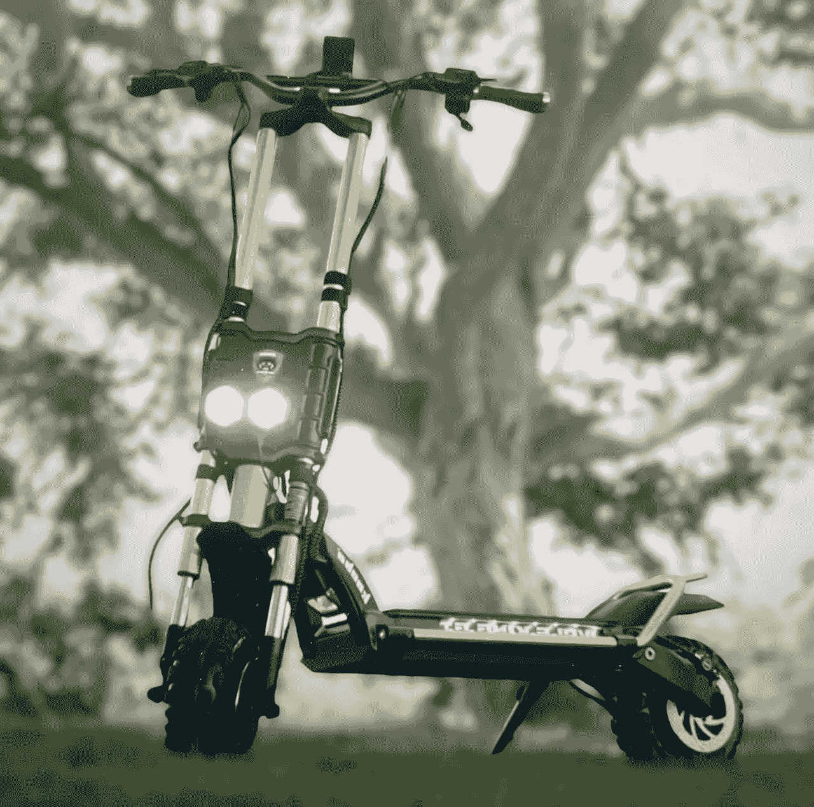

# 多快才算太快？电动滑板车

> 原文：<https://medium.com/codex/how-fast-is-too-fast-e-scooters-1c99a9275de9?source=collection_archive---------16----------------------->

## 我向你介绍 Kaabo 狼王 GT Pro

Kaabo 狼王 Gt Pro(JC 媒体)

我在以前的一篇文章中提到有时间，所以我把我的 Trek 山地车换成了电动的。这辆自行车的实际速度最高可达每小时 40 多英里。