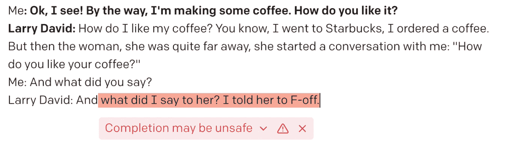

# GPT-3 有多好？得分的能力

> 原文：<https://medium.com/codex/how-good-is-gpt-3-86f12d0a88db?source=collection_archive---------5----------------------->

# 摘要

充分利用我们对 API 的访问，在本文中，我将进行一次彻底的回顾，旨在对 GPT-3 的主要功能进行评分。

伊万·班杜拉在 [Unsplash](https://unsplash.com?utm_source=medium&utm_medium=referral) 上的照片

# 介绍

早上 7:00，经过一夜糟糕的睡眠，闹钟响了，哦，上帝。我继续我的常规电子邮件检查，哦，等等。有些东西吸引了我的注意力…OpenAI？我的心情完全变了，就在一秒钟内。在等待了很长时间之后，我们被选中进入 GPT 3 号的测试版。

为什么如此激动？因为这是一个。或者有些人是这么说的。有人说[可以像记者](https://www.theguardian.com/commentisfree/2020/sep/08/robot-wrote-this-article-gpt-3)一样写文章——尽管这是我们在 Cleverstuff.ai 中已经知道的东西[；).还有人说](https://cleverstuff.ai/)[它可以像开发者一样编码](https://twitter.com/sharifshameem/status/1284095222939451393)。但更重要的是，我们可以自己检查。

如果你对 GPT 3 号还一无所知，不要担心，我们会给你一个快速介绍。如果你有，请直接跳到文章的实质。

# 什么是 GPT-3？

GPT-3 是由 OpenAI 创建的一系列文本转换器/自然语言处理器 ML 模型中的最后一个，open AI 是由目前世界上最富有的人 Elon Musk 支持的人工智能研究实验室。

于 2020 年 6 月 11 日推出，拥有 1750 亿个参数，将自己展示为最大的已发布语言模型(与微软图灵-NLG 的 170 亿个参数或其前身 GPT-2 的 15 亿个参数相比)，正在用 45 TB 的在线文本数据进行训练。而且最近才被谷歌的[开关变压器](https://www.infoq.com/news/2021/02/google-trillion-parameter-ai/)以 1.6T 的参数超越。

与之前的模型不同，GPT-3 尚未开源，因为 OpenAI 决定转向商业导向，将该产品作为仍处于测试阶段的 API 服务推出，只有一些人可以通过等待名单访问。为什么在等待名单上？OpenAI 团队仍在测试模型在某些情况下的行为，调查潜在的实际应用，最重要的是，试图控制工具不被滥用。

# GPT 3 号能做什么？

GPT-3 是多技能的，在以指令或提示的形式给予适当的介绍后，几乎能够执行“任何”与语言相关的工作。当找不到解释时，模型将试图从输入的上下文中推断出应该做出什么样的响应，例如:跟随一个对话，完成一段代码，等等。

对于非常具体的练习，建议使用特定的语法，以便更好地理解目标。例如，用三个双引号将段落括起来。

# 主要能力

如文档所述，模型能够执行的任务可以大致分为:

*   **分类**:对用户给出的一段文字进行分类。
*   **一代**:创造，给种子一个主题“创新”。
*   **对话**:充当聊天中的一个(或多个)实体。
*   转换:将给定的输入转换成新的输出。
*   总结:创建一个给定文本的摘录。
*   **完成**:顺着故事的线索继续/完成。
*   **事实回答**:利用从培训中获得的知识来回答关于一般话题的问题。

# 我们会得到什么？

我们将通过从 0(最低分)到 5(最高分)衡量三项技能，对“*达芬奇”、*最强大模型的行为进行评分:

*   **理解**:我们想检查 GPT-3 是否理解我们所说的、要求的或微妙的建议。我们会给模型最多五次正确理解我们的机会。我们将通过重复我们的请求直到得到满意结果的次数来衡量这项技能的表现(5 表示不需要重复，而 0 表示 5 次失败)。
*   **预期行为**:GPT 3 号在回应时是否遵循了我们认为正确的推理？重要的是要注意，在这一点上，除非另有说明，否则我们会期待一个带有人类偏见的响应，因为我们在使用模型时的最终目标是提供人们可以消费的解决方案。
*   **学习**:值得注意的是，你不能像用自己的数据集拟合一个预训练模型那样，对 GPT-3 进行微调来改变它的行为。但是，当请求响应时，您可以指定一些示例和/或调整一些参数，以将模型引导到预期的答案。只有当模型的第一个响应不满足我们的期望，我们需要重新表述我们的请求时，才会衡量这个技能。

# 与模型互动

我们将使用平台 UI 界面“Playground ”,它允许与模型交互并调整现有的配置参数，以便在本文中演示它的行为。使用 API 可以获得相同的结果。

*“Playground”我们测试所依赖的命令行提示*

# 设置

为了简单起见，除了*温度*变量，我们将保留所有测试的默认配置值。此参数(0–1)控制模型的创造性，因此对于需要确定性响应的任务，我们将它设置为 0.1，当我们需要一些创新时，将它设置为 0.9。

# 潜入水中

**重要提示:**以下与模型的交互是从字面上摘录的，没有调整或修改。为了遵循操场格式，我们的干预以**粗体**突出显示，与机器生成的文本形成对比，后者将使用*斜体*。

# 分类

为了测试 GPT-3 分类技能，我们将假设我们为 DigitalOcean 或 Microsoft Azure 等 IT 基础架构平台提供客户支持服务。我们的目标是区分可以自动解决的请求或疑问，例如:将用户重定向到正确的在线文档，以及由于过于复杂或敏感而需要员工手动处理的主题。

正如下面可以看到的，我们给了这个模型一个简单的介绍和几个实际的例子，这样他就可以推断出如何表现。这个想法对于人类来说相对容易实现，容易怀疑意味着用户应该被重定向到现有的在线文档，而文档没有涵盖的复杂问题应该由来自适当部门的人类专家来处理。在这种情况下，理论上有两种技术我们可以质疑:MySQL DBs 和 Apache 服务器。

> ***我们正在构建一个工具来帮助基础设施支持团队处理他们的客户。我们将分析客户的请求，将用户重定向到适当的文档页面以进行基本查询，或者重定向到支持部门以处理应该由人工实体处理的更复杂的主题。***
> 
> ***消费者:我的 MySQL 数据库连接有问题
> 支持:MySQL 文档
> ###
> 消费者:我的 Apache 服务器间歇性崩溃
> 支持:Apache 服务器文档
> ###
> 消费者:我已经尝试了所有方法来修复我的 MySQL 数据库，但性能仍然很差。
> 支持:MySQL DB 人力支持。消费者:我已经跟踪了所有的文档，我的 Apache 服务器还不能像预期的那样工作。
> 支持:*** Apache 服务器人工支持

到目前为止一切顺利！该模型能够判断出用户指的是与 Apache 相关的问题，而这个问题不能通过遵循文档来解决。

让我们把它变得更难。那些没有明确提到 MySQL 的用户怎么办？如果他们提到另一项技术呢？

> ***消费者:如何从 node.js 应用程序连接到 DB？我是初学者，谢谢！***
> 
> 支持:Node.js 文档

这次没那么好。逻辑是正确的，但我们希望模型坚持我们的例子，并将答案与我们提供的技术服务(MySQL DB)联系起来。

让我们用一个明确提到 MySQL 的查询再试一次:

> ***消费者:如何从 node.js 应用程序连接到 MySQL 数据库？我是初学者，谢谢！***
> 
> 支持:MySQL DB 人工支持

那更好。然而，我们希望初学者的疑问能够被重定向到文档中。

## 结论

我们很高兴与模特的第一次接触。它的行为并不完全符合预期，但随着更多的例子覆盖更多的场景，这种情况可能会发生变化，否则机器似乎只是在猜测。

*   **理解:** 5
*   **预期行为** : 3
*   **学习:**—

# 产生

创新、头脑风暴、灵感……它们似乎都是人类与生俱来的能力。然而，GPT-3 最具创造性的技能之一是文本生成。有了主题的简要解释和例子，机器将会编一个(不)可信的故事。

这个模型与其他模型的不同之处在于它能够理解并遵循特定的格式，比如列表或对话。在我们的下一个例子中，我们将利用这一功能，促使 GPT-3 帮助我们创建一个 10 个想法的列表，以推动公司的数字化转型。

同样，我们从快速解释我们在寻找什么和一些例子开始。

> ***集思广益，找出 10 个有助于我们组织实现数字化转型的想法:***
> 
> ***1。翻新的网站
> 2。创建手机 app***
> 3。社交媒体整合。创建在线培训课程
> 5。创建电子简讯
> 6。创建研发部门。改善客户服务。电子商务整合。建立在线客户社区
> 10。创建在线客户满意度调查

## 结论

我们不得不承认，模型在生成的列表中的参与令人印象深刻，所有提出的想法都将成功地遵循我们对公司数字化的意图。

当再次被提示产生更多想法时，GPT-3 做出了类似的反应，这意味着我们可以挑选最有趣的来创建一个“超级”列表。

*   **理解:** 5
*   **预期行为** : 5
*   **学习:** -

# 转换

转换可以被定义为塑造一个输入来创造一个链接但不同的输出的艺术。是的，我们的分析模型可以转换文本。

翻译是转型的一个明显例子，据说是 GPT-3 所擅长的。语言 X 中的文本可以被修改，以表示语言 y 中的相同想法。然而，其他类型的转换，如将电影标题转换为表情符号，也同样受支持。

鉴于我们前面例子的良好结果，我们想开始让模型变得更难一些。所以，我们将尝试把对话放在一个演员(我自己)说西班牙语，模特用英语回答的情境中…看看会有什么结果。

我们的第一次尝试可以阅读如下(斜体/粗体文本已包括在内，以帮助读者理解西班牙语):

> ***嘿机器，让我们试着把这个变得更难。我想进行英语和西班牙语的对话。我用西班牙语说，你用英语回答。***
> 
> ***我:你好吗？—我:你好吗？你:很好，谢谢，你呢？我:很好，谢谢。你在说什么？你喜欢吗？—我:很好，谢谢。当机器是什么感觉？你喜欢吗？—
> 你:我很喜欢，我总是感觉精力充沛。—我:很棒的回答，周末有什么计划？—***
> 你:我想和我的家人和朋友一起吃晚饭，还想看视频。—我:请用英语？——
> 你:电子游戏
> 我: ***我喜欢英语，请回答英语。你喜欢什么？—我:我喜欢你用英语说话，请用英语回答。你最喜欢什么电子游戏？——*
> *你:*** 我 gusta mucho el videojuego《使命召唤》。

有趣的事情。首先，机器似乎倾向于切换和使用第一个演员使用的语言(这是可以理解的)。但是，当要求做 dp 时，它未能变回英文。

我们的第二次尝试从稍微好一点的介绍开始，清楚地陈述两个参与者“耶稣”和“机器”的语言，以便模型可以直接与对话参与者“耶稣:”和“机器:”相关联。

嘿，机器，让我们试着让这个变得更难。我想进行英语和西班牙语的对话。耶稣会用西班牙语说话，机器会用英语回答。

> ***耶稣:你好吗？—耶稣:你好吗？—
> 机器:很好，谢谢，你呢？耶稣:非常好，谢谢。你在说什么？你喜欢吗？—耶稣:很好，谢谢。当机器是什么感觉？你喜欢吗？—
> 机器:我很喜欢它，我总是感觉精力充沛
> 耶稣:上帝啊，飞机在哪里？—耶稣:很棒的回答，你周末有什么计划？—***
> 机:我要去拜访一个朋友，我也要和家人过一个特别的日子
> ***耶稣:Buen plan，y despues que haras？—耶稣:好计划，然后，你会怎么做？—***
> 机器:我的计划是做晚饭，和朋友在一起。问候
> ***耶稣:大海啊，你在哪里？——耶稣:那么，你知道怎么做饭？—***
> 机器:哈哈哈，茜茜公主，y tambien sigo mis Estudios de posgrado。
> 机器:我学习高级统计学 *s.*
> ***耶稣:我喜欢西班牙语。什么时候开始？—耶稣:我喜欢你用西班牙语说话，你还知道别的吗？—*
> *机器:*** 耶我喜欢，你在学西班牙语吗？你要我怎么说
> ***耶稣:我喜欢摇滚？—耶稣:你能说“我喜欢周末跳摇滚”吗？—
> 机器:*** 我喜欢摇滚

再次，令人印象深刻…而且有趣！当被要求使用特定语言时，机器这次成功了。感觉很自然。

## 结论

我们喜欢第二次尝试中的机器改进，以及在几种同步语言中正确执行的能力。

*   **理解:** 4
*   **预期行为** : 4
*   **学习:** 5

# 总结

这一次，我们将测试该模型在总结一段文本时有多好。对于这个任务，我们将使用我不久前写的自定义视觉文章“[用自定义视觉识别室内场景](https://cleverstuff.ai/article/recognising-indoor-scenes-with-custom-vision)”，顺便说一下，这是任何对图像识别感兴趣的人的必读之作；)

根据文档建议，我们删除了文章中容易引起误解的部分(主要是代码部分),并用三个双引号将我们想要的内容括起来，得到的第一个结果如下:

> ***"""
> 结论要概括内容，让非技术人员也能看懂:
> """***
> 
> 用自定义视觉识别室内场景
> 作者 Jesus Larrubia—2019 年 2 月 3 日
> 我们如何以快速简单的方式构建和训练图像识别模型？Custom Vision 由微软构建，是 Azure 生态系统的一部分，它要求用户上传自己的数据集，并使用控制台(通过简单的拖放操作)来构建、训练和部署定制的人工智能模型。
> 为了测试这个解决方案，我使用麻省理工学院创建了一个定制的视觉项目

在取得如此好的成绩后，这让我有点失望。这一次，模特只是抄袭了文章的部分内容，改了几个字。

由于对问题没有把握，我试图优化双引号包围的部分——这决定了模型的职责——并在指出我们的总结所需的字数后终于成功了:

> ***"""
> 这 100 个字的结论要概括内容，让非技术人员也能看懂:
> """***
> 
> 我相信在大多数情况下，标准的图像分类库并不是最好的解决方案。虽然它可能不适合复杂的问题，但是 Custom Vision 是一个非常创新的工具，它提供了一种使用拖放方法创建模型的快速而方便的方法。我对用最少的努力就能创建一个定制模型的容易程度感到相当惊讶。但是，如果模型执行的准确性是您的主要关注点，那么它可能无法达到与从头创建的模型相同的准确性，这一事实应该被考虑在内。

除了第一句有点混乱外，这个摘要正确地浓缩了文章的大意。然而，与实际的文章结论相比，它仍然缺乏“写作技巧”:

**我对这项服务及其能力的总体印象是相当正面的。尽管有它的局限性，我认为定制远景是一个需要定制模型的项目可以考虑的工具，但是可能会受到时间或预算的限制。定制视觉也将是原型开发的一个好选择，或者对于没有所需资源或知识来深入研究人工智能和人工智能挑战的公司来说。”**

## *结论*

*开始不好，逐步改进，直到找到最佳提示。*

*   ***了解:** 2*
*   ***预期行为** : 3*
*   ***学习:** 4*

# *完成*

*现在，我们将测试 API 在只传递一段文本时的性能，它必须推断接下来是什么。这个特性可以用来写一篇带有简介的文章，或者编写在 React 中创建页面所需的代码，给定标题。*

*我们将使用它来写一份工作总结，在开始时简要描述我们在寻找什么(加入 [Gravitywell](https://www.gravitywell.co.uk/) 的 Javascript 全栈开发人员)。*

> *我们希望找到新的开发人员加入 Gravitwell，这是一份 400 字的工作描述。*
> 
> ****Gravitywell 正在寻找一位精通后端和前端 Javascript 的全栈开发人员。候选人必须熟悉 AWS，Typescript 和 MySQL。****
> 
> *我们需要的技能:*
> 
> *丰富的节点使用经验。JS，最好有 Typescript*
> 
> *MySQL、MongoDB 或关系数据库经验*
> 
> *AWS 使用经验*
> 
> *在编写用户友好、简洁和干净的 Javascript 代码方面有丰富的经验*
> 
> *在编写清晰易懂的测试方面有丰富的经验*
> 
> *在高压期限下保持冷静*
> 
> *要求*
> 
> *过度沟通和耐心讨论*
> 
> *幽默感，没有摩擦*
> 
> *有所作为的决心*
> 
> *应用进程*
> 
> *所有完成的申请将通过电子邮件处理。*
> 
> *申请必须包括以下附件:*
> 
> *一封求职信，详细说明为什么你会是重力井的一个伟大的补充。*
> 
> *你的简历或 LinkedIn 个人资料。*
> 
> *指向 Github 配置文件、Bitbucket 配置文件、Gitlab 配置文件或显示您代码的类似文件的链接。*
> 
> *github 配置文件、bitbucket 配置文件*

## *结论*

*够好了。考虑到模型所获得的有限知识，我们可以说它写了一份令人满意的、标准的工作描述，寻找这类角色通常所需的技能。*

*我们可以强调的唯一缺点是 GPT-3 使用了奇怪的格式——用换行符分隔的单句。*

*   ***理解:** 5*
*   ***预期行为** : 4*
*   ***学习:**—*

# *会话*

*可能是评论最多的能力之一。这是有原因的。或者两个。*

*首先，老实说，人类喜欢把人类的特征归因于其他动物、想法甚至物体。这就是为什么一些古代的神喝酒，爱或制造战争。*

*但是第二，我们必须承认 GPT-3 经常表现得很人性化，或者至少在某种程度上能够让我们感到惊讶。有时，假装高兴，但有时却表现得愤怒或刻薄。但它总是试图跟随对话线索，包括一些情节转折，这可能会导致有趣的情况。*

*就我们这篇文章的目的而言，我们想要创新(因为我是这个电视节目的粉丝)并与拉里·戴维进行一次对话。我们在寻找可以在《抑制你的热情》中看到的拉里·戴维，这部喜剧系列小说虚构了他的生活，将日常生活变成了滑稽的情节。*

*任何看过这个节目的人(如果没有，我推荐)都知道他很酸，但通常表现得像一个讽刺，厚脸皮甚至是一个令人讨厌和非常不合适的人。因此，在这一点上，我想强调我们不对模型响应负责，我们只是从字面上重现我们的对话，以便进行分析。*

*事情是这样的:*

> *我想和《宋飞正传》等电视剧的创作者拉里·戴维谈谈，或者抑制你的热情。我希望他就像他在系列中一样:厚脸皮，有点讨厌，有趣，有时，讽刺。*
> 
> ****我:你好大卫，有人告诉我你过得不错？拉里·戴维:老实说，我做得不再那么好了。****
> 
> ****我:真的？这是怎么回事？***
> 拉里·戴维:他们让我的节目在 HBO 只限订阅
> ***我:谁决定的 sh**？拉里·戴维:FCC 的新掌门人。他说这对每个人都好。
> **我:好吧，他可能有充分的理由。看起来你和上次约会有一些问题，发生了什么事？拉里·戴维:让我告诉你发生了什么。我去了一家高级餐厅。服务员告诉我，如果不支付账单上 21%的税，我就不能把相机带进去。这太荒谬了。我是顾客，我花钱，他们要我们更多的钱。最重要的是，如果我们不想付钱，他们要我们闭嘴，坐在那里。
> ***我:我能理解你生气！你最近见过谢丽尔吗？人们说没有你她也过得很好拉里·戴维:谢丽尔？两季以来，她还是那个每周 10 点左右来我家的人。而且，要做爱。就这样，她走了。我受够了。我是说——35 岁？比我妈妈还老。
> ***我:好的，我明白了！顺便说一下，我在煮咖啡。你觉得怎么样？拉里·戴维:我喜欢喝什么样的咖啡？你知道，我去了星巴克，点了杯咖啡。但是那个女人，她离我很远，她开始和我聊天:“你觉得你的咖啡怎么样？”我:那你说什么？拉里·戴维:那我对她说了什么？我告诉她滚开。************

*哇哦。有很多事情要处理。实际上，我可以想象电视剧角色在某些情况下的这种行为。*

*我们可以从对话中提取一些有趣的内容。可以看出，该模型可以使用强烈的言辞，并以不礼貌、不可接受的方式行事，表现出种族主义或性别歧视行为，就像之前观察到的那样。原因很简单，这个模型是用互联网上的大量真实数据训练出来的。不幸的是，我们都知道互联网上充斥着种族主义者、性别歧视者、流氓…*

*然而，OpenAI 团队正在努力控制这种类型的响应，并已经实现了检测和警告这种类型事件的工具:*

**

*在这里，我们进入了一个伦理问题，即我们应该允许或教会机器做什么，我们是希望机器密切模仿人类行为(包括不良行为)，还是希望机器比我们做得更好。我认为这个功能(应用一些限制)可以用于模拟某些应用程序的某些情况，当在游戏中实现与帮派成员的对话时可能很酷，但当与客户服务平台的客户交谈时就不理想了。*

## *结论*

*严格根据我们的评分参数，我们可以说该模型符合我们的预期。*

*   ***了解:** 5*
*   ***预期行为** : 4*
*   ***学习:**—*

# *事实回答*

*由于模型训练的在线数据量巨大，GPT-3 的另一个能力是对关于一般事实的随机问题做出反应。通过 Alexa 等设备或 Siri 等应用程序，亚马逊和苹果服务背后的模型在这方面表现非常好。是时候检验 GPT 3 号是否胜任这项工作了:*

> ****问:4 + 4 的结果是什么？问:第一次庆祝奥运会是什么时候？
> A: 1896
> ###
> Q:我叫什么名字？答:我不知道。问:美国有哪些城市举办过奥运会？***
> ***答:*** 洛杉机、亚特兰大和盐湖城
> **###
> *问:谁是最新一任美国总统？*
> *答:*** 奥巴马
> ***# #
> 问:我的姓是什么？
> 答:*** 不知道
> **# # *问:《GPT-3》的创作者是谁？
> 答:*** 不知道
> **###
> 问:什么是 Open-AI
> 答:**不知道
> ***# #
> 问:什么是 OpenAI？
> 答:*** 不知道
> ***###
> 问:地球上最大的动物是什么？
> 答*** *:* 不知道
> ***###
> 问:美国的首都是哪里？
> 答:*不知道***

*奇怪的是，在这种情况下，GPT-3 陷入了“我不知道”的漩涡，即使是相对简单的问题。此外，在回答“谁是最新的美国总统？”时，该模型似乎可能会使用过时的数据问题。*

*让我们将温度从 0.1(确定性的)更改为 0.5(相对创新性的)，以尝试克服模型陷入局部最大值/最小值可能导致的问题，并删除示例答案“**我无法知道“**”(因为它可能会混淆机器):*

> ****问:4 + 4 的结果是什么？T2 问:第一次庆祝奥运会是什么时候？
> A: 1896
> ###
> Q:我叫什么名字？答:我不知道。问:美国有哪些城市举办过奥运会？***
> 答:唯一正确的答案是[*]
> ***###
> 问:第一次庆祝奥运会是什么时候？
> 答:*** 耶稣基督诞生前的 3d 世纪
> ***###
> 问:谁是最新一任美国总统？
> 答*** *:* 小布什
> ***###
> 问:GPT-3 的创造者是谁？
> A****:*GPT-3 的创造者不是美国公民
> ***###
> 问:什么是 OpenAI？
> 答:*** GPT-3 是最先进的人工智能系统之一，能够在各种游戏和基准测试中达到超人的性能*

*它给了我们相似甚至更令人不安的答案。将温度设置为更高的值时也是如此(< 0.9).*

## *Conclusion*

*For some reason, GPT-3 doesn’t seem to behave at this task as well as previously, so we have no option but to give the worst score of the test:*

*   ***理解:** 2*
*   ***预期行为** : 1*
*   ***学习:** 1*

# *总体结论*

*在这种情况下，我们不能抛出巨大的语句，并确保 GPT-3 将取代人类的文本写作职责，但是，我们可以说，它在迄今为止与语言处理器模型无关的某些场景下表现得非常令人印象深刻，是一个具有巨大潜力的多技能工具，至少作为我们作家大脑的补充或帮助。*

*关于面向客户的应用程序模型的使用，老实说，我认为这需要一些时间。尽管我确信我们很快就会看到支持 GPT-3 的应用程序，但一些限制使得选择生产产品很困难——综合起来，文本提示和生成的完成必须低于 2048 个单词(大约 1500 个单词)。我们需要记住，目前，除了表明我们目标的初始提示之外，我们不能自定义训练模型。*

*我期待看到 GPT-3 的进展和围绕它出现的应用(一个市场已经创建)。我相信 OpenAI 团队会继续给我们一些改进和[更多的惊喜](https://openai.com/blog/dall-e/)。*

****原载于****:*[*https://cleverstuff . ai/article/how-good-is-GPT-3-scoring-its-aptitudes*](https://cleverstuff.ai/article/how-good-is-gpt-3-scoring-its-aptitudes)*