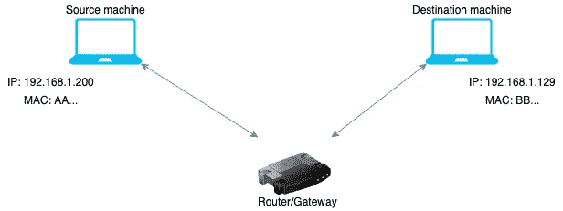

# HTTP 数据如何在互联网中传输

> 原文：<https://medium.com/codex/how-http-packets-travel-through-internet-9fd447f90bb3?source=collection_archive---------5----------------------->

今年，在做了 4 年多的软件工程师后，我决定是时候回归基础了，老实说，我一开始并没有理解好。

我不太了解的一个方面是互联网实际上是如何工作的。我知道我们进行 API 调用(可能是 HTTP ),然后通过线路传输数据，但除了我们在大学里获得的那些高级细节之外，中间发生的事情对我来说大部分都是一个黑盒。

为了更好地掌握基础知识，我试图从 OSI 模型的第 7 层开始，深入研究 HTTP 数据包是如何从源机器路由到目的地的，并尽我所能在本文中与大家分享这些信息:)

# 术语

在我进入实际细节之前，我想先了解一些定义或术语。

1.  **MAC 地址**:-MAC 地址是唯一标识网络上每个设备的硬件标识号。MAC 地址是制造在每个网卡中的，因此不能更改。在 OSI 模型中，MAC 地址用作第 2 层地址。例如 00:0d:83:b1:c0:8e。
2.  **地址解析协议** :-通俗地说，ARP 协议是用来为一个 IP 地址识别 MAC 地址的。通过使用 ARP 协议识别的 MAC 地址，路由器知道数据包的下一跳是什么。我们将在后面详细讨论如何使用 ARP 在本地网络和互联网上向目的地发送数据包。
3.  **网络地址转换**:——同样，用外行人的话来说，NAT 是用来把私有地址转换成公有地址的。由于有限的 IP4 地址，并不是每个设备都有公有地址。在家中，您的设备(如笔记本电脑和手机)会由 wifi 路由器分配一个本地唯一的 IP 地址。当设备发送数据包时，源 IP 地址是设备的私有 IP，数据包被发送到路由器/网关。然后，路由器将此私有 IP 地址替换为自己的公有 IP 地址，并在 NAT 表中添加条目后通过互联网发送数据。然后，此 NAT 条目使路由器能够将响应发送回您的设备。一个 NAT 条目看起来类似于[这个](https://gist.github.com/himanishm07/82668dfab657d0d419e4ffffcdd313f0)。(请记住，这是一种严重的过度简化)。因此，当路由器看到来自 7.12.9.14:443 的响应时，它知道数据需要返回到 192.168.1.23:8091。
4.  **代理服务器** :-代理服务器是一台专用计算机或运行在计算机上的软件系统，充当端点设备之间的中介。如果您有一个转发 HTTP 代理设置，您的所有请求将被发送到该代理，然后该代理将代表您向目的地发出 HTTP 请求，并向您发回响应。

# 分组路由

现在到了有趣的部分。如下所述，我将在本文中讨论 3 个用例。

## 本地网络中带有源和目的地的 HTTP 请求

在这种情况下，数据包不必通过互联网传输。下面提到所涉及的高级步骤

**源机**

1.  IP 为 192.168.1.200 的源计算机从向 IP 为 192.168.1.129 的目标计算机发出 HTTP /Get 请求。
2.  数据包被传输到源机器的第 4 层，在那里添加源端口和目的端口。
3.  数据包被传输到第 3 层，在那里添加源和目的 IP 地址。
4.  然后数据包被传递到第 2 层。这就是 ARN 出现的原因。
    4.1*。*源机器通过使用子网掩码计算目的机器是否在其网络中。
    *4.2。*在这种情况下，由于目的地在局域网内，源广播一个 ARP 请求，询问目的 IP 的 MAC 地址。
    4.3*。*目标机器以其 MAC 地址响应。
    4.4*。*最后，源附加该 MAC 地址作为目的 MAC 地址，并附加源 MAC 地址作为自己的 MAC 地址。

**路由器**

然后数据包被发送到路由器。这些路由还会做一些如下所述的事情

1.  它检查目的 MAC 地址，以了解数据包是否发往它。在我们的例子中，MAC 用于网络中的其他机器。
2.  根据路由表，将数据包路由到目的机器。在这里，**路由器仅作为交换机工作。**
3.  由于数据包需要在本地传输，而且源和目的地都知道彼此的 IP 地址，因此不需要**NAT**。

**目的机器**

1.  当数据包到达目的地机器时，它首先检查 MAC 地址，然后检查目的地的 IP 地址。当两者都与机器匹配时，机器然后在第 7 层打开 GET 消息并处理它。
2.  基于该请求，目的服务器然后生成响应。
3.  现在，目标机器成为源机器，源机器成为目标机器，并且重复该过程以使响应到达最初的源机器。

## 来源和目的地在不同网络中的 HTTP 请求

这里，遍历变得有点复杂，因为数据包需要通过 Internet。这个遍历中增加的一个过程是 NAT。由于私有 IP 地址仅在本地网络中有意义，路由器在收到数据包时会将数据包的源 IP 地址替换为自己的地址，并在其 NAT 表中创建一个条目。因为来自目的机器的响应将被发送到路由器的 IP 地址，所以这个 NAT 条目告诉路由器在专用网络中什么是要发送响应的实际机器。

**源机器**

1.  IP 为 192.168.1.200 的源计算机向 IP 为 1.2.3.4 的目标计算机发出 HTTP /Get 请求。
2.  数据包被传输到源机器的第 4 层，在那里添加源端口和目的端口。
3.  数据包被传输到第 3 层，在那里添加源和目的 IP 地址。
4.  然后数据包被传递到第 2 层。在这里，**流程与用例 1** 没有什么不同。
    4.1*。*源机器通过使用子网掩码计算目的机器是否在其网络中。
    *4.2。*在这种情况下，目的地是**而不是**局域网的一部分。
    *4.3* 由于数据包不在本地网络中，源决定将数据包发送到其网关**。**大多数情况下，是路由器。
    *4.4* Source 向网关 IP 发出 ARP 请求，在我们的例子中是 192.168.1.1。
    *4.5。*目标机器以其 MAC 地址响应。在我们的例子中，FF 是网关/路由器的 MAC 地址。
    4.4*。*最后，源附加该 MAC 地址作为目的 MAC 地址，并附加源 MAC 地址作为自己的 MAC 地址。

**路由器**

然后数据包被发送到路由器。在这个用例中，路由器做了很多繁重的工作。

1.  路由器检查 MAC 地址，以了解数据包是否发往它。在我们的例子中，MAC 是针对路由器本身的。
2.  然后检查目的 IP 地址。检查 IP 地址后，意识到数据包实际上不是发送给它，而是发送给公共网络，因为数据包中的目的 IP 地址是 1.2.3.4。
3.  然后，路由器将源 IP 地址(192.168.1.200)更改为自己的公有 IP 地址，即 7.7.7.7。
4.  然后，它在 NAT 表中创建一个条目，其中源为 192.168.1.200:端口，目的地为 1.2.3.4:端口。
5.  有趣的部分来了。现在，当路由器知道数据包需要发送到 Internet 时，它会检查路由表，看是否知道数据包要发送的下一跳。
6.  如果路由器的路由表中有该地址的条目，它会将数据包发送到该路径，否则，它会将数据包发送到默认路由，通常是其 ISP。
7.  在这两个用例中，基于 IP 地址，它发出一个 ARP 请求来查找下一跳的 MAC 地址。
8.  现在，数据包的源 MAC 地址属于路由器本身，目的 MAC 地址属于下一跳。

在上面的示例中，在步骤 1 到 4 中，路由器作为网关工作，因为它将私有 IP 替换为公共 IP。从 5 到 8，路由器充当路由器。

**中间节点/路由器**

对于源和目的地之间的所有中间节点，遵循上述步骤 5-8，直到数据包到达目的地。

**目的地机**

1.  该机器首先检查 MAC 地址，然后检查 IP 地址，并意识到数据包是发给自己的。
2.  然后，Destination 生成响应，并将其发送回请求的源地址。在我们的用例中，这将是 7.7.7.7，即路由器的**公共地址。**

## HTTP 请求的源和目标位于不同的网络中，在源处有转发代理

在这种情况下，来自源机器的所有数据包都被发送到代理服务器。然后，代理创建一个对目的服务器的请求，获取对请求的响应，打包对源的响应，并将其发送回来。
代理提供了各种好处，如为源隐藏 IPs，提供了额外的安全层。除此之外，代理还可以缓存响应。

**源机**

1.  IP 为 192.168.1.200 的源计算机向 IP 为 1.2.3.4 的目标计算机发出 HTTP /Get 请求。这就是添加目的 IP 作为 HTTP 请求的一部分变得很重要的用例，我们将在下面看到。
    注意:- "Host "头是在 HTTP 1.1 中引入的。这个“主机”属性是目标机器 IP 地址被提及的地方(在我们的用例中是 1.2.3.4)
2.  包被传送到源机器的第 4 层，在那里源和**代理端口**被添加。
3.  数据包被传输到第 3 层，在此添加源和**代理 IP** 地址。
    注:-如上所述，在代理的情况下，所有请求仅向代理提出。这就是目的 IP 和端口用于代理的原因。
4.  然后数据包被传递到第 2 层。这里的**流程同**
    用例 2
    *4.1。*源机器通过使用子网掩码来计算目的机器是否在其网络中。
    *4.2。*在这种情况下，目的地是**而不是**局域网的一部分。
    *4.3* 由于数据包不在本地网络中，源决定将数据包发送到其网关**。**大多数情况下，是路由器。
    *4.4* 源对网关 IP 发出 ARP 请求，在我们的例子中是 192.168.1.1。
    *4.5。*目的机器用它的 MAC 地址来响应。在我们的例子中，FF 是网关/路由器的 MAC 地址。
    4.4*。*最后，源附加该 MAC 地址作为目的 MAC 地址，并附加源 MAC 地址作为自己的 MAC 地址。

**本地网络路由器和中间路由**

这里的过程与用例 2 中的过程相同。唯一的区别是，在用例 2 中，目的地实际上是目的地机器，而在这个用例中，目的地是代理服务器，但是路由器完全不知道它。

**代理服务器**

现在，当数据包到达代理服务器时，它的代理负责将数据包发送到实际目的地。这就是“主机”标题出现的地方。

1.  代理以 HTTP 请求的形式从源机器获取数据包。
2.  由于这是一个 HTTP 代理，代理读取 HTTP 数据并读取主机头以了解目的 IP。
3.  从这里，代理服务器向目标机器(在我们的用例中是 1.2.3.4)发出一个 HTTP 请求。此过程与用例 2**相同，其中代理是源，目的地是目的地。**
4.  然后，代理从目的机器获得 HTTP 响应，在点 1 中为来自源机器的请求创建一个响应，并将其发送回去。

**目的服务器**

这里的目的服务器根本不知道源机器，它得到的包都有源地址作为代理服务器的地址。目标服务器处理请求并将响应发送回代理服务器。
然后，代理服务器接收到这个响应，并通过它的路由器(7.7.7.7)将其传输回实际的源机器(在我们的用例中是 192.168.1.200)

这篇文章到此为止。希望你能从中了解到一些新的东西。如果你喜欢这篇文章，那么请喜欢并关注。如果你想了解像 HTTP，HTTP/2 和 3，TCP UDP QUIC 等网络概念，你也可以查看我的其他文章。

另外，在 linkedIn 上关注我