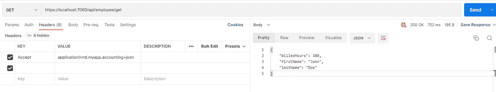
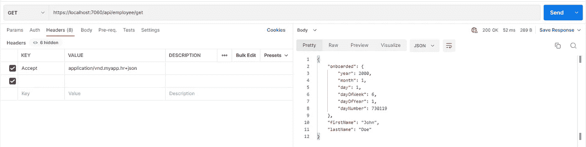

# 我如何使用 IActionConstraintFactory 来处理内容协商

> 原文：<https://medium.com/codex/how-i-am-using-iactionconstraintfactory-to-handle-content-negotiation-c6bed3e66b89?source=collection_archive---------6----------------------->

## 基于接受类型的资源表示

照片由 [stock.adobe](https://stock.adobe.com/) 中的 [Tierney](https://stock.adobe.com/uk/contributor/202206661/tierney?load_type=author&prev_url=detail) 拍摄

我在这篇文章中假设你已经知道什么是 Rest 和 RestApi，或者如果你像我一样，那么你练习它们，但是找到正确的术语来解释它们并不容易。

坦率地说，虽然我在过去几年中一直在使用 API，并且我已经阅读了许多关于 True Rest 和 HateOS 的文章(并且观看了许多教程),但是我还没有在实践中使用过 True Rest……直到现在。

为什么要内容协商？因为 Rest 资源可以有多种表现形式，这取决于谁在请求该信息。一个可能是人力资源部门，另一个可能是会计部门，这两个部门都想要关于同一资源的不同类型的信息。

**但是**，我不打算写内容协商，而是写我如何通过`IActionConstraintFactory`实现内容协商，以便为客户提供相同的端点。

> 您可以使用以下链接找到演示的链接:[https://github.com/ramihamati/webapidemos/tree/main/WebApi.DemoActionConstraintFactory](https://github.com/ramihamati/webapidemos/tree/main/WebApi.DemoActionConstraintFactory)

## 限制

首先，什么是一个`[IActionConstraint](https://docs.microsoft.com/en-us/dotnet/api/microsoft.aspnetcore.mvc.actionconstraints.iactionconstraint?view=aspnetcore-6.0)`？它们提供条件逻辑来确定某个操作对于给定的请求是否有效，并且与没有应用约束的操作相比，它还为路径查找提供了更好的匹配。

因此，我们实际上可以创建一个属性，该属性从`IActionConstraint`接口派生，并将其应用于我们的端点，但是在我们的示例中，我们希望创建一个基于枚举的特定约束，因此，我们将使用`IActionConstraintFactory`，它允许我们实际生成一个遵循更动态逻辑的`IActionConstraint`

## 设计概念

*   创建一个供应商类型，告诉我们谁在请求数据
*   创建一个动作约束工厂，它将根据供应商类型生成动作约束
*   创建一个动作约束，该约束将确定标头中的**接受**类型是否与接受的类型相匹配

enum 供应商类型具有可能要求资源的所有供应商类型的列表

InputAcceptTypes 是一个类，我们在其中保存接受头值的常量值

现在我们的工厂，将接收一个供应商类型并生成相应的`IActionConstraint`

上面的工厂创建了一个 VendorRouteConstraint，它的简单任务是从请求头中提取接受值，并确定适当的供应商类型

接下来呢？我为相同的资源创建了两个模型，然后两个控制器有完全相同的端点，但是有不同的路由约束

下一步是在 InputFormatters 中实际注册我们的媒体类型。因此，如果您转到启动文件，您可以添加以下行:

结果是:

