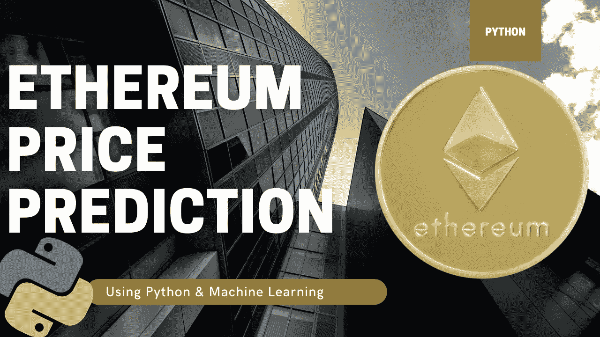

# 我如何尝试用 Python 和机器学习来预测以太坊的未来价格

> 原文：<https://medium.com/codex/how-i-attempted-to-predict-ethereum-future-prices-with-python-machine-learning-fe31e8d2e807?source=collection_archive---------2----------------------->

## 使用 Python 预测未来两周乙醚的未来价格

***免责声明:*** *本文材料纯属教育性质，不应作为专业投资建议。自行决定投资。*