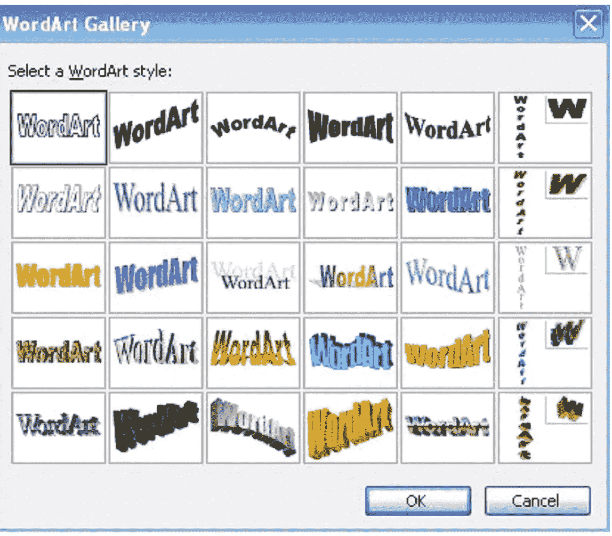

# 我是如何成为一名数据工程师的——纯属意外！！

> 原文：<https://medium.com/codex/how-i-became-a-data-engineer-accidentally-87ccf2d19183?source=collection_archive---------4----------------------->

## 数据工程 101

## 有时候，发生在你身上最好的事情是意外之喜

图片由[皮克斯拜](https://pixabay.com/?utm_source=link-attribution&utm_medium=referral&utm_campaign=image&utm_content=2709671)的 Gerd Altmann 提供

关注我在 Medium 上的文章或我在 [LinkedIn](https://www.linkedin.com/in/saikatdt/details/featured/) 上的帖子的人都知道我一直在分享数据工程的职业道路。

我上一篇关于学习数据工程的综合计划的文章已经成为病毒。全世界的人都喜欢简单而全面的研究主题。

这里可以看博客[。](/codex/how-to-become-a-data-engineer-905686dee7ce)

 [## 如何成为一名数据工程师

### 2022 年你如何学习并成为一名数据工程师的完整路线图

medium.com](/codex/how-to-become-a-data-engineer-905686dee7ce) 

在数据工程中，努力理解从哪里开始以及如何开始的人们很快就联系并分享了这个计划。

如果你想，你可以直接从[这里](https://withsaikatdt.gumroad.com/l/DE2022)下载计划(如果你想免费，只需输入 0。如果你付钱，我可以买一杯咖啡)

然而，我认为合乎逻辑的延续是与你们分享我的经历。我是如何成为一名数据工程师的——纯属偶然？

**这一切是如何开始的？**

我一生都是一名优秀的学生。不算好，也不算坏。

我一直认为我不配坐在第一排。然而，我也是后座议员的弃儿。

在竞争激烈的入学考试中连续失败后，为了获得一个好的排名，我做了印度数百万学生每年都在做的事情——工程学。

然而，我专注于我的工程。从第一年开始，我就有一个目标，那就是在第一次面试中获得一份我能得到的工作。

我以前从未见过笔记本电脑。与电脑的最大互动仅限于微软 Word 中那些花哨的沃德艺术字体和 Mspaint 中的可悲艺术。千禧一代对快乐了解多少？

尽管如此，我在大学的大部分时间里，要么是在体育教室里拿着 TT 的球拍，要么是在朋友的笔记本电脑上学习所有的编程语言。

不知不觉三年过去了，我第一次面试就收到了 TCS 的邀请。

在加入 TCS 之前，我花了将近 6-7 个月的时间完成了我的学位。我得到了更多的邀请，但仍在等待加入 TCS。然后在 2010 年 12 月，我们得到了幸运(或者是吗？)终于加入职业界的消息。

**训练中的蜜月期:**

在 TCS 培训的前三个月被认为是你职业生涯中最好的时光。我们回到了学校，学习更多的编程知识，结交新朋友，但薪水还是一样的。

训练是适度的，任务是定期的，然而乐趣是让我们一生都怀念那些日子的原因。

训练后，我们被分配到特定的流，并放在板凳上，等待 RMG 的电话分配到一个项目。

又一个月过去了，我们仍然在挣钱，一整天什么也没做。我们从来没有忘记享受坐板凳的日子，但是沮丧开始出现了。然后我终于接到了期待已久的电话。

**我的第一个项目**

不，电话不是来自一个 RMG 人，而是来自一个朋友。她从另一个朋友那里得知，一些同事接到了面试电话。

来自 [Pixabay](https://pixabay.com/?utm_source=link-attribution&amp;utm_medium=referral&amp;utm_campaign=image&amp;utm_content=1351317) 的[罗尼·欧瓦特](https://pixabay.com/users/roverhate-1759589/?utm_source=link-attribution&amp;utm_medium=referral&amp;utm_campaign=image&amp;utm_content=1351317")的图片

我们想都没想就冲了过去，我们也注册了。

不幸的是，我在面试中表现很差。我确信我不会被选中。

然而令我惊讶的是，我们都被选中了。我们最终加入了 TCS 的一个项目。

**我们的角色是什么？**

执行其他人已经构建的一些 SQL 脚本，并将截图复制到另一个 word 文档中。大量的手工任务，任何一个第九标准的孩子都能做，给这个角色起了一个沉重的名字，ETL 测试员。

这就是我如何成为一个数据项目的一部分。充其量是一场事故。我擅长 Java——J2EE，只接受过 Java 方面的培训。我甚至很擅长 C/C++/ASP，但是我在这里执行 SQL 和截图。

显然，我们在测试阶段加入了这个项目。这是一个将源数据迁移到数据仓库的项目(我以前从未听说过这个术语)。

我们唯一知道的是 BIPM——商业智能绩效管理是一个时髦词，商业智能是应该进入的技术领域。

我们很高兴在商业智能领域开始了自己的职业生涯。这几乎是当前数据工程和现代数据堆栈的基础，但我们当时并不知道。

我开始学习构建和支持数据仓库的复杂性。我开始学习 SQL、SSIS，并开始修复管道、监控故障等。

慢慢地，我开始自动化许多手动监控，建立一个仪表板，我也慢慢地进入开发团队，致力于建立实际的管道。

在接下来的 3 年里，我磨练了自己的技能，同时也培养了软技能。这种持续的专注确保了我在工作的第三年就成为了团队领导。第四年，我被选为英国的应用协调员。

**现场体验**

那是 2014 年至 2015 年，我已经在英国工作，并享受在那里的时光。这项工作主要涉及管理升级、与客户交谈以了解棘手领域、发现机会并解决任何可能的冲突。

**短暂的平静:**

2015 年，我第一次接触大数据工程，因为我开始在这方面进行培训。大数据正慢慢成为行业热点。大型科技公司已经开始实施大数据，并开始从中获利。

然而，较小的公司仍在观望。我们仍然被称为 ETL 开发人员，而不是数据工程师。即使在那之后，我也要花两年多的时间，才能着手一个真正的大数据项目，包括数据工程，在 Azure Stack 上构建一个数据湖。

**Azure 数据工程师的机会:**

2017 年，我开始为一家飞机发动机制造商工作，帮助团队建立预防性维护框架和仪表板。他们仍在 SSIS 进行整合工作。

过了一段时间，我被调到另一个项目，与美国和加拿大一家领先的金融服务提供商合作。该客户制定了对其源系统进行数字转换的宏伟计划，并构建了一个数据湖来支持数据集成和更快的报告。

我们开始构建，用 ADLS gen2 存储数据，用 Hive 创建外部和内部表，用 HDI 集群运行执行。然而，系统经历了非常高的延迟。

然后我们更换了工具。我们搬到了 ADLS 的数据湖，Azure 数据工厂的集成，Azure Synapse 的数据仓库和 PowerBI 的报告。

**继续学习**

这个机会再次点燃了学习的火花。我开始每天做复合学习。从 Azure Data Stack，我开始探索其他云和工具，如雪花、数据块等。

虽然我偶然成为了一名数据工程师，但我接受了它。我喜欢数据仓库。我把数据作为主要技能，并继续让自己变得更好。

 [## 感觉被冷落:以下是如何在 IT 行业保持相关性的方法

### 世界正在快速变化。技术的变化甚至更快。以下是您如何浏览这些内容，以及…

medium.com](/tech-start/feeling-left-out-heres-how-to-stay-relevant-in-it-sector-dbccc51889b4) 

**担任首席工程师和导师**

最后，在这个行业呆了 11 年多之后，我开始和你分享我的经验。我现在正慢慢努力成为数据领域的思想领袖。

我开始做我喜欢的事情。我开始教授和指导低年级学生和年轻的专业人士。

我相信许多人仍然在努力遵循一条特定的数据职业道路。你们中的许多人发现很难进入一个成熟的数据工程角色。

因此，我希望我的经历可以帮助你坚持一条特定的道路，并不断学习，以便能够迁移到数据工程师角色。不过，不要只强调成为一名数据工程师。保持你的选择，并在前进的过程中把握住它。在真正融入一个角色之前，你可能会换很多次角色。

如果你仍然感到失落，请不要犹豫，在这里与我预约一些时间。

 [## 在 topmate.io 上预订与 Saikat 的时间

### 我帮助你发现定义你的职业。

topmate.io](https://topmate.io/saikatdutta) 

我将分享更多关于数据行业的故事、文章和经验。你可以关注我更多这样的帖子。

***感谢*** *的阅读！如果你想与我取得联系，请随时通过*withsaikatdt@gmail.com*或我的* [*LinkedIn 个人资料*](https://www.linkedin.com/in/saikatdt/) *联系我。*