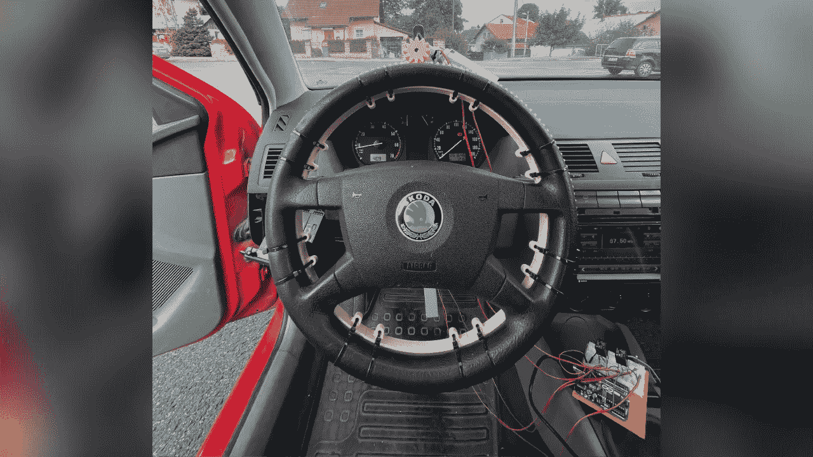
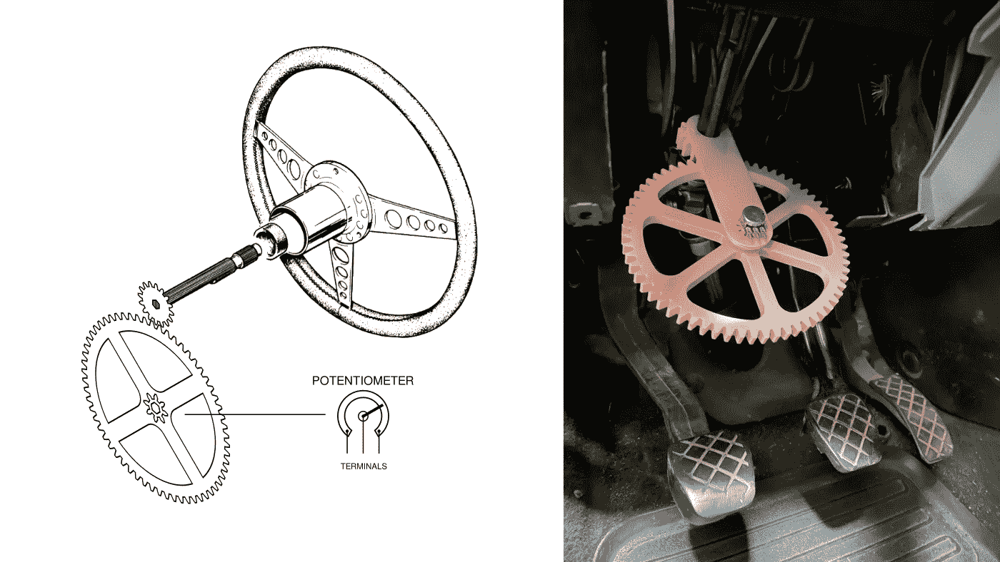
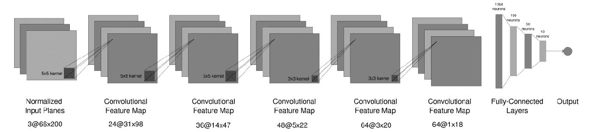
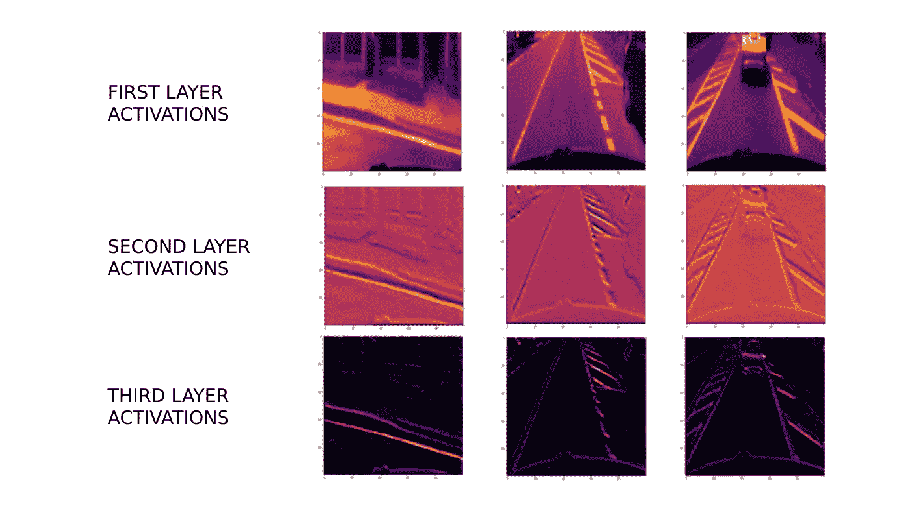
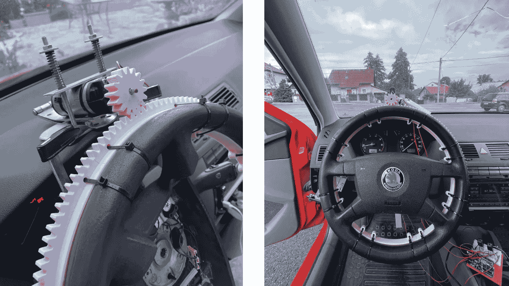
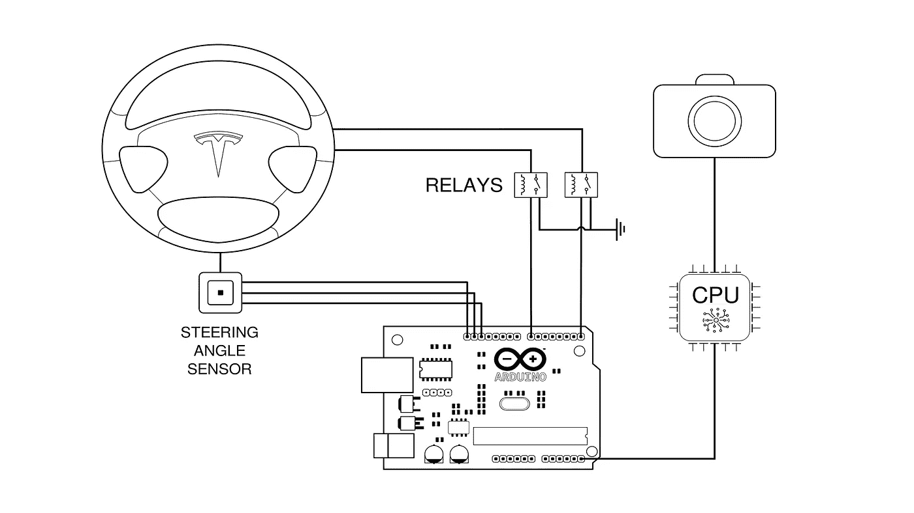
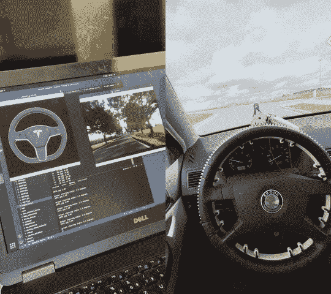

# 我如何从零开始建造一辆真正的自动驾驶汽车

> 原文：<https://medium.com/codex/how-i-built-a-real-self-driving-car-from-scratch-409998d708a?source=collection_archive---------1----------------------->

来源:图片由作者提供。

2021 年夏天大学二年级结束后，我决定从事当时最先进的项目之一——从零开始开发一款自动驾驶软件，并在实车中实现。在公开了我的[代码](https://github.com/mateomd-dev/maeve-autopilot)的一些主要部分并发布了一个[演示视频](https://youtu.be/h1Wg7Cn1D-E)之后，我收到了许多关于这个项目的问题。所以，我决定分享一下开发过程背后的故事。

我一直对任何与 AI 和机器学习相关的东西都很着迷。计算机能够学习的想法和软件开发中的一个完整的范式转变，对我来说是非常鼓舞人心的。然而，我完全无法理解*。2021 年 2 月左右，我开始上可以说是最受欢迎的 Coursera 相关主题的课程——[机器学习](https://www.coursera.org/learn/machine-learning?utm_source=gg&utm_medium=sem&utm_campaign=07-StanfordML-ROW&utm_content=07-StanfordML-ROW&campaignid=2070742271&adgroupid=80109820241&device=c&keyword=machine%20learning%20mooc&matchtype=b&network=g&devicemodel=&adpostion=&creativeid=516962315003&hide_mobile_promo&gclid=CjwKCAiAksyNBhAPEiwAlDBeLHvf3K9Jfjs77yy7pFjfqGtLrzN0UMYYtcw3WhhsBxfEMC1IsaQuahoCqmEQAvD_BwE)、[深度学习专业化](https://www.coursera.org/specializations/deep-learning?utm_source=gg&utm_medium=sem&utm_campaign=17-DeepLearning-ROW&utm_content=17-DeepLearning-ROW&campaignid=6465471773&adgroupid=77656689495&device=c&keyword=coursera%20deep%20learning%20specialization&matchtype=b&network=g&devicemodel=&adpostion=&creativeid=506750650449&hide_mobile_promo&gclid=CjwKCAiAksyNBhAPEiwAlDBeLPUYNmgNJuRtZNZUMIzj0njAzstXWVMLouSp1283hz5N_FCnUUr4kRoCGmUQAvD_BwE)和 [TensorFlow 职业证书](https://www.coursera.org/professional-certificates/tensorflow-in-practice)的一部分。
我非常支持实践学习，所以我想在我感兴趣的领域选择一个项目，这样我就可以应用我的知识。作为特斯拉的忠实粉丝，我从一开始就被自动驾驶汽车和计算机视觉的世界所吸引——然而，我想超越仅仅在例如 GTA 汽车中实现神经网络，所以我将这个想法提升到了一个新的水平。*

经过初步研究，由于时间和预算的限制，我“解决”了一个自主转向机制。很快就发现，即使是单独驾驶也是一项非常具有挑战性的任务。我从可以说是更传统的显式分解问题的方法开始，研究了用于车道检测和路径规划等任务的各种算法。然而，由于这个项目旨在加深我对深度学习仍然有些浅薄的知识，我更倾向于使用神经网络的端到端方法。很快，我看到了 2016 年 NVIDIA 的一篇论文,其中讨论了 CNN 的一种实现，该实现将视频输入的原始像素映射到转向命令，结果令人惊讶地好。也有相当多的实现可用，这激发了我创建自己的实现。
系统的高级概述非常简单:

*   在汽车前部安装一个摄像系统
*   获取任何给定时间的转向角度值
*   将这两个配对，并通过神经网络传递
*   构建一个在方向盘上执行转向命令的系统
*   使系统适应实时执行，即拍摄前方道路的图像，预测转向角度并在转向单元上执行

# 选择汽车

鉴于这个项目的高度实验性和潜在的破坏性，我买了我能找到的最便宜的车——具体地说，是斯柯达法比亚的第一款。在这个阶段，我没有一个详细的实施计划，所以我对汽车的唯一要求是动力转向，这使得它可以在不需要对转向柱进行大量和昂贵的调整的情况下建立转向机制。

自然，我做的第一件也是最重要的一件事就是印上一个特斯拉的标志，并把它拍在汽车的前面。有一次，我差点开错车走了…

特斯拉 Model 3(左)在我的车(右)旁边，有特斯拉的标志。来源:图片由作者提供。

# 收集预算数据

为了坚持这个项目的“端到端”方面，我想产生自己的数据集。在尝试了一堆网络摄像头之后，我把一部旧 iPhone 6S 安装在前窗后面，用它来代替视频输入。
测量转向角度是一个更大的挑战。现代汽车通常要么有 CAN 总线，可以在任何给定时间接入以获得精确的转向角度，要么有直接内置在方向盘内的独立转向角度传感器。我的车两者都没有，所以我不得不从头开始建造自己的传感器。

我的设计背后的主要思想是使用由转向引起的动态变化的阻力，并将其映射到转向角度值。我面临的第一个问题是方向盘转动超过 360 度，所以我需要考虑这些“额外的转动”我最初的解决方案是在转向柱周围使用一个线圈，并在转向柱上安装一个电刷，电刷可以滑过线圈，改变导线的电阻。
更简单(对大多数人来说，更明显……)的解决方案是基于齿轮和一个电位计:我计算齿轮比，将转向角度值映射到安装在转向柱下方的电位计的 360°范围内，打印齿轮，然后*瞧，*:

齿轮式转向角传感器的原型。来源:图片由作者提供。

电位计连接到 Arduino 板，然后连接到运行代码的笔记本电脑，以读取和匹配来自 iPhone 的视频输入的转向角度。虽然脚本本身并不太复杂，但是这种设置的难点在于同步 Arduino 和笔记本电脑之间的串行通信，因为驱动任务的延迟要求有些严格。
从那以后，以莱克斯·弗里德曼的播客为背景，在我的镇上开上几个小时的车成了我的休闲活动。

# 数据预处理

在不同模型的训练过程中，我尝试了几种技术，但只有一些产生了显著的效果。来自视频输入的图像被调整为 100x100 的大小，并被裁剪以删除那些会扰乱网络的不必要的特征，尤其是在光线不好的情况下(主要是天空曝光过度)。所有图像都被转换为单通道颜色。除了这些方法之外，我尝试应用低数值的高斯模糊和其他滤镜——这在某些情况下产生了微小的差异，但我无法完全分析相关性。

# 神经网络体系结构

有了像样的数据集，就该设计和训练神经网络了。正如我提到的，最初的架构是基于 NVIDIA 的文件，但是，我已经试验了许多模型和调整，特别是在演示中，整个系统是非常不同的。

本文中描述的主要架构也是公共存储库的一部分，如下所示:

*   标准化层
*   六个卷积层(ReLU 激活)，后跟一个最大池层
*   变平层
*   四个完全连接的层，后面是一个输出神经元

神经网络的原始结构。来源:图片由作者提供。

该网络最小化网络输出和实际转向角之间的 MSE。我在 TensorFlow 中编写了这个模型，对于大多数部分，我都是使用我的旧笔记本电脑来训练它(是的，迭代需要很长时间)。在训练期间，我使用了 Adam 优化器和 Dropout 来获得其他数据集上的更好结果。这个模型对于测试数据集上的慢速行驶来说是足够的，只有在复杂或者不重复的场景下才会失败。正如所料，网络的激活主要突出车道和路边。

激活突出道路特征的神经网络。来源:图片由作者提供。

# 转向机构

在我通过对上一步收集的数据进行测试来最终确定模型之后，下一步(可能也是最具挑战性的一步)是设计和实现负责实际控制汽车的执行单元。

基于我之前在 gears 和 Arduino 上的成功，我最初的想法是使用单个 DC/步进电机通过 H 桥 IC 连接到电路板来转动轮子。我拆除了后雨刮器，以获得 DC 电机，但它不够强大，无法可靠地转动方向盘，即使有很高的齿轮比。

转向机构的两个原型。来源:图片由作者提供。

在测试了我周围的其他几个电机后，这让我对我需要什么有了更好的想法，我买了一个更强大的电机(32 安培，380 瓦)，将其安装到我的设置中，将其连接到电路板，然后…立即烧毁了 600 安培 H 桥:)
嗯，我主要是一个软件家伙，所以我向所有对电子产品更有经验的人道歉。使用 H 桥成为一个问题，因为对于电路来说足够强的 H 桥会非常昂贵；冷却机制也是如此，它必须用来保持较小的 H 桥存活。

因此，就像之前的转向角传感器一样，我通过使用两个继电器构建自己的“H 桥”来克服这一障碍，从而在物理上分离控制器 Arduino 电路和连接到汽车电池的耗电 DC 电机。在那之后，我又花了几个小时修复 bug，再次测试数据集上的设置，并在一个空停车场开车。

使用继电器替代 H 桥的电路图。来源:图片由作者提供。

# 最终测试和结果

第一次真正的测试失败得很惨。汽车在行驶几分钟后开始漂移，或者它会做出奇怪的自发决定，通常是为了弥补系统中某个地方的累积错误。我最喜欢的一次是在恶劣天气条件下的测试，当时汽车决定在附近的湖里快速游一会儿。
*花费了大量的时间和不眠之夜来修复错误，实现跟踪错误的机制，并可能覆盖自主系统，进一步分析模型，等等。在所有这些之后，我最终得到了一个系统，它产生了令人印象深刻的结果，并可以在大多数情况下很好地推广，在这些情况下，决策不依赖于其他方面，如识别、检测或导航。尽管整个管道的设计有些简单，但所有可能出错的地方都出错了。一路上有太多的挑战，例如保持电机稳定，处理转向角度的精度以避免车轮在两个值之间无休止地振荡，调整序列频率等等，很难相信这一切最终真的成功了。但确实如此。*

**

*行动中的自主转向机制。来源:图片由作者提供。*

# *结论*

*这篇文章描述了我作为软件和硬件初学者参与一个高级项目的经历。从学习和巩固知识的角度来看，建立一个端到端的数据收集、处理管道，实现自动驾驶的神经网络，以及从零开始制造所有主要硬件组件的过程无疑是我所建立的最雄心勃勃和最有价值的项目。回顾一路走来所做的决定，今天有很多事情我会以不同的方式去做——但毕竟，这就是学习和进步的意义所在。这个项目向我打开了自动驾驶汽车、深度学习和计算机视觉的世界，我希望未来继续朝着这个方向前进。*

*欢迎在评论中提出任何问题！*