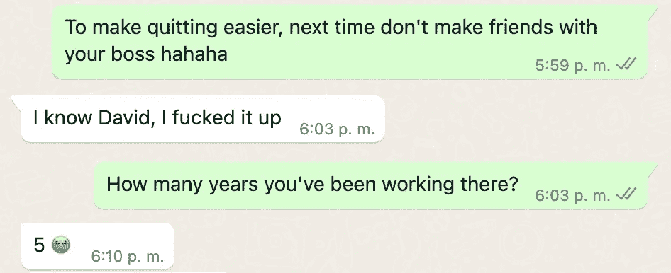

# 作为一名全职软件工程师，我是如何坚持学习和写作的

> 原文：<https://medium.com/codex/how-i-consistently-study-and-write-with-a-full-time-job-as-a-software-engineer-87e141d6be7f?source=collection_archive---------1----------------------->

## 揭开我在复杂的一天中完成事情的常规

几天前，我和我的朋友 Andrea(也是一名软件开发人员)聊天，她告诉我:

我和安德里亚的对话截图

对于许多专业人士来说，这个对话没有意义，但是对于软件来说…