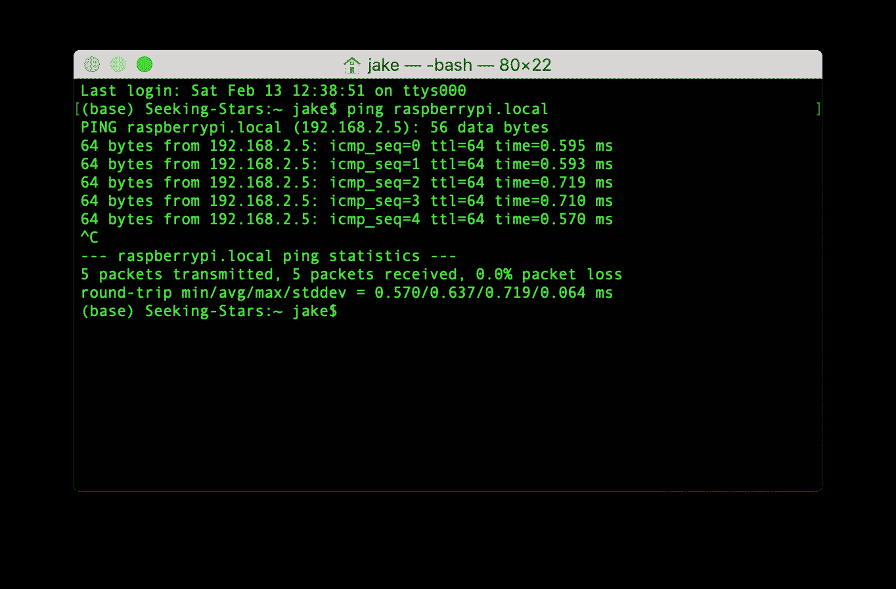

# 我如何创建一个系统来测量停车流量

> 原文：<https://medium.com/codex/how-i-created-a-system-to-measure-parking-traffic-9329d7f260b0?source=collection_archive---------14----------------------->

## [法典](http://medium.com/codex)

为了一个本科研究项目，我创建了一个基于内森·罗伊设计的[的系统。非常感谢 Nathan 通过 LinkedIn 与我保持联系，帮助我解决一路上遇到的任何问题，并创建了这个项目。](https://nathanrooy.github.io/posts/2019-02-06/raspberry-pi-deep-learning-traffic-tracker/)

该系统是 Raspberry Pi，它运行对象分类张量流模型，并将检测数据存储在 CSV 中以供进一步分析。在我的个人资料的另一篇文章中阅读更多的项目概念和统计分析**(当它完成后我将在这里发布)**。本文旨在为任何想要复制该系统的人提供安装指南。

# 材料

要构建该项目，您需要以下材料。我会链接到我购买它们的地方，因此，如果它们不再可用，请运行谷歌搜索以查看其他地方:

*   树莓 Pi 4 B (2GB 内存)——35 美元: [pishop.us](https://www.pishop.us/product/raspberry-pi-4-model-b-2gb/)
*   树莓黑皮相机 v2——30 美元:[阿达果](https://www.adafruit.com/product/3100#tutorials)
*   MicroSD 32GB，带 SD 适配器，兼容卡列表中的[。我从史泰博买的是 14 美元。](https://elinux.org/RPi_SD_cards)
*   3 英尺以太网电缆——5 美元: [OfficeDepot](https://www.officedepot.com/a/products/417157/Ativa-Cat-5e-Ethernet-Cable-3/?utm_source=google&utm_medium=cpc&&gclsrc=aw.ds&gclid=CjwKCAiA4rGCBhAQEiwAelVti98n7hHsRZZAki_B-ZUTrnAU2nfZR7HlsfJPwivIhrJrQASaM1kDNhoCnCkQAvD_BwE&gclsrc=aw.ds)
*   j5Create USB 3.0 千兆以太网适配器(Jue 130)——25 美元: [BestBuy](https://www.bestbuy.com/site/j5create-usb-3-0-to-gigabit-ethernet-adapter-gray/2001047.p?skuId=2001047&ref=212&loc=1&ref=212&loc=1&ds_rl=1264993&ds_rl=1264987&gclid=CjwKCAiA4rGCBhAQEiwAelVti4vp5oMBqE6Q9toYnkuC_vuz-ySOt11tfPZiV0o624n8w9IOuiVMbhoCauUQAvD_BwE&gclsrc=aw.ds) 。注:如果您的计算机已经有一个以太网适配器，您不需要这个。
*   大型塑料工程围栏——20 美元:[阿达果](https://www.adafruit.com/product/905)。
*   INIU 18W 20000mAh 动力银行——20 美元:[亚马逊](https://www.amazon.com/gp/product/B07YCR7FR9/ref=ppx_yo_dt_b_asin_title_o00_s00?ie=UTF8&psc=1)。为此，你必须**绝对确定**电池长度为 5.3 英寸或更短，除非你打算买一个比我在这里使用的更大的项目箱。对于这个项目，我需要连续运行系统大约 16 个小时，所以 20000mAh 是合适的。您可以根据需要调整容量，但要注意项目箱的大小限制。此外，Pi 4 通过 USB-C 供电，所以请确保您的电池包括 USB-C 电缆，或获得一个适配器。
*   钕埋头环形磁铁 N42 (20 个装)——15 美元: [totalElement](https://totalelement.com/collections/countersunk-discs/products/1-2-x-1-8-x-1-8-inch-neodymium-rare-earth-countersunk-ring-magnets-n42-20-pack) 。它不一定是这些精确的钕磁铁，但要确保无论你得到的是 N42，是一个“环”磁铁，因为你需要使用一个螺钉将它们连接到项目的情况下。
*   计划预算额外的 **$20** 用于任何额外的粘合材料、螺钉、螺母等。
*   电脑最好运行 Ubuntu 20.04 (Windows 10 和 MacOS pre-BigSur 也可以，这只是为了驱动程序与以太网适配器兼容)。

总的来说，该系统大约需要**185**美元。这种*比 450 多美元的气动管道系统*要便宜得多。

# Pi 配置

一旦交付了所有东西，您需要将 Raspbian 操作系统安装到 microSD 卡上，并在 Pi 上进行一些配置。

## 安装 Raspbian 操作系统

将 microSD 插入电脑的 microSD 读卡器或适配器。Raspberry Pi 提供了一个实用程序，使这一过程变得相当快速和简单。[下载树莓 Pi 成像仪](https://www.raspberrypi.org/software/)，并安装。

安装完成后，打开 Raspberry Pi 成像仪。选择 OS 为 Raspbian Pi OS (32 位)，并选择您刚刚插入电脑的 microSD 卡。


选择 Raspberry Pi OS (32 位)，然后选择您将放入 Pi 的 SD 卡。

> **更新 2022:** 出于安全考虑，所有 rpi 发货时都没有出于安全目的的帐户设置。在刷新 microSD 之前，请务必点击成像仪窗口右下角的齿轮。选择“启用 SSH”，并添加所需的用户名和密码。

一旦你这样做了，开始安装。这需要几分钟，取决于您的 microSD 卡的传输速度。安装完成后，您需要进行一些配置，以使它启动并对您的机器可见。

## 编辑引导分区上的 config.txt

现在您已经安装了 Raspbian，SD 卡仍然在您的计算机中，导航到 SD 卡上的引导目录，并打开名为 **config.txt** 的文件。


config.txt 位于安装的 SD 卡的根目录中

在文件的末尾，您需要添加以下内容:

```
dtoverlay=dwc2
```

最终结果应该如下图所示。确保完成后保存并退出。


## 启用 SSH，这样您就可以与您的 Pi 对话

SD 卡仍在您的计算机中，在卡的根目录下创建一个名为 ssh 的空文件。无论你选择怎样做，都是由你自己决定的。就我个人而言，我只是导航到目录并使用一个命令。

```
~$ cd ../.. *#This takes you to the root directory of a Mac from your home directory*
~$ cd Volumes/boot *#Replace "boot" with the name of the SD card volume*
~$ touch ssh *#The touch command creates a file with the given name* ~$ ls *#Check to make sure the file was created*
```


执行上述命令后产生的文件。可以看到，“ssh”在 SD 卡的根目录下成功创建。

## 编辑 cmdline.txt

编辑名为**cmdline . txt .**Find**root wait**的文件，添加以下内容，前后加一个空格:

```
modules-load=dwc2,g_ether
```

完成后，生成的文件应该如下所示:

```
console=serial0,115200 console=tty1 root=PARTUUID=84b6fcd0–02 rootfstype=ext4 elevator=deadline fsck.repair=yes rootwait **modules-load=dwc2,g_ether** quiet splash plymouth.ignore-serial-consoles
```

完成后，请务必保存并退出。

## 连接到您的 Pi

现在一切都设置好了，所以你可以访问你的 Pi。弹出 SD 卡，并将其插入 Pi 上的 microSD 插槽。

首先，将 USB 以太网适配器插入您的计算机，如果这适用于您的话。Mac 和 Windows 需要安装额外的驱动程序才能正常工作，所以请从[本页](https://en.j5create.com/pages/drivers)下载合适的驱动程序(JUE130 ),如果您运行的是 Mac 或 Windows，请参见后面的说明。

然而，Ubuntu 不需要额外的驱动程序来工作。插入适配器并重新启动。然后，使用以太网电缆将 Pi 连接到适配器。在 Ubuntu 中找到有线网络设置，在 IPv4 和 IPv6 下，将方法改为“仅链接本地”。您需要这样做，因为您的 Pi 不是一个接入点，也没有为您的计算机提供互联网。如果不完成这一步，您将很难使用 ssh。

对于其他操作系统，可能需要额外的设置。J5Create 应该会给你完整的安装说明，否则请查看 Google on 使用 USB 以太网适配器。

要测试您的 Pi 是否工作正常，您可以使用下面的命令 ping 它(在 Mac/Linux 中，Windows 可能不同):

```
~$ ping raspberrypi.local *#raspberrypi.local is the address of your Pi*
```

如果一切运行良好(这是应该的),您应该会得到如下结果:



我的终端返回成功的 pings，我按 control+C 停止操作。我的 RPi 连接成功。

此外，您应该看到 Pi 的以太网端口和适配器上的下行链路和上行链路 led 都亮起。

如果您最终得到一个错误消息，说 **ping:无法解析 raspberrypi.local:未知主机**，请稍等片刻，然后重试。Pi 可能没有完全启动。如果你仍然有问题，使用名称**拉斯贝里皮**。如果你在*之后仍然*有连接到你的 Pi 的问题，你可能想要从安装 Raspbian 重新开始这个过程，或者只是谷歌你的问题。

## 访问 Raspbian(用于无头设备)

> **更新 2022:** 出于安全考虑，所有 rpi 在发货时都没有默认登录 pi / raspberry。在 Raspberry Pi Imager 中，您应该已经配置了高级设置，因此 SSH 已启用，并且您已经设置了自己选择的用户名/密码。

如果您的 Pi 没有显示器和键盘，有一个简单的解决方法。在访问 Raspbian 之前，您需要使用以下命令 ssh 到 Pi:

```
~$ ssh pi@raspberrypi.local
```

接受任何出现的提示，使用默认密码登录，就是 **raspberry。你以后应该改变这一点。**

现在您已经通过 ssh 登录，接下来，您需要启用 VNC 服务器，它允许您查看和访问 Pi 的桌面。为此，请使用以下命令来访问配置:

```
~$ sudo raspi-config
```

然后，使用向上/向下键滚动到界面选项，并按 enter 键进行选择。进入选项界面后，滚动至 **VNC** 并选择**是>。**

此外，您需要转到本地化选项，设置您的地区和时区，并输入您的 wi-fi 网络的 SSID 和密码(以便您的 Pi 可以连接到外部世界，以便稍后下载依赖项)。


在下一个对话框中选择 **< Ok >** ，使用左右箭头键选择 **< Finish >** 。您的 Pi 将重新启动。

很好，现在您已经设置好远程访问您的 Pi 桌面了。

您可以使用 **VNC 浏览器**来查看您的 Pi 的桌面，并在那里使用它。关于如何安装我不会说得太详细，只需进入 [VNC 浏览器下载页面](https://www.realvnc.com/en/connect/download/viewer/)，为你的机器选择正确的安装，然后安装。然后，转到**文件> >新连接…** 并为 VNC 服务器键入 **raspberrypi.local** (或者您在上一步中使用的任何名称)，不要管其他选项。

安装并设置好之后，您可以在 VNC 浏览器中双击刚刚建立的连接。在出现任何提示时点击“Continue ”,然后使用与 ssh 相同的凭证登录:

> 用户:pi
> 密码:树莓

登录后，您需要完成配置。它应该一步一步地引导你完成所有你需要做的事情。完成后，您的 Pi 就可以远程使用了！VNC 将被证明是有用的，尤其是如果你需要排除模型故障。

# 安装必要的软件包

## 安装 Docker

为了在您的 Pi 系统上安装模型，Nathan Rooy 通过 dockerizing 简化了模型和应用程序的安装。我强烈建议您在继续之前研究一下 Docker 是什么以及它是如何工作的，因为这样做将有助于解决您遇到的任何问题。就我个人而言，我发现这个 2 分钟的视频非常有帮助。

要在 Raspberry Pi 上安装 docker，请遵循 Debian 的 [Docker 文档安装指南。](https://docs.docker.com/engine/install/debian/#install-using-the-convenience-script)

然后，一旦安装了 Docker，就需要将当前用户添加到 Docker 用户组中(这样用户就可以运行容器，而不需要 sudo 权限)。

```
sudo usermod -aG docker pi
```

如果该命令成功执行，它将不会输出任何内容。它可能会产生一个错误，要求您创建一个用户组(因为该用户组本来就不存在)，这应该通过使用此命令来解决，然后在以下时间后重试将 pi 添加到用户组:

```
sudo groupadd docker
sudo reboot *#You need to reboot for the changes to take effect*
```

## 安装城市移动跟踪器(UMT)

接下来，您需要通过 Docker 安装应用程序及其依赖项。因此，如果你的 docker 安装还没有工作，修复它！

为了简化应用程序的安装和运行，我创建了一个小的 shell 脚本。在您的主目录中，从我的 github repo 下载 [install.sh](https://raw.githubusercontent.com/hainesdata/rpi-urban-mobility-tracker/master/shell/install.sh) (从 [Nathan Rooy 的 repo](https://github.com/nathanrooy/rpi-urban-mobility-tracker) 派生而来)并使用以下命令运行:

```
wget [https://raw.githubusercontent.com/hainesdata/rpi-urban-mobility-tracker/master/shell/install.sh](https://raw.githubusercontent.com/hainesdata/rpi-urban-mobility-tracker/master/shell/install.sh)
chmod +x install.sh
./install.sh
```

该脚本应该安装所有东西，构建容器，并自动运行容器。去买些食物，因为这需要一段时间——可能需要 20 分钟左右。

## 测试城市轨道交通

完成后，在容器运行的情况下测试 UMT，看看它是否工作。

```
cd umt_output *#Make sure you are in UMT directory, unless you're already in the running container.* wget [https://github.com/hainesdata/rpi-urban-mobility-tracker/raw/master/sampledata/sampledata-01.mp4](https://github.com/hainesdata/rpi-urban-mobility-tracker/raw/master/sampledata/sampledata-01.mp4) *#Downloads sample footage* umt -video sampledata-01.mp4 -save
ls output
```

如果一切正常，应该有一个名为“output”的目录，当运行 **ls output** 命令时，应该包含注释。jpg 图片。此外，应该存在一个名为“object_paths.csv”的 CSV 文件。忽略任何与 TensorBoard 或 bogomips 相关的警告。这是预期的行为，并不妨碍模型的功能。

也有可能样本视频上的注释不准确，这也是意料之中的行为。尝试运行以下程序，将 RPi 摄像机对准周围环境，片刻后按 control + C 键停止实时分析:

```
sudo rm -rf output object_paths.csv *#Clear recent test results*
umt -camera -save
```

您应该看到帧计数，类似于最后的分析。如果没有显示“没有检测到…”的消息，则模型正在检测对象，并且一切正常。要检查你的结果，你可以查看输出目录中的照片，或者使用我的报告中包含的帧拼接工具。要使用它，请运行以下命令进行下载:

```
cd ${UMT_DIR}
wget [https://raw.githubusercontent.com/hainesdata/rpi-urban-mobility-tracker/master/shell/stitch.sh](https://raw.githubusercontent.com/hainesdata/rpi-urban-mobility-tracker/master/shell/stitch.sh)
chmod +x stitch.sh
```

并像平常一样执行 shell 脚本:

```
./stitch.sh
```

这将所有的帧拼接在一起，形成一个名为“analyzed-frames.mp4”的 MP4 视频。视频的速度会大大加快，这可以通过使用 **nano** 并编辑 stitch.sh 中的“setpts”参数来改变。如果您不熟悉如何使用 nano，这里有一个针对我们目的的快速说明:

```
nano stitch.sh
```

然后使用左右箭头滚动至“设定值”参数，并根据需要进行更改。该参数是视频中每帧长度的比例，因此数字越小意味着视频速度越快。实时速度，试试 PTS*3 或者 PTS*4。完成后，只需 CTRL+S 保存，CTRL+X 退出 nano。

# 系统装配

## 项目框:安装

项目箱组装可以是非常主观的，因为它取决于你得到的磁铁，项目外壳，和你的系统总重量。出于这个原因，我将保持这个更普遍。

为了固定住项目箱，你需要大约 3-4 块磁铁来支撑项目的重量。如果您使用不同的项目盒，3 可能是一个很好的起点，但如果您注意到您的盒子在安装到磁性垂直表面时会滑动，请增加 3。就我而言，我只需要 3 个。

你将需要一个钻头，因为你需要刺穿项目箱的塑料以插入一个螺钉(你将需要紧贴磁铁的螺钉)。有了 Adafruit 的项目箱，已经有了可以钻取的好地方。对于您的情况可能有所不同，但无论如何，螺母都可以方便地从另一侧将螺钉固定到位。只是要确保螺丝放置在盒子边缘附近，因为你可能很难在以后安装其他组件。

这是我的样子:


项目箱的背面，用螺丝将钕磁铁固定到位，另一侧用螺母将螺丝固定到位。

## 项目框:伪装

根据您设置系统的环境，您可能希望使您的系统更加独立，以防止任何类型的篡改或盗窃。Adafruit 的项目箱尤其如此，因为盖子是透明的，所以你可以看到一切。

在我的例子中，我画了盒子。我只是在盖子上的一个点上放了一便士(为相机留出空间)，然后用 Plasti-Dip 将外壳(除了带磁铁的底部)涂成哑光黑色。我没有让它变得完美——它只是做了它的工作，让它不那么引人注目，它做到了。此外，如果你不熟悉 Plasti-Dip，一定要在这里阅读更多关于它的内容。这是一个不可思议的产品，可以用于多种用途。简而言之，就是那种可以像橡胶一样剥离而不留痕迹的油漆。


这个系统看起来像是用塑料浸渍伪装的。是的，该系统的灯光很暗，但仍然可见，尤其是在晚上。这在测试时尤其有用，因为您可以全天监控电池电量，而无需打开外壳。

## 添加组件

下一步是将所有组件(电池和带摄像头的 Pi)添加到机箱中。我强烈建议使用 5-10 磅的 velcro 带将电池固定在外壳上，同时使用命令带将 Pi 固定在电池上。当然，这样做是完全可选的，你可以按照自己喜欢的方式去做。请记住，Pi 会变热很多，因此粘合剂或安装设备必须能够支撑住它。

就我个人而言，我的预算很紧，最后一切都松了，因为当它有一条线连接时，电池几乎完美无缺，Pi 不会去任何地方。我用胶带把相机固定在盖子上。看看下面我的样子:


我不需要 velcro 来做这个电池。由于 USB 电缆连接到电池上，电池紧密地安装在外壳中，并采用类似弹性的表面处理，使其固定到位。如果你打算这样做，为了劣质的电线，请确保每次插入电池时电线都向同一方向弯曲，并且在这样做时不要太紧张。我相信工程师们会对此一笑置之，这是可以理解的，但它的功能和我的目的一样。

## 系统现场测试

现在组装已经完成，UMT 已经启动并运行，系统终于可以重见天日了。您需要携带一台笔记本电脑、以太网适配器(如果适用)、以太网电缆，当然，您还需要携带系统到您计划测试的任何地方。

通过打开 VNC 并连接到我们之前设置的主机来连接到 Pi。在 VNC 浏览器中打开 Pi 的桌面，在远程桌面中启动终端。

打开箱子，将 UMT-Pi 连接到您的笔记本电脑，启动容器。你可以运行由 **install.sh** 下载的 **init.sh** shell 文件来自动启动一切，前提是你已经安装了 UMT。如果您还没有安装 UMT，那么您的 Pi 需要连接到互联网才能安装。启动 Docker 容器后，运行以下命令来启动 UMT 并启用后台处理:

```
nohup umt -camera -save
```

因为我们使用 nohup 运行 UMT，所以终端上不会有输出。输出将被定向到一个名为 nohup.out 的文件，因此如果出现任何错误(突然停止记录、内存泄漏等)，您可以使用输出文件来查找任何错误。此外，使用 [syslogs](https://stackoverflow.com/a/10979779) 帮助排除故障。无论您是在测试阶段还是在实际的数据收集阶段，运行 UMT 的方法都是相同的。

启动模型后，稍等片刻，然后断开以太网电缆与 Pi 的连接，关闭外壳，并安装它。您的系统应该进行记录(还会记录您打开和关闭外壳的过程— *为了进行准确的分析，您应该排除前几百帧和后几百帧。这取决于你需要多长时间来设置/关闭*。


这就是测试对我来说的样子。

请随意收拾您的东西离开一会儿，但是请注意，之前使用的 **-save** 标志只在少于 2 小时的测试中有用。Docker 会在图像达到大约 2GB 时终止进程，因为保存的图像会临时存储在内存中(这是 Docker 容器工作的本质)。当您准备停止它时，卸载它，打开外壳，插入以太网电缆，重新连接到 VNC 的 Pi，最后在终端窗口(应该仍然打开)中按 Ctrl+Z 来停止该过程。控制台可能需要一些时间来响应。但是一旦完成，你可以运行 stitch.sh 或者手动查看帧，前提是你用 **-save** 运行了 UMT。此外，所有数据都将包含在输出的 CSV 中。

如果一切顺利，您的模型应该可以顺利地检测到一切。如果没有，您可能希望根据 [Nathan 的文档](https://github.com/nathanrooy/rpi-urban-mobility-tracker/blob/master/README.md)调整灵敏度阈值，并在记录时测试其他角度。

你也应该在晚上测试。我注意到该模型在光线昏暗的区域和/或当汽车远光灯出现时难以检测。话说回来，角度会直接影响自动曝光，进而影响物体检测。而且，在下雨的时候测试或者为镜头区域搭建一把“伞”。如果雨滴覆盖了透镜看到的塑料，模型很可能会在检测和/或分类方面遇到困难。该模型还可以检测静止的车辆，因此在测量交通流量时避免直接瞄准停车场，因为这可能会影响数据分析。

# 结论

既然您已经构建了系统并对其进行了测试，那么剩下的研究就由您来进行了。就个人而言，我会使用 CSV 中包含的分类和 x/y 数据来查找交通方向，以及某个东西是否是汽车。请务必经常给电池充电，并考虑任何丢失的数据。如果是这种情况，在一致的时间间隔内记录数据可能更容易。

我希望这份指南能提供丰富的信息，并对你的研究有所帮助。如果在此过程中有任何问题，请在 [my Github repo](https://github.com/hainesdata/rpi-urban-mobility-tracker/issues) 上提出问题。如果你对我收集的数据的分析和我的系统应用感兴趣，请访问我个人资料中关于停车交通的另一篇文章。当它完成的时候，我将在这里张贴一个链接。

祝您愉快！如果你有任何问题，请随时联系我。