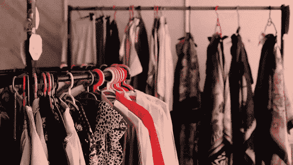

# 我是如何创造出一种每年能为英国时尚零售业节省 1.5 亿英镑的算法的

> 原文：<https://medium.com/codex/how-i-created-an-algorithm-that-could-save-the-uk-fashion-retail-industry-150-million-per-year-9455e8caf55b?source=collection_archive---------4----------------------->

## [法典](http://medium.com/codex)

今年早些时候，我与伦敦的一家初创公司合作，该公司为时装零售商提供如何推动利润增长和更好地了解客户偏好的建议。

据估计，全球服装零售市场价值高达 1.4 万亿美元，包括耐克、Zara、拉尔夫·劳伦和李维斯等品牌。

零售商通常会在顾客能够在店内或网上购买衣服之前的六周到六个月内进行首次进货。

零售买家面临的最大难题之一是库存分散(某些尺寸有备用库存，而客户正在寻找的其他尺寸没有库存)，这是由于主要基于有限的数据和人为决策对新产品的尺寸比例预测不正确。这迫使零售商要么对产品打折，降低收入，要么将产品放回仓库，增加存储成本。

我的项目专注于创建一个机器学习算法，可以更好地预测这些尺寸比例，并允许零售商索回这笔“损失”的收入。

基于以下优势，Python 被确定为构建预测模型的最佳语言:

*   免费和开源
*   易于准备(由所有团队成员完成)
*   ML 库的广泛收集
*   适合制作功能原型
*   强大的数据操作

Python 的环境支持大量的库，但是通过互联网研究，我确定了*五个*关键库，用于预测过程的不同阶段(例如*数据分析、数据收集*等)。):

*   **NumPy** —数据结构，数学计算
*   **熊猫** —数据结构/分析/操作
*   **Seaborn** —数据可视化
*   **Scikit-learn** —机器学习算法
*   **Keras/TensorFlow** —神经网络算法

> 查看我在我的[上发表的关于数据科学的 10 大 Python 库的中型文章](/analytics-vidhya/top-10-python-libraries-for-data-science-78a6a2c3871f)

# 1.数据清理

数据清洗基本上就是*识别*和*消除数据中的* *错误*。

产品属性数据从数据库中提取出来，放入 Pandas 数据框中，进行透视和压缩，以使数据更易于理解和以后使用。任何“NaN”值都被转换为零(以避免数学计算过程中的错误),并且所有低销售额的产品都被删除，以最小化预测模型的“噪音”。

# 2.数据分析

数据分析基本上是*理解*数据以获得有用的见解，这将推动模型开发和未来决策。

我浏览了大量数据，以更好地了解不同产品的尺寸比例随时间的变化，确定可能需要在模型中增加权重的“重要”特征，以及特征本身或外部变量(如经济指标)之间的任何相关性。

然后数据被分成*训练*和*测试*数据供模型使用。

# 3.模型开发和测试

模型开发和测试基本上就是*设计、开发*和*测试*不同类型的机器学习算法。

在开发之前，确定了一个成功指标*均方根误差*，因为它避免采用误差的绝对值，这意味着它不会受到大值的过度影响。

我探索了*回归*(例如 k-neighbors)*分类*(例如 Gaussian naive Bayes)*聚类*(例如 meanshift)和*人工神经网络*(例如 k-neighbors)算法，以确定哪一个具有最小的买方误差，从而在回溯测试时具有最准确的预测。

*然后进行超参数优化*(改变大范围的参数以优化模型的学习过程)，以确定局部最小值，即在时间/计算能力限制内我能找到的最低可能误差。

这些误差也在逐个尺寸的基础上进行分析，并利用有限的训练数据来确定模型的稳健性。

最后，进行了一次全面的回溯测试，以确定优化后的模型会让零售商获得多少“损失”的价值，仅英国时尚零售市场每年的总额就达到了惊人的 1.5 亿英镑。想象一下，如果这种算法被小心地放大并集成到零售购买流程中，会有多大的全球潜力…

那么除了一些数据科学技术和 Python，我还学到了什么呢？永远不要低估你能提供的价值，即使你没有什么经验。

尤其是对那些还没有意识到数据全部潜力的更“成熟”的行业来说，他们已经把数据扔进了内华达州中心某个地方的数据服务器。