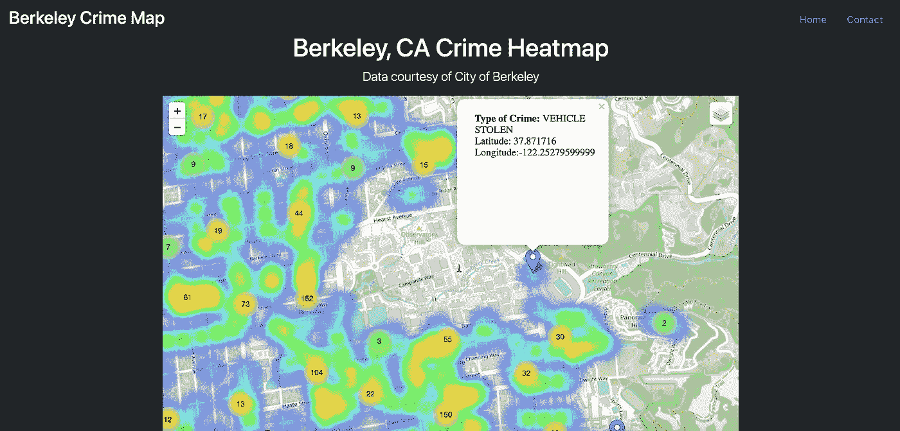
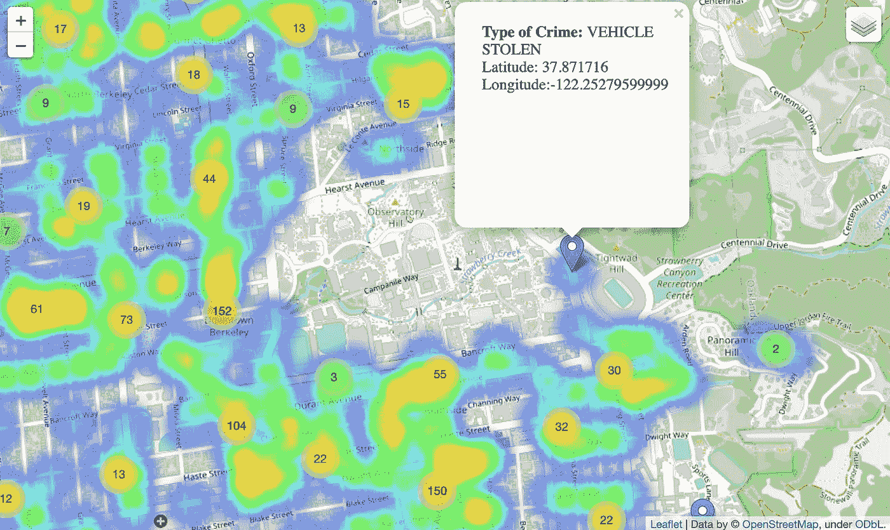
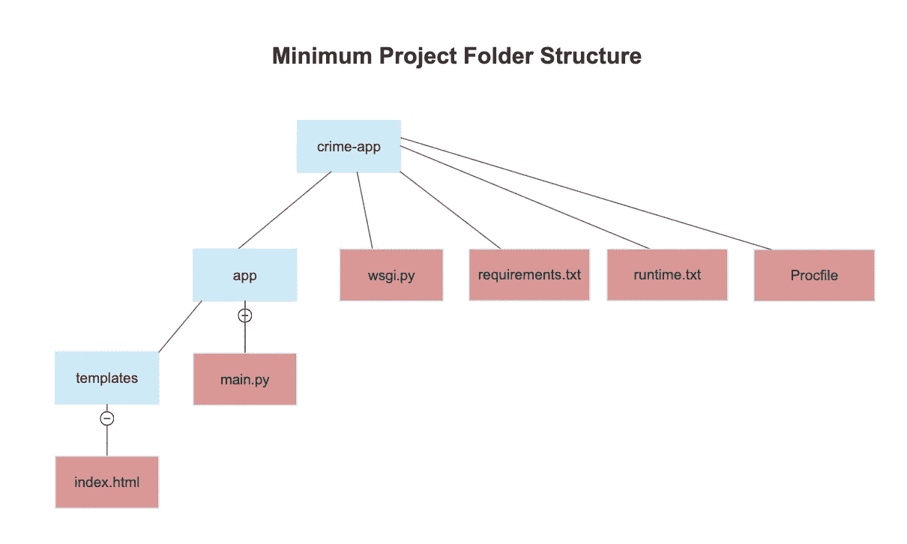
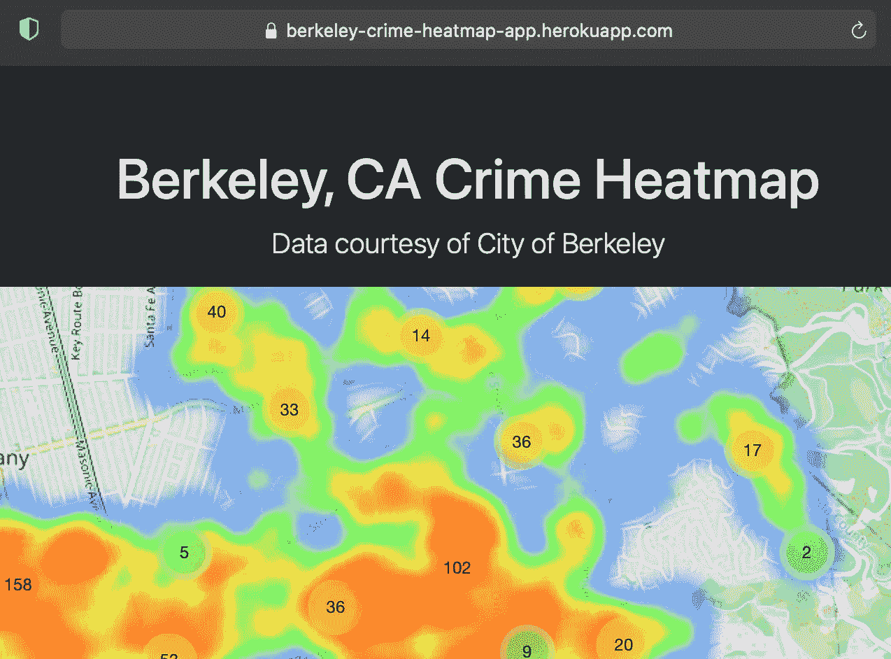

# 我如何使用 Python、Flask 和 Heroku 部署犯罪热图 Web 应用程序

> 原文：<https://medium.com/codex/how-i-deployed-a-crime-heatmap-application-using-python-flask-and-heroku-48b9dfb5362f?source=collection_archive---------8----------------------->



据 berkeleyside.org 称，加州柏克莱市的警察每年要处理大约 77000 个求助电话。作为一名在加州大学伯克利分校*学习数据科学的大三学生(2022 更新:我毕业了！我明白，生活在一个城市里，一个人必须时刻保持警惕，对自己要去哪里、与谁交往以及采取什么行动做出明智的决定。考虑到这一点，我决定利用今年夏天的一些空闲时间来创建一个可以帮助伯克利居民保持安全的东西:一个犯罪热点地图，允许用户交互式地探索伯克利的犯罪地点和密度，其中包括一个带有纬度、经度和犯罪类型的信息面板。*

看看这里:https://berkeley-crime-heatmap-app.herokuapp.com/

2023 年更新:很遗憾，免费的 Heroku dynos 不再可用，这意味着上面的网站目前无法运行。你需要订阅 Heroku 的生态计划，以便继续本教程。

我写这篇文章不仅是为了记录我的工作以供将来参考，也是为了给有兴趣的人提供一个创建自己的 Python 应用程序的指南。如果你是那种愿意跟随 GitHub 库的人，[点击这里](https://github.com/aydensalazar/crime-app)。

# 下载和清理数据

对于 Python 代码，我们将在 Pandas 中工作，这是一个 Python 数据操作和分析库。这篇文章假设读者对熊猫有一些了解，尽管会提供一些解释。

首先，让我们从伯克利市公共数据库中获取数据。创建一个名为 **main.py** 的文件来存储您的所有代码，以便进行数据下载和清理。虽然有多种方法可以导出数据，但我决定通过 Socrata 开放数据 API (SODA)导出。由于 SODA 的默认记录限制是 1000，我需要将参数`$limit`更改为最大值`$limit`50，000。

```
crime = requests.get(“[https://data.cityofberkeley.info/resource/k2nh-s5h5.json?$limit=50000](https://data.cityofberkeley.info/resource/k2nh-s5h5.json?$limit=50000)")
crime = crime.json()
crime = pd.DataFrame.from_dict(crime)
```

接下来，我们必须从“block_location”列中提取纬度和经度，检查 NA 值，并删除不必要的列。这个过程非常简单，尽管我已经包含了下面的代码以供参考:

```
# add coordinates column
crime[‘Latitude’] = crime[‘block_location’].apply(lambda x: x.get(‘latitude’))
crime[‘Longitude’] = crime[‘block_location’].apply(lambda x: x.get(‘longitude’))crime[‘Longitude’] = crime[‘Longitude’].replace(r’\s+’, np.nan, regex=True)
crime[‘Longitude’] = crime[‘Longitude’].replace(r’^$’, np.nan, regex=True)
crime[‘Longitude’] = crime[‘Longitude’].fillna(-0.99999)
crime[‘Longitude’] = pd.to_numeric(crime[‘Longitude’])
crime[‘Latitude’] = crime[‘Latitude’].replace(r’\s+’, np.nan, regex=True)
crime[‘Latitude’] = crime[‘Latitude’].replace(r’^$’, np.nan, regex=True)
crime[‘Latitude’] = crime[‘Latitude’].fillna(-0.99999)
crime[‘Latitude’] = pd.to_numeric(crime[‘Latitude’])# check for any NA/null values
crime.isnull().sum()
crime = crime.drop([‘:[@computed_region_b3wi](http://twitter.com/computed_region_b3wi)_w8ix’, 
 ‘:[@computed_region_fhmw](http://twitter.com/computed_region_fhmw)_rucx’,
 ‘:[@computed_region_u3y2](http://twitter.com/computed_region_u3y2)_d2ws’,
 ‘:[@computed_region_5s6d](http://twitter.com/computed_region_5s6d)_2f32’,
 ‘:[@computed_region_3ini](http://twitter.com/computed_region_3ini)_iehf’,
 ‘:[@computed_region_5bih](http://twitter.com/computed_region_5bih)_7r3y’,
 ‘:[@computed_region_x3q3](http://twitter.com/computed_region_x3q3)_gi3e’,], axis=1)# drop null values
crime = crime.dropna()
```

# 构建热图

为了对热图进行编码，我们将使用 for，这是一个用于可视化地理空间数据的 Python 库。虽然这是我第一次使用 leav，但它让绘制交互式地图变得如此简单和容易，给我留下了深刻的印象。首先，让我们初始化地图对象，设置位置为加州大学伯克利分校，缩放比例为 14.5。

```
map = folium.Map(
 location=[37.871853, -122.258423],
 zoom_start=14.5
)
```

以上代码行所做的只是创建一个空白地图；我们需要添加犯罪数据点，这样它才会有用！首先，创建一个 MarkerCluster 对象，我们将它视为包含犯罪数据点的地图的一个*层*。然后，我们将把这个图层放在空白地图上，因此用犯罪标记填充它。

```
marker_cluster = MarkerCluster(
 name=”Crimes by Marker”,
 overlay=True,
 control=True
)
```

现在我们有了 MarkerCluster 对象，我们必须将每个单独的犯罪记录添加到该对象中。虽然有多种方法可以做到这一点，但由于数据集相对较小，我选择使用迭代。让我们将犯罪数据框架中的“纬度”和“经度”列转换为列表，然后将每个列添加到 **marker_cluster** 。

```
lat = crime[‘Latitude’].tolist()
lng = crime[‘Longitude’].tolist()
offense = crime[‘offense’].tolist()
locations = list(zip(lat, lng))
offense = crime[‘offense’].tolist()for i in range(len(lat)):
 location = lat[i], lng[i]
 crime_type = offense[i]
 html = ‘’’<b> Type of Crime: </b> {}<br>
 Latitude: {}<br>
 Longitude:{}<br>’’’.format(crime_type, location[0], location[1])
 iframe = folium.IFrame(html, width=200, height=200)
 popup = folium.Popup(iframe, max_width=200)
 marker = folium.Marker(location= location,popup=popup)
 marker_cluster.add_child(marker)marker_cluster.add_to(map)
```

请注意，leav 中的标记有一个弹出参数。这允许我为每个标记制作一个简单的 HTML 格式的弹出窗口，其中包括犯罪类型、纬度和经度。

有趣的是，实际的热图组件非常简单，只需要两行代码。

```
HeatMap(
 data=list(zip(lat, lng)),
 name=”Crimes by Heatmap”).add_to(map)
folium.LayerControl().add_to(map)
```

然后，瞧！就是这样！



# 为部署设置项目文件夹

这是我第一次在 web 上部署 Python 应用程序，我很快发现将原始的 Python 脚本文件翻译成 web 友好的 HTML 页面比我预想的要复杂。

我们花了前一部分的时间处理我们的 **main.py** 文件。在接下来的这一部分，我们将使用 Flask，一个 Python 的微 web 框架，和 Heroku，一个云平台即服务，允许 Python web 应用部署。我们现在将创建一个具有以下文件排列的项目文件夹:



蓝色节点是文件夹；红色节点是文件

1.  **main.py** 包含了在前面几节中创建的 Folium 热图的 Python 代码。
2.  **wsgi.py** 包含以下代码:

```
from app.main import appif __name__ == “__main__”:
 app.run()
```

3.列出了允许应用程序正常工作的所有依赖关系。在这种情况下，我们只需要几行:

```
numpy==1.17.2
pandas==0.25.1
Flask==1.1.1
requests==2.22.0
folium==0.12.1
```

4. **runtime.txt** 指定 Heroku 将使用的 Python 运行时。我遇到的一个 bug 是 Heroku 只支持特定的 Python 运行时:

```
python-3.7.11
```

5. **Procfile** 告诉 Heroku 应用程序将在最开始运行的命令:

```
web: gunicorn wsgi:app
```

6.index.html 有点棘手。根据您想要的 HTML 布局，这个文件会有所不同。对于我的应用程序，我最终使用 Bootstrap，这是一个免费的 CSS 框架，使 HTML web 开发变得容易。Bootstrap 的网站上有一大堆很酷的模板可供网页设计选择。

虽然我不会深入介绍 Bootstrap 的细节(请随意查看我的 [GitHub 库](https://github.com/aydensalazar/crime-app)以了解我是如何使用它的)，但我将介绍如何将 follow 热图插入 HTML 网页，这需要两个步骤:

a)返回到 **main.py** 并在文件底部添加以下代码:

```
html_map = map._repr_html_()app = Flask(__name__)[@app](http://twitter.com/app).route(“/”)
def index():
 return render_template(“index.html”, map = html_map)if __name__ == “__main__”:
 app.run(host=”127.0.0.1", port=8080, debug=True)
```

这将我们的叶子地图转换成一个 HTML 对象，然后我们可以将它传递给 render_template 函数，以便在我们的 index.html 文件中使用它。

b)打开**index.html**。选择要在页面中插入叶子地图的位置，然后使用以下代码进行插入:

```
<div class=”col-md-8" style= “margin:0 auto;”>
 {{map|safe}}
 </div>
```

通过 Flask 测试你的应用程序以确保没有问题是个好主意。参考 Real Python 的这篇文章，了解使用 Flask 在本地测试应用程序的细节。

# 部署到 Web

恭喜你走到这一步！最后一步:web 部署。部署你的 Python App 有很多方法，包括 Google 云平台和 Heroku。我在我的项目中使用了 Heroku，但是你可以随意选择使用。

在您的终端中，导航到您的 crime-app 文件夹并运行以下命令:

```
pipenv install flask gunicorn
```

这样做的目的是创建一个虚拟环境，允许 Python 库和依赖项与其他项目分开。

接下来，键入以下命令运行虚拟环境:

```
pipenv shell
```

然后初始化 git 存储库，添加文件，并提交:

```
git init 
git add .
git commit -m "Our first commit"
```

现在，假设您已经设置了一个 Heroku 帐户，按顺序运行以下命令:

```
heroku login
heroku create this-is-my-crime-app
git push heroku master
```

搞定了。您的应用程序将被部署到[http://this-is-my-crime-app.herokuapp.com](http://this-is-my-crime-app.herokuapp.com)(目前，这里没有任何内容，因为这是一个示例)。

同样，如果你想看看我的犯罪应用程序的工作版本，请点击这里:[https://berkeley-crime-heatmap-app.herokuapp.com/](https://berkeley-crime-heatmap-app.herokuapp.com/)



# 结论

虽然我的犯罪应用程序非常简单，但今年夏天我想通过第一次部署 Python 应用程序来挑战自己。这个过程绝对是值得的，我期待着在未来与 Heroku 和 Flask 更多的合作。此外，我很乐意在目前的网站上扩展；我的想法包括制作一个基于人工智能的导航应用程序，它可以推荐避开高密度犯罪区域的路线，以及一个包含各个地区一般犯罪统计汇总的仪表板。最终，我想继续利用我的编码知识为公众提供一些在日常城市生活中有用的东西。