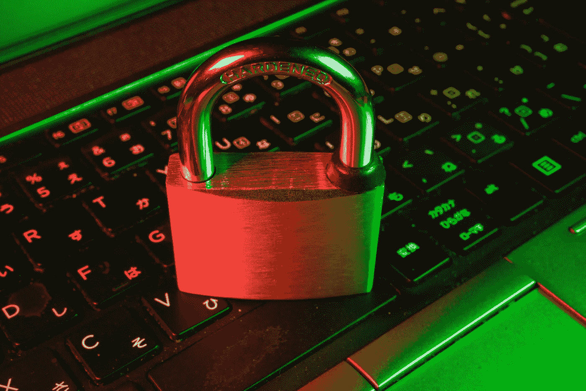

# 我是如何发现并向一家价值数百万美元的公司报告安全漏洞的

> 原文：<https://medium.com/codex/how-i-discovered-and-reported-a-security-vulnerability-to-a-multi-million-dollar-company-c5879e092fb6?source=collection_archive---------7----------------------->

照片由[飞:D](https://unsplash.com/@flyd2069?utm_source=unsplash&utm_medium=referral&utm_content=creditCopyText) 在 [Unsplash](https://unsplash.com/s/photos/cyber-security?utm_source=unsplash&utm_medium=referral&utm_content=creditCopyText)

有一天我在互联网上发现了一个非常大的公司的 API 的漏洞。我浏览了 API 的登录页面，注意到没有任何形式的验证码来保护表单。答对了，暴力弱点。暴力攻击是指攻击者猜测一堆不同的用户名和密码，看看他们是否可以提升自己的权限。

我们以前都和验证码打过交道，我们可能会发现它们只是一个小麻烦，但是它们对于维护 web 应用程序的安全性非常重要。验证码只是一个只有人类才能解决的谜题，它们基本上确保是一个真实的人而不是一个机器人、脚本或程序发出认证请求..

很自然地，我写了一个 python 脚本来尝试对网站进行暴力攻击。几秒钟之内，我就能用不同的用户名和密码运行 2000 多个请求。我的 IP 没有被标记或禁止，谁曾经应该是分析日志是在方向盘上睡着了。

因为我是个好人，所以我决定向公司报告这个漏洞。我注意到的第一件事是，他们让我很难找到如何披露漏洞，但经过一番搜索后，a 找到了一个电子邮件地址，并开始撰写我的第一份漏洞报告。该报告包括漏洞的详细信息、我是如何发现它的、我用来测试它的脚本以及我个人的安全建议。

显然，我建议安装一个验证码系统，以防止脚本运行。对于公司来说，标记并暂时禁止有异常活动的 IP 地址也是明智的，比如在几秒钟内有数千次失败的登录尝试。在多次登录失败后锁定用户账户也不是一个坏主意。

可悲的是，对于这个巨大的问题，没有采取任何措施。这个网站仍然很脆弱，尽管我很努力，但我得到的只是一封自动回复的邮件。

专注于安全的企业将有一个处理漏洞披露的既定渠道，并应提供一个漏洞奖励计划。不为负责任地披露会给公司带来一切的漏洞提供任何金钱奖励是非常吝啬的。

自动化安全是一个笑话，你需要有人保持警惕，并准备好处理出现的问题。修复漏洞应该是每个公司 CI/CD 管道的一部分。

科里的角落播客:[https://anchor.fm/coreys-corner](https://anchor.fm/coreys-corner)
加德纳 App 开发:[https://gardnerappdev.com](https://gardnerappdev.com)
Get yoke d🍳[https://thoughtsandfitness.com](https://thoughtsandfitness.com)学会编码:[https://www.youtube.com/channel/UCfd8A1xfzqk7veapUhe8hLQ](https://www.youtube.com/channel/UCfd8A1xfzqk7veapUhe8hLQ)