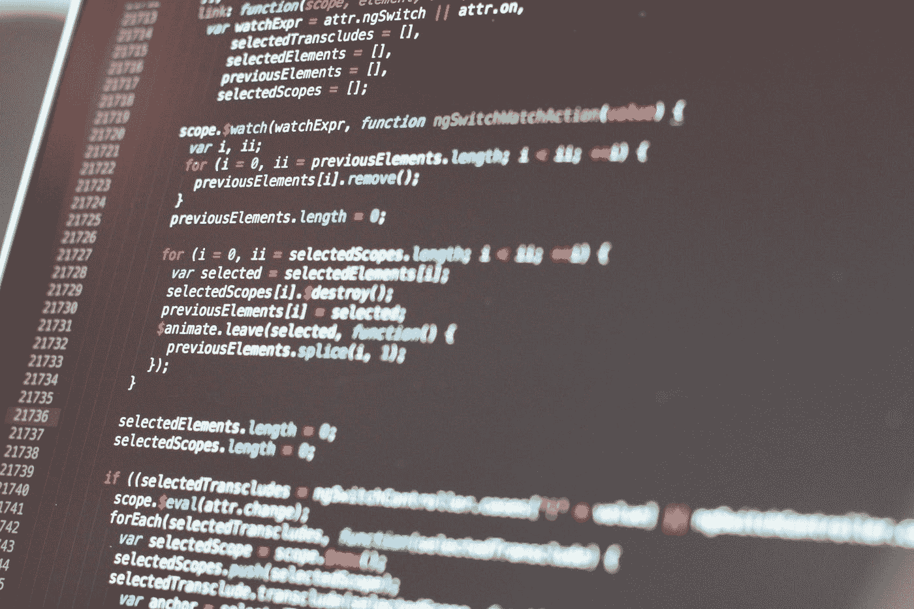

# 我是如何向一个开始学习编程的学生解释递归的

> 原文：<https://medium.com/codex/how-i-explained-recursion-to-a-student-who-started-learning-programming-2ff6faa0ff66?source=collection_archive---------0----------------------->

## [法典](http://medium.com/codex)

由[塔拉斯·什普卡](https://unsplash.com/@bugsster?utm_source=medium&utm_medium=referral)在 [Unsplash](https://unsplash.com?utm_source=medium&utm_medium=referral) 上拍摄的照片

我记得当我刚开始学习编程时，试图理解不同的编程概念或语言特性并没有太大的困难。我在第一次打开这本书的 30 分钟后写了一个 Hello World 应用程序。同一天，我获得了对变量、原始数据类型和算术的高度理解…