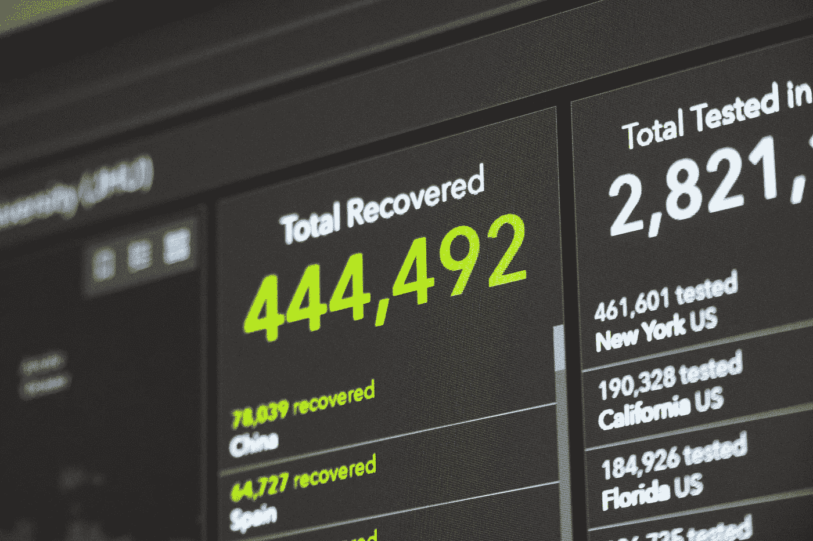
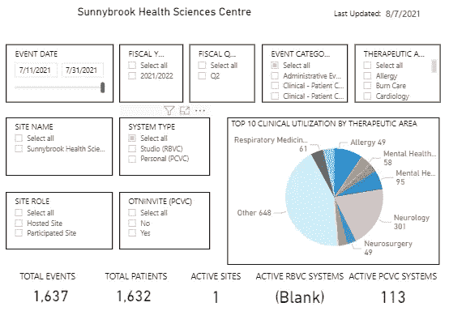
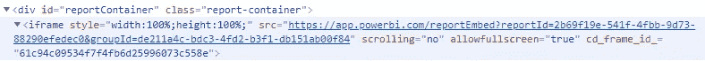
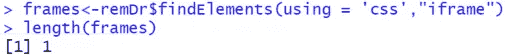
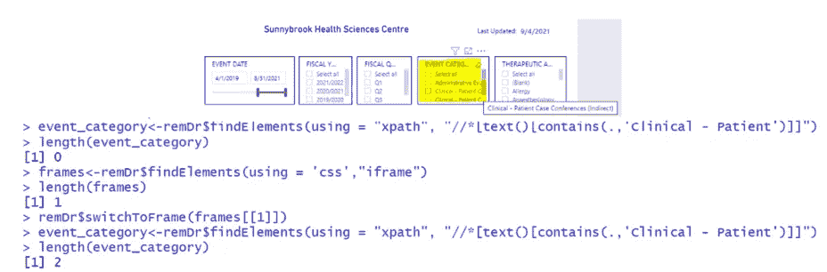
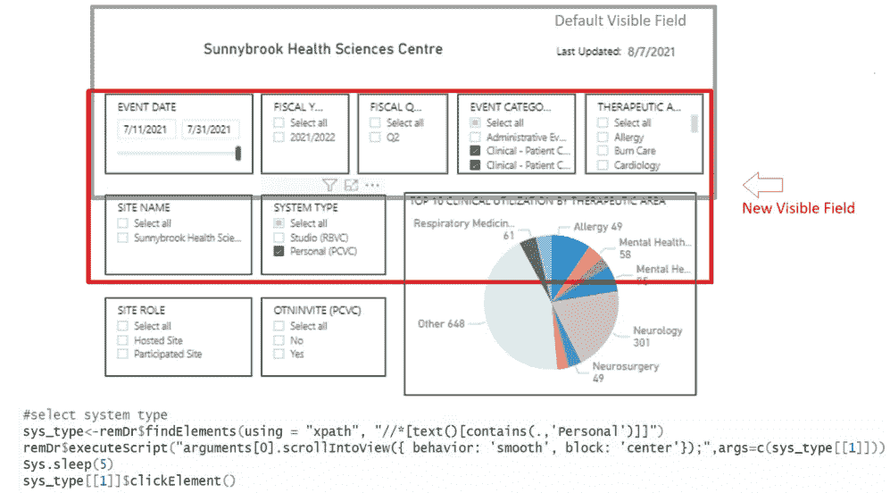
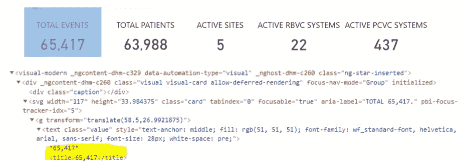
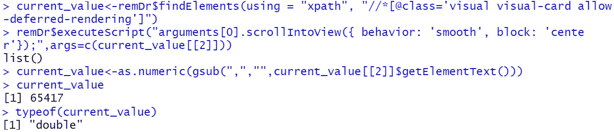

# 如何使用 Selenium 提取仪表板 KPI 数据

> 原文：<https://medium.com/codex/how-i-extract-dashboard-kpi-data-with-selenium-6705bf4a8e47?source=collection_archive---------5----------------------->

马丁·桑切斯在 [Unsplash](https://unsplash.com/?utm_source=medium&utm_medium=referral) 上的照片

交互式仪表板对于商业智能世界来说并不新鲜。然而，当我们穿越 2020 年新冠肺炎的许多波浪时，这些仪表板真正吸引了公众的目光。对最新数据的迫切需求似乎引发了一场争夺[最佳仪表盘](https://www.analyticsvidhya.com/blog/2020/07/top-20-covid-19-dashboard/)的竞赛。对于我们这些数据搜索者来说，有时访问感兴趣的数据的唯一方式是通过这样的仪表板，这并不奇怪；因此，用有用的技巧升级我们的 Selenium 工具包来收集仪表板数据是完全有意义的。

让我们以我最近的项目为例:

该项目包括通过[安大略省远程医疗网络(OTN)](https://otn.ca/) 跟踪基于医院的医疗从业者对虚拟医疗的使用。只是一些背景信息:作为世界上最大的远程医疗网络之一，随着虚拟护理成为许多诊所的规范，OTN 在疫情的使用量急剧增加。对于患者和医疗服务提供者来说，这无疑是一个好消息，因为获得及时和高质量的医疗服务已经受到了巨大的影响！这个项目是作为一项持续的工作而诞生的，旨在衡量虚拟护理的接受程度，其中包括从 OTN 网站上发布的使用仪表板中收集数据，然后将数据转化为针对我们自己的受众的定制报告。

包含相关数据的仪表板发布在 OTN 网站上。

任何常规任务都是自动化的机会。这也不例外；原来 dashboard 就像是网页中的网页，所以 Selenium 基础知识(点击[此处](https://siqi-zhu.medium.com/rselenium-will-work-for-free-b6b3869d9968)快速刷新)仍然是最终脚本的基础，需要注意以下几点:

*   **处理 iframe:**

在我们开始挖掘仪表盘上显示的内容之前，我们必须首先关注仪表盘是如何嵌入网页的。一个常见的策略是使用 [iframes](https://en.wikipedia.org/wiki/HTML_element#Frames) 来显示外部内容。iframe 的处理方式类似于不同的 HTML 页面；因此，Selenium 需要一个手动开关来定位 iframe 中的任何元素。

通过对 HTML 的视觉检查，不难发现我们感兴趣的仪表板确实使用了 iframe，并且是使用 Power BI 构建的:

另一种方法是使用 Selenium 命令 **findElements()** 和方便命名的 css 句柄‘iframe’在 R 中直接查询:

从上面的代码中可以看出，结果保存在一个名为“frames”的列表中，其长度表明在当前页面上只能找到一个 iframe——请注意，一些网页可能会使用多个 iframe 来管理不同的外部内容。

快速检查以确认仪表板位于唯一的 iframe 中:

在本例中，我使用仪表板上“事件类别”下的复选框选项作为“代理”web 元素，以确认它只出现在 iframe 中，而不在网页的其他地方。

*   **感兴趣的内容不在视野内:**

既然 Selenium 可以正确地定位仪表板，我们就可以开始生成我们想要的仪表板 KPI 数据了。交互式仪表板的一个明显优点是它的交互性。有许多内置的功能来帮助实现这一点:日期切片器、复选框等等。在后端，每个特性都与它自己独特的 HTML 相关联，可以像对待任何其他 web 元素一样对待。这也意味着我们可以愉快地应用 Selenium 命令 **findElement()** 和 **clickElement()** 来模拟手动步骤。

有些 web 元素只有在进入可视区域后才可以点击，就像这个仪表板上的复选框一样。默认视图从可见字段中删除了一些复选框，不方便地包括了“系统类型”的复选框——只是一些简单的背景信息:OTN 平台提供了两种类型的系统:Studio/RBVC 需要物理的现场设置，而 PCVC，代表个人视频会议服务，类似于 zoom，可以在个人计算机上访问。如果我们希望根据系统类型分析控制面板数据，我们需要手动向下滚动页面，以便将相关选项显示在视图中。硒的情况也是如此！需要注意的是，Selenium 本身没有直接的滚动命令；相反，我们可以利用非常灵活的[**execute script**](https://cran.r-project.org/web/packages/RSelenium/vignettes/basics.html#injecting-javascript)**()**命令(从 [**其他**](/codex/beyond-the-basics-here-are-3-ways-i-have-used-javascript-in-selenium-272e9417270a) 可能的用途中得到启发！)和 JavaScript 中的 **scrollIntoView** 命令，使复选框选项可见，从而可点击。

*   **存储为文本的数字**

最后，我们已经勾选了所有相关的复选框，并准备好抓取 KPI 数据“总事件”,它显示在卡片视图中。

当涉及到抓取结构化数据时，我们在这个阶段不必太担心数据类型。但是，当我们从仪表板中抓取数据时，它们可能不是我们想要的格式，并影响我们检索数据的方法。例如，通过检查 HTML，我们可以看到“总事件”的值实际上是作为文本存储的。方便的是，我们可以使用 **getElementText()** 命令返回可见文本。不要就此打住:需要进行一些后期的字符串处理来删除用作千位分隔符的逗号，然后将数据类型转换为数字。幸运的是，由于这种情况下的字符串解析相对容易，所以我将这两个步骤结合在一起，只用了一行代码:

**结论**

由于交互式仪表板在传递来自大量底层数据的关键信息方面的多功能性和有效性，它们已经获得了广泛的应用。另一方面，对于处于数据生命周期另一端并渴望从所有骗子和缝隙中捕获数据的人来说，Selenium 已经被证明是同样有价值的方式！