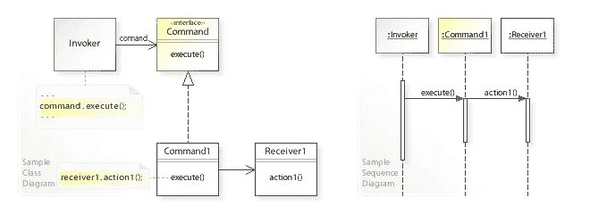
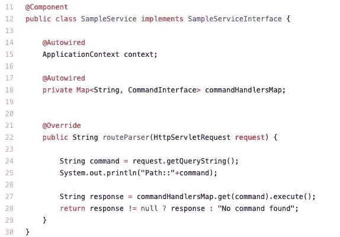
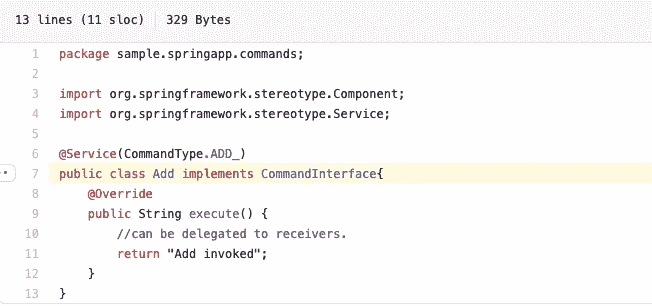

# 我如何在 Spring boot 中实现命令模式

> 原文：<https://medium.com/codex/how-i-implemented-command-pattern-in-spring-boot-870c1f2c73b0?source=collection_archive---------3----------------------->


汉娜·乔舒亚在 [Unsplash](https://unsplash.com?utm_source=medium&utm_medium=referral) 上的照片

如果您熟悉命令设计模式，当您看到这一点并开始思考该实现与标准 java 或任何其他编程语言有何不同时，您可能会感到困惑。别担心，这样想很正常。相信我，当我第一次开始思考这个问题时，我也有同样的感觉。

事实是，从根本上来说没有什么不同，但是让我们来探索如何利用 Spring 强大的 IoC(控制反转)框架，并简化命令模式的实现。

这里有一个命令设计模式组件交互的概览。



来源:维基百科

从上图中，我们可以看到这个模式中的 3 个主要组件

**调用者**是第一个接收请求(用户交互、web API 调用等)的人。示例代码可以在这里找到。



**‘Command’**是一个命令接口的具体实现，它抽象了如何执行用户请求。对于给定的应用程序，可以有许多具体的命令类。通常，应用程序必须通过构建一个映射来收集所有这样的命令，并使其对调用者可用。本文更多地关注如何利用 Spring 的 IoC 来创建这个映射，它删除了样板代码。



**‘接收者**’是实际执行业务逻辑的人。Receiver 可以是一个单独类中的方法，也可以是 command 类本身的一部分，以保持简单。

Spring 中简化了大量代码的两件事。

```
@Autowired
private Map<String, CommandInterface> commandHandlersMap;
```

和

```
@Service(CommandType.*ADD_*)
public class Add implements CommandInterface{
```

如果我们只是用 Spring 的组件/服务/bean 注释来注释所有的命令类，那么 spring-context 将拥有关于你的类的所有信息。

> 最好的部分是当我们自动连线命令地图时，如上所示，它完全让我大吃一惊。它用我们作为类定义及其实例的一部分提供的命令名自动填充映射。从字面上看，我们不必手动创建地图并不断添加命令名和它们的实例。这显然去掉了一堆代码行和链接，从而也提高了可读性。

最后，缺点是我们将业务逻辑与 Spring 框架紧密耦合，当我们考虑这一点的好处时，这在我看来并不坏，而且我猜我们不会那么容易地频繁切换到其他平台。

此处提供了代码示例

[](https://github.com/krishnarama/SpringSample) [## 克里希纳摩/春天样本

### 示范命令模式的示例 springboot 应用程序- krishnarama/SpringSample

github.com](https://github.com/krishnarama/SpringSample)