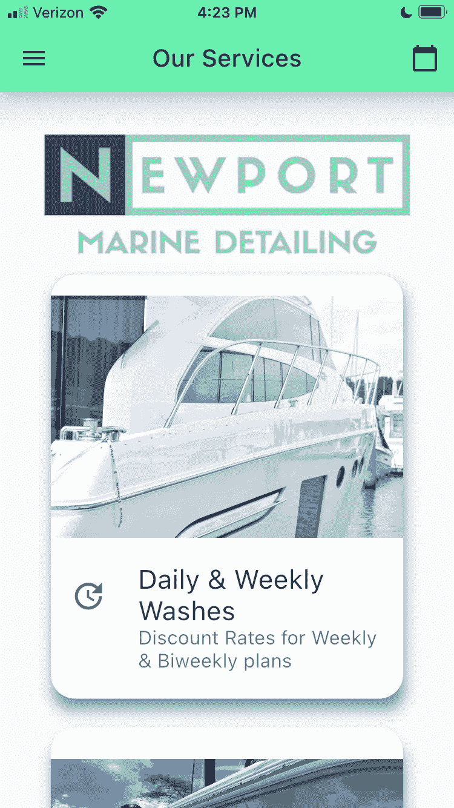
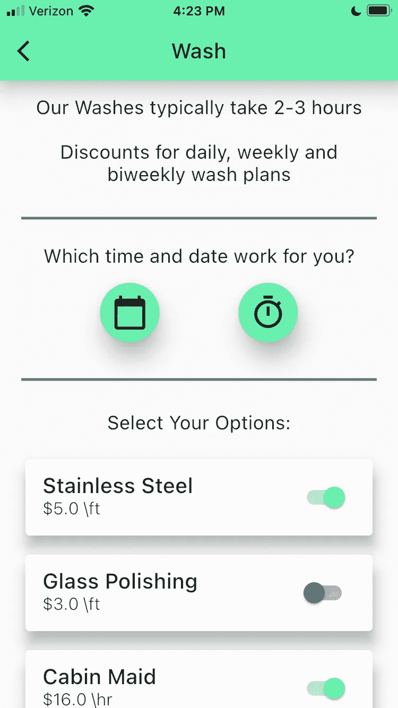
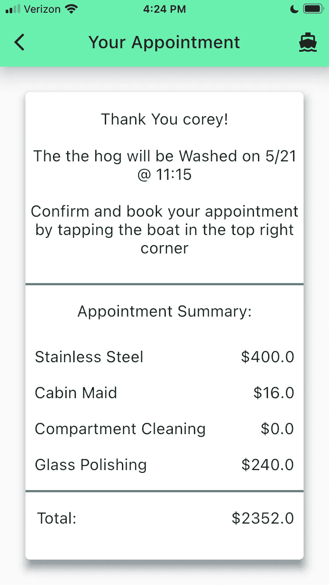

# 我如何推出我的第一个应用程序

> 原文：<https://medium.com/codex/how-i-launched-my-first-app-f844020229bd?source=collection_archive---------4----------------------->

纽波特海洋细节现在可以在 iOS 上使用

我已经写了两年的代码，但是直到去年我才真正进入 web 和 iOS 应用程序开发。我完全是自学的，上个月我在苹果商店推出了我的第一个应用程序，下面是我是怎么做的。

我开始通过看 YouTube 教程来学习如何编码。当我知道我想成为一名“真正的”开发人员时，我决定投资自己，买了迈克尔·哈特尔的 Ruby on Rails 教程，后来又买了他的《T2 挣得足够危险》教程。我怎么推荐这些课程和这本书都不为过，它们教会了我基本的 Ruby、CSS、JavaScript、元编程、面向对象编程、测试驱动开发、Git、MVC 架构、命令行等等。

在完成这些教程后，我开始在边上建立一些项目，包括**我自己的** [**网站**](https://gardnerappdev.com) **，并开始我自己的** [**YouTube 频道**](https://www.youtube.com/channel/UCfd8A1xfzqk7veapUhe8hLQ) 与他人分享我所学到的东西。

如果你还没猜到，我的第一个 iOS 应用的 API 是用 Ruby on Rails 构建的，那么前端呢？嗯，我使用了 [Flutter](https://flutter.dev/) ，这是一个用于开发用户界面的开源 [Dart 语言](https://dart.dev/)框架。

第一次听说 Flutter 是从[这个](https://www.youtube.com/watch?v=ewFH0l2CLFo)视频里。最终，我跳到了自由代码营，并跟随了一个[颤振教程](https://www.youtube.com/watch?v=pTJJsmejUOQ)。在接下来的几个教程中，我取下了辅助轮，开始着手我自己的项目。

去年夏天从 5 月到 7 月底，我几乎每天都在坚持不懈地开发一款订餐应用。我几乎不知道任何 Dart 或 Flutter，但在几个月的时间里，我能够构建 [**一个非常好看的点餐应用**](https://www.youtube.com/watch?v=xB5PXRR4jOw) 。最终，我将出售这个应用程序，但我首先要建立的 API。

那个夏天我学到的最有价值的事情是，当你把一个大项目分成一系列小步骤时，它会变得容易得多。如果你用硬编码的数据自下而上地构建你的 UI，发现和处理 bug 会容易得多。设置好基本布局后，下一步是重构，使布局能够动态呈现数据。

一旦我有了一个坚实的投资组合，我终于准备好开始在现实世界中承担项目。一天，我在体育馆看到了一个高中的老朋友。我们做了所有的例行公事，我们意识到我们可以一起工作。我向他展示了我的一些演示，他对这款点餐应用印象深刻。

他拥有一家船舶设计公司，想要一个应用程序来管理他所有预约的预订。我们讨论了他想要的所有功能，然后我开始构建它。其实就这么简单。

我在开发 Newport Marine Detailing 应用程序时面临的一个主要挑战是**理解行业专用术语和所提供的服务类型**。为了以正确的方式构建这个应用程序，我必须了解我的客户正在运营的业务。我不仅要设身处地为他着想，还要想象自己拥有一艘船(最好是一艘巨大的游艇)。如果我是船主，我想要什么样的应用程序？

与客户沟通，与用户共情，这是你必须自己学习的东西。如果你不能理解别人想要什么，那么你是一个多好的程序员也没用，**软件开发人员的目的是构建人们想要使用的东西**。

构建整个系统最困难的部分是在两种不同的语言/框架之间来回切换。Ruby 和 Dart 是两种语言之间最远的距离。Ruby 是抽象的而 Dart 是具体的，Ruby 是动态的而 Dart 是静态的，Rails 是基于 MVC 而 Flutter 是基于状态的，等等。

该应用程序由两部分组成:用于预约约会的 iOS 应用程序和用于管理和查看约会的 web 应用程序。我的基本工作流程包括:1)为页面构建 UI(Flutter ); 2)为页面构建模型和控制器(Rails ); 3)构建 API 调用并将它们集成到现有的 UI 中(Flutter)。一定要看看我的博文 [*让 Flutter API 调用变得简单*](https://c0reygardner63.medium.com/making-flutterapi-calls-easy-38ef7ea4e5d4) 。

做完这些之后，我会在本地机器上进行现场测试。直到构建了大量的 iOS 应用程序后，我才开始开发管理界面的 web 应用程序。

一旦一切就绪，我就在线启动了 API/Admin Web 应用程序，并在它与非本地服务器交互时开始测试该应用程序。在确认一切都按计划运行后，是时候把我的应用程序提交给苹果公司审核了。

在阅读了苹果的开发者政策后，我开始了提交应用程序的艰难过程。老实说，这并不难，但是苹果创建和提交构建的文档太糟糕了，所以花了一段时间才弄清楚。一旦提交，苹果公司会在 24 小时内审核发布的应用程序；).

没有人的应用程序在开发过程中没有任何错误。幸运的是，这个应用程序中的所有错误都很小。我不得不做一些拼写上的改变，修改一些价格，调整图标图片的大小，但是除此之外一切都很顺利。更新一个苹果应用程序就像通过 X 代码重新提交你的内部版本并更新它的内部版本号一样简单。

**总之我花了< $100.00 自学了用 Flutter 开发 iOS 和用 Rails 开发 Web**。我学到的大部分内容都可以在 YouTube 上免费获得。考虑到【Ruby on Rails 开发人员平均年薪为****11.5 万美元，iOS 开发人员平均年薪为******11.9 万美元，这已经不错了。**在做了一年的开发人员后，这将是我最初投资的大约 1200 倍的回报。****

****学习如何编码并不困难，你只需要投入时间并知道你的目标是什么。如果你有兴趣学习旋舞和红宝石，一定要查看我的 [**免费教程**](https://www.youtube.com/watch?v=DuTaOGvfMdA) **和我的** [**播客**](https://podcasts.apple.com/us/podcast/coreys-corner/id1479097455)**；-)******

********