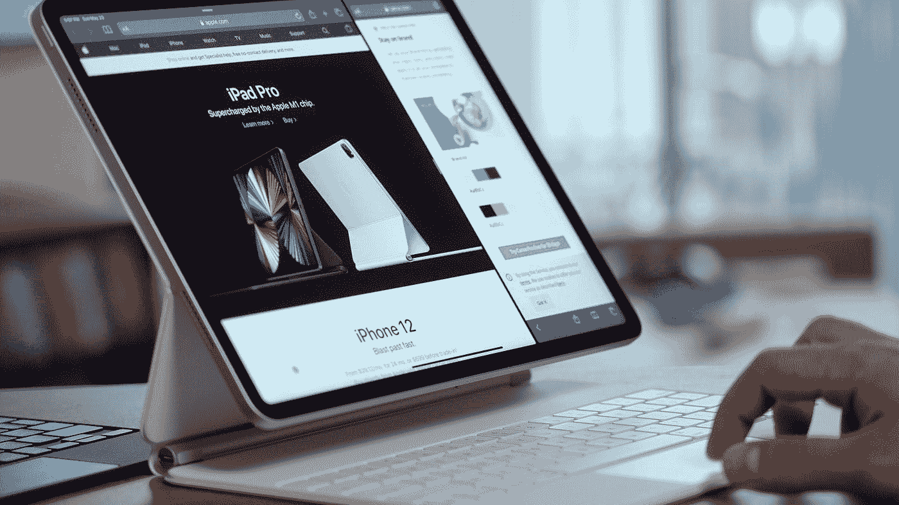

# 如何在 iPad Pro 上学习编码

> 原文：<https://medium.com/codex/how-i-learn-coding-on-an-ipad-pro-da915365e21e?source=collection_archive---------0----------------------->

# **简介**

在 iPad 上编码很难。

学习如何在 iPad 上编码就更难了。

但是有些人还是想在 iPad 上学习如何编码(包括我)。

这就是我如何在 iPad 上学习编码，你也可以。

由[丹尼尔·罗梅罗](https://unsplash.com/@rmrdnl?utm_source=medium&utm_medium=referral)在 [Unsplash](https://unsplash.com?utm_source=medium&utm_medium=referral) 上拍摄

# **我从**开始

好吧，我撒谎了。

我在 iPad 上开始编码的时候并没有完全从零开始。

在一台旧的笔记本电脑上，我学习了 Python 的基础知识，还在 YouTube 上看了几个编码教程。我学习了变量、列表和循环之类的东西，但是我不知道稍微高级一点的主题，比如列表理解和 lambda 函数。

还学了一些 HTML 和 CSS，在看一个 YouTube 教程的时候建了一个基本的网页。

因此，尽管我有一些关于编码的先验知识，但我绝不是编程专家。

# **我在 iPad 上编码的目标**

当我学习编码时，我有(现在仍然有)两个主要目标:用 JavaScript 学习营销自动化，用 Python 学习数据科学。

作为一名数字营销人员，用 JavaScript 自动完成某些任务将有助于大大减少我管理广告账户的时间。

作为一个对统计学感兴趣的人，使用 Python 学习数据科学提供了一套工具来帮助我进一步分析数据，这超出了我使用基本的入门统计学所能做的。

学习数据科学也有助于数字营销，将我的两个兴趣结合在一起。

当我谈到我如何学习编码时，试着记住这些目标，因为我的学习方法是基于这些目标的。

# **我在 iPad 上学习编码的方法**

## 资源:

这是你一直在等待的。以下是我在 iPad 上学习编程时使用或曾经使用过的资源(按时间顺序排列):

**freeCodeCamp**

迄今为止最好的资源之一是[免费代码营](https://www.freecodecamp.org/)。正如他们网站上所说，freeCodeCamp 是“一个帮助你通过构建项目来学习编码的非盈利性社区。”我喜欢 freeCodeCamp 在他们的课程中每一课都提供小挑战。这些小挑战让我能够应用课程中讨论的想法。

对于所有的学习资源(甚至在编码之外)来说，这一点很重要:学习想法是好的，但是应用想法更好

至少对我来说，我可能有过数百次观看 YouTube 教程的经历，但是当我开始编码的时候，我就完全忘记了一切。从 YouTube 上数以百万计的题为“新程序员犯的错误”或“我希望在学习编程之前就知道的事情”的视频来看，我并不孤单。

这是贯穿本文的一种模式。主动学习资源排名靠前，被动学习资源排名靠后。

**YouTube 教程**

如前所述，YouTube 教程不是学习如何编码的最佳选择。虽然它们可能是很好的资源，但是如果您想要保留这些信息，您需要应用它们。否则，你会完全忘记你所看的一切。

每当我使用 YouTube 教程时，我都喜欢在拆分视图中打开 YouTube 和代码编辑器，这样我就可以在学习时应用我刚刚学到的东西。

**数据营**

另一个很好的资源是 DataCamp。像 freeCodeCamp 一样，DataCamp 也有一些课程，通过一路上的小挑战来测试你的知识。虽然 DataCamp 确实有一个高级计划，但我喜欢使用免费的计划来练习数据科学技能。

免费计划每天给你一节课，我发现这对建立一个有规律的编程习惯很有帮助。

如果您想更深入地了解 DataCamp 课程，您可能需要订阅高级服务。但是，我没有尝试过，我不知道它有多好。

**卡格尔**

Kaggle 是我喜欢的另一个活跃的学习资源。Kaggle 的特色是迷你数据科学课程，在这里你可以将你的知识应用于数据集。我参加了一些课程，这是一次很好的学习经历。

我唯一的问题是，如果你把 Kaggle 作为唯一的学习材料，我觉得它有点太快了。因为有太多的内容，信息根本就没有坚持下来。事实上，尽管有一些小挑战，我通过 Kaggle 的学习很快就从主动学习变成了被动学习。我不确定为什么会这样，尤其是 Kaggle 在结构上和 DataCamp、freeCodeCamp 类似，没有这个问题。

然而，一旦我开始构建项目，我就开始通过 Kaggle 学习很多东西。我能够分析我觉得有趣的数据，这让我更加专注于学习数据科学。

我会向对数据科学感兴趣的人推荐 Kaggle 课程，但一定要在学习课程的同时完成项目。

**Coursera**

像 YouTube 教程一样，Coursera 的课程对我来说太被动了，什么都学不到。我选择的具体 Coursera 课程是密歇根大学教授的带有 Python 的数据科学课程。虽然有一些小挑战，但还不足以让我完全融入内容。结果我大部分的学习都是被动的，而不是主动的。

对我来说，Coursera 的课程太专注于学习信息，而不是应用信息。

**代码大战**

到目前为止，我最喜欢的在 iPad 上学习编码的工具是 Codewars。对于那些不了解 Codewars 的人来说，Codewars 是一个对任何级别的程序员都有很多挑战的网站。这是一种将学习如何编码游戏化的有趣方式。

我发现我在代码战的挑战中学习得最好。游戏化让编码变得有趣，减少了我开始编码的阻力。我非常喜欢它，以至于花 30 分钟到 1 小时在 Codewars 上已经成为我日常生活的一部分。这帮助我发展和应用了我的编码知识。

我还发现，我通过 Codewars 挑战赛了解到了一些新概念。我记得当我在 Codewars 上做最初几个挑战时，我用相对基础的解决方案解决了这些挑战。在看别人的解决方案时，我看到了更高级的话题(至少对我来说)比如列表理解和 lambda 函数。

不知道这些是什么，我会搜索更多关于如何使用它们的信息。一旦我学到了一些信息，我就把我学到的东西应用到同样的 Codewars 挑战中，这帮助我巩固了我刚刚学到的东西。

这很容易成为我最喜欢的学习工具，我强烈推荐使用 Codewars 来学习编程。

## 工具:

上面，我讨论了我用来在 iPad 上学习编码的资源。通常，找到这些资源并不是棘手的部分。棘手的部分是找到代码编辑器和其他编程工具。以下是我目前在 iPad 上使用或曾经使用过的编码工具:

Scrimba

正如我之前提到的，我的目标之一是用 JavaScript 学习营销自动化。除了营销自动化，还有一个子目标是学习 web 开发的基础知识。Scrimba 让我在使用 iPad 的同时学习了 web 开发。

据我所知，在 iPad 上创建一个离线网页是不可能的，但我不能 100%肯定。尽管如此，我还是使用在线代码/web 开发平台 Scrimba 来构建迷你网页，在那里我可以应用 HTML、CSS 和 JavaScript 的知识来制作很酷的小项目。

从这些项目中获得乐趣对我来说至关重要，因为这让我更容易工作。

学习任何技能时，开心很重要。除了给人们的“追随你的激情”的建议之外，我认为在工作中享受乐趣对于提高你的生产力是很重要的。我觉得这一点就是为什么 Scrimba 和 Codewars 是我在 iPad 上学习 web 开发和编码的一些最喜欢的工具。

**通行证**

到目前为止，Carnets 是一个免费的 Jupyter 笔记本应用程序，可以在 iPads 上本地运行。最初，Carnets 是我用来学习 Python 的一个重要应用。然而，出于几个原因，我放弃了 Carnets 应用程序。

我离开卡耐特的主要原因是因为我遇到了一个奇怪的故障。由于某种原因，在使用 Carnets 时，enter 键对我不起作用，这使得编码变得困难和乏味。

如果我能解决应用程序的问题，我可能会比现在更频繁地使用通行证。

**卡格尔**

我知道我提到过 Kaggle 是一个资源，但我也发现 Kaggle 是一个很好的工具。Kaggle 非常适合构建数据科学项目，正如我之前提到的，只有当你开始创建个人数据科学项目时，Kaggle 的全部潜力才会释放出来。

通过能够分析我感兴趣的主题的数据(如分析 COVID 爆发和谷歌趋势数据之间的关系)，我能够获得更多乐趣。这最终帮助我学得更好更快，使 Kaggle 成为我的一个很好的工具。

**雷普利特(Repl.it)**

我最近开始探索的一个新工具是 Replit。据我所知，Replit 类似于 Scrimba，但有更多的编程语言。今年我可能会上一堂关于 R 的课，这使得能够拥有一个 R 的在线代码编辑器对我来说很重要。

虽然我没有太多时间使用 Replit，但到目前为止，它看起来是一个很棒的代码编辑器。

这些是我用来在 iPad 上学习编码的主要工具。虽然有像 Pythonista 这样的其他工具，但这些工具通常是付费的，所以我倾向于避免使用它们。

# **为什么 iPad 已经可以编码了**

记住以上信息，在 iPad 上编码是可能的。对于某些工作流程，一台 iPad 就够了。

例如，一些出于兴趣在 Codewars 上编码并把编码作为爱好的人可以使用 iPad 作为他们唯一的编码设备。类似地，从事基础甚至有点高级的数据科学项目的人可以在 Kaggle 和 Google Colab 上工作，这是一个在线编码环境。由于这些应用程序可以通过浏览器运行，因此可以在 iPad 上使用。

就我个人而言，iPad 可以作为我营销自动化和学习数据科学目标的唯一编码设备。营销自动化通过 Google Ads 在浏览器中完成，数据科学可以在 Kaggle 中完成。

对于其他工作流程，iPad 不是最好的。

大学计算机专业的学生不应该把 iPad 作为他们唯一的编码设备。是的，拥有一台 iPad 很有帮助，是的，你可以在 iPad 上写代码。然而，有一些独特的情况下，iPad 将无法工作，如果你发现自己处于这种情况下，你就有麻烦了。

例如，我正在考虑在秋季学期选修一门统计计算课程。然而，我需要访问 R 和 SAS 的代码编辑器。虽然我可以用 Replit 代替 R，但 SAS 有一点不同。SAS 可以通过浏览器访问，但在 iPad 上的实现并不是最好的。因此，虽然从技术上来说我只能使用我的 iPad，但我最好有一台笔记本电脑作为备份，以防万一。谢天谢地，我有一台旧的笔记本电脑，如果我需要运行一个计算机专用的程序，它可以完成基本的代码操作。

如果你是一名想要一台 iPad 的计算机科学学生，考虑购买一台(相对)便宜的 MacBook 和一台 iPad。

购买 12.9 英寸的 iPad Pro(如果你将 iPad 作为唯一的设备，我会推荐 12.9 英寸的版本)将花费你 1099 美元。加上神奇键盘(349 美元)和 Apple Pencil 2(129 美元)，你的总花费是 1577 美元。

购买翻新的 M1 MacBook Air(849 美元)和翻新的 11 英寸 iPad Pro(519 美元)以及 Apple Pencil 2(129 美元)需要花费 1497 美元。

在这一点上，我会推荐计算机科学学生的第二个选择，他们正在考虑将他们的 iPad 作为他们唯一的电脑(或者实际上任何一个大学生)。

# **未来会怎样**

iPad 可能会成为一个编码设备。毕竟，苹果在 iPadOS 15 中支持类似 Xcode 的系统，这将有望为 iPad 开辟更多的编程语言。

在我看来，iPad 是计算机的未来。它提供了任何未来计算机需要的所有硬件:触摸屏、鼠标和键盘。它现在需要的只是软件。

多年来，我们一直期待苹果能在 iPad 上支持先进的桌面软件。

会很快发生吗？

我不知道。

## [更多每周 iPad 内容(以及我的顶级 iPad 应用的免费列表)，请加入 Overoptimize！](https://overoptimize.substack.com/)