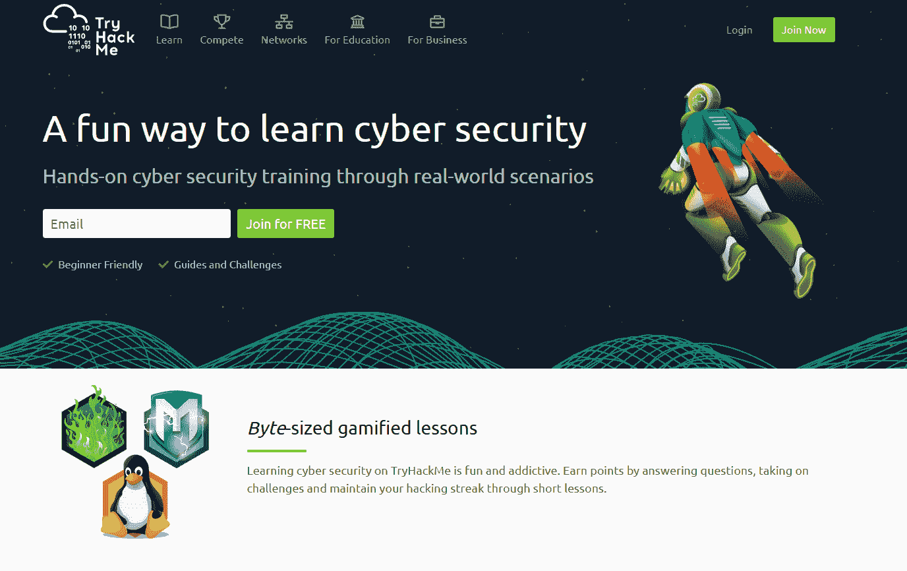

# 我十几岁时是如何学习黑客的！

> 原文：<https://medium.com/codex/how-i-learned-hacking-as-a-teenager-4120a7ae69eb?source=collection_archive---------4----------------------->

图片由 pixabay.com 拍摄

每个人都喜欢在午餐后喝杯提神的可口可乐，但也有一部分人喜欢可口可乐和黑色帽衫。在我继续说下去之前，这篇文章不是由可口可乐赞助的。当然，我知道你一定想知道那些晚上从不睡觉的可乐上瘾者是谁，他们是黑客。那么，黑客是怎么知道怎么黑的呢？一切都归结于实践和经验。是的，有些人可能天生在电脑黑客方面有着超级智慧，但这并不意味着你不能像电影中的演员一样黑客。今天，我将讲述我是如何在青少年时期学习黑客的，并且仍然在写作的同时学习。(免责声明:我远不是一个专业的黑客，这篇文章旨在成为一个鼓舞人心的指南。)

我对计算机和技术的好奇心是从 11 岁在网上发现一篇文章后开始的，这篇文章是关于“黑客入侵在线帐户”的。这并不是我正确学习技术的开始，因为我太年轻，不知道任何关于自学的事情，甚至不知道我在哪里学习。几年后，在我十几岁的时候，我终于设法让自己遵守纪律，并实际上开始追求我最喜欢的科目是“黑客/网络安全”。

## 我是怎么开始学习的！

高中辍学后，我有很多空闲时间，但也是在那个时候，我发现了网络安全领域。我是在网上看到一则广告时偶然发现网络安全的，广告上说一个免费的网络安全短期培训课程正在向所有人教授。我没有犹豫一分钟就报名了，因为除了早上做俯卧撑，我没有别的事可做。注册几天后，课程实际上开始了，在那里我学习了基本的 Linux 命令，设置了一个 VM 并使用基本的工具来注入有效负载。这是非常短暂的阶段，但我在短时间内学到了很多东西，因为我在课后花了额外的努力学习。几个星期后课程结束了，课后，我报名参加了每月 10 美元的 Tryhackme.com 自学，因为我也有足够的信心每天挑战自己。Tryhackme 提供带有证书的网络安全课程的廉价订阅，但其中 70%的内容任何人都可以免费访问。

作者图片

## 网络安全基础概述

当我们刚开始学习时，我们都有这个共同的问题，被各种各样的学习主题淹没，忍不住对自己说**“我不知道我应该学习什么”**。如果我要回答这个问题，首先，网络安全是一个巨大的领域，不同的人专门研究网络安全的某个领域。一般来说，网络安全有三个主要的专业领域:红队(模仿坏黑客对公司网络基础设施的攻击，以便公司可以做好准备，最大限度地减轻真正的网络攻击的小组)，蓝队(负责防御和升级网络基础设施的安全并处理网络事件攻击的小组)和 Pentesters(专门通过物理安全和网络安全从道德上突破公司，报告公司的物理安全措施、技术漏洞和网络安全的小组)。学习网络安全的路线图因您感兴趣的领域而异，但每个追求网络安全的初学者都需要了解基本的基础知识，即基本安全、Linux、编程和网络。一旦你学会了我提到的所有东西，你就会知道你需要在哪个领域专攻。

## 学习资源(免费和付费)

正如我上面提到的，你可以在 Tryhackme 和 HackTheBox 这样的平台上免费学习网络安全。但是免费使用这些平台对初学者来说也有一个很大的缺点，那就是**“我不知道我应该学习什么”**。这就是为什么如果你真的想通过这些平台提供的结构化学习路径认真学习网络安全，你需要支付每月 10 美元的价格。但是，如果你花不了几美元，你仍然可以从 youtube 和 google 上学习。以下是一些创建网络安全内容的 Youtubers 用户:

1.  网络导师:【https://www.youtube.com/@TCMSecurityAcademy】T4
2.  网络查克:[https://www.youtube.com/c/NetworkChuck](https://www.youtube.com/c/NetworkChuck)
3.  大卫·邦巴尔:[https://www.youtube.com/@davidbombal](https://www.youtube.com/@davidbombal)

一定要检查他们频道上的播放列表视频！

## 网络安全之前应该学的东西！

之前，我已经简单地提到了学习主题，但是你需要在进入赛博之前学习这些。首先，您需要学习 IT 基础知识，包括了解计算机硬件、安装操作系统、排除计算机错误、基本网络拓扑和网络协议(如 HTTP、HTTPS、端口和 VPN)的一般概念。第二，你需要学习 Linux 因为 Kali Linux 是你作为黑客日常需要使用的 Linux 发行版，你需要的所有黑客工具和软件都是预先配置在 Kali Linux 里面的。最后，你需要学习编程和计算机科学的一般概念，因为相信我，当你进入黑客领域时，你将需要编程。为了总结这一切，您需要学习 IT 基础知识、Linux 和编程。要了解 IT 基础知识，你可以从 youtube 上学习，或者在这个网站上注册一个账户[https://www.professormesser.com/](https://www.professormesser.com/)，然后选择 Comptia A+ core 1。完成核心 1 后，继续核心 2，但请记住，如果您已经有了构建 PC、安装操作系统、排除软件错误和使用网络的经验，您可以直接跳到学习 Linux。学习 Linux 的最好方法是安装 Linux 作为你的操作系统，并每天使用它。此外，您可以在一天内学习 Linux 的基础知识，因为作为新手，要真正掌握 Linux，您只需要知道一些常见的命令，如 cd、ls、cat 和 man。作为一名黑客，最好是学习一门专注于脚本和创建黑客工具的编程语言，但作为一名初学者，Python 只是你所需要的，因为 90%的黑客工具都是用 Python 编写的，是一种完美的脚本语言。你可以通过 youtube 上 10 个小时的长视频来学习 Python，也可以通过一个更短的课程来学习，这个课程对初学者友好，比传统的 Python 教程更侧重于黑客技术。(看视频一定要做好笔记-【https://www.youtube.com/watch?v=7utwZYKweho】T2&list = WL&index = 8&t = 6609s。)

## 做完什么都要学什么？

要再次回答这个问题，我需要回到同一个问题**“我不知道我应该学什么”。**是的，网络安全是一个永无止境的领域，每天都有新的东西要学，因为技术总是在不断涌现和创新。简而言之，我自己也不知道在这之后该学些什么。知道该学什么的最好方法是坐在电脑前，真正学到一些东西。很抱歉，我甚至不了解自己，也没有比告诉你要有一些自律，只是“学习”更好或更完整的答案。

这很大程度上是作为初学者开始学习网络安全的指南。我仍然是一个努力成为网络安全专家的青少年，我也希望这篇文章对你有所帮助。此外，关注我的媒体和 Twitter，获取更多类似的文章！

【https://twitter.com/CybericTech】*跟着上推特:上*