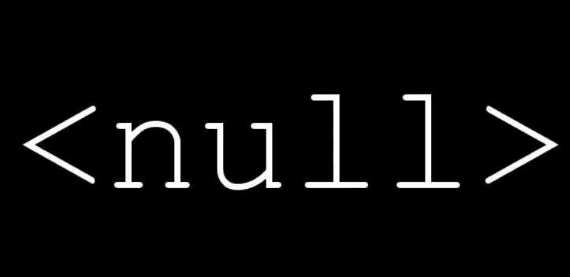

# 我是如何在 SQL 中学会不再担心和热爱 NULL 的

> 原文：<https://medium.com/codex/how-i-learned-to-stop-worrying-and-love-null-in-sql-9d06a73bca8e?source=collection_archive---------17----------------------->

空值是表示未知值的数据类型。它不等同于空字符串或零。假设您有一个雇员表，包含诸如`EmployeeId`、`Name`、`ContactNumber`等列和一个备用联系号码。该表有几个强制值列，如`EmployeeId`、`Name`和`ContactNumber`。但是，备用联系号码*不是必需的*，因此有一个…