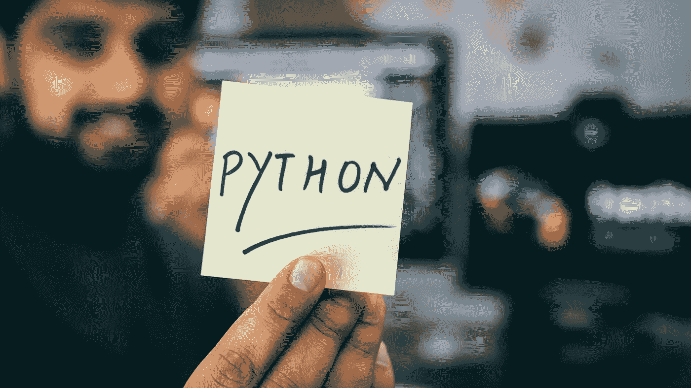

# 多亏了 Python，我学会了用不同的方式思考

> 原文：<https://medium.com/codex/how-i-learned-to-think-in-a-different-way-thanks-to-python-75a3418cb05a?source=collection_archive---------9----------------------->

## 让我遇到 Python 的失望。

在 [Unsplash](https://unsplash.com?utm_source=medium&utm_medium=referral) 上由 [Hitesh Choudhary](https://unsplash.com/@hiteshchoudhary?utm_source=medium&utm_medium=referral) 拍摄的照片

当我发现 Python 的时候，我已经很擅长用 C#等其他语言编程了。我可以花很多时间来讨论 Python 的语义，但我只想说，它是一种非常易读的高级语言，与函数式编程有着特殊的关系。