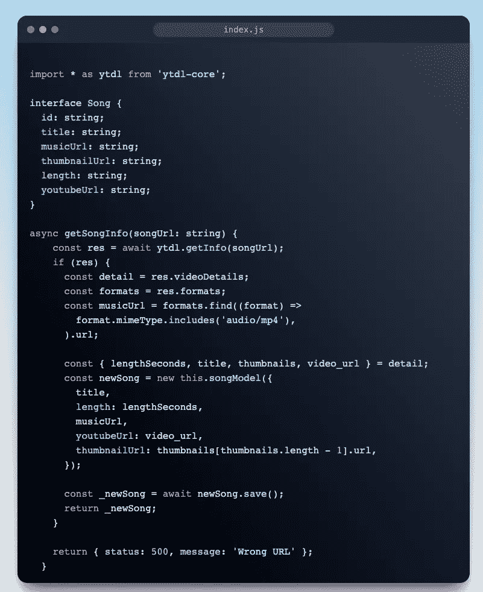

# 我如何用 NodeJS 制作一个 YouTube 下载器

> 原文：<https://medium.com/codex/how-i-made-a-youtube-downloader-with-nodejs-nestjs-cd72e84163e9?source=collection_archive---------9----------------------->

最近我很无聊，无事可做，所以我想用 Flutter(对我来说是一个全新的堆栈)做一个音乐播放器。问题是我找不到一个好的来源来为我的应用程序获取音乐，于是我决定为自己创建一个 API。

目的是创建一个 API 来从 youtube 视频中获取信息，获取其标题、长度、缩略图、音频 URL，并将它们存储到数据库中，以便在其他 GET API 调用中使用

这是该函数的完整代码，我将在下面解释每一行代码:

**首先**，API 的关键是`ytdl-core`库。这是一个 YouTube 下载模块。仅用 Javascript 和一个节点友好的流接口编写，你可以在 NPM 上找到。这里我就导入一下。

**其次**，我将为一首**歌曲定义一个接口，**对此没什么好说的

**最后**，最重要的部分，API 本身:

传递一个 youtube url 作为参数，然后使用 ytdl 库的`getInfo`方法。记得放一个`if`块来拦截错误的 URL。

回应会有很多信息，但在我看来，我们只需要`videoDetails`和`formats`。

然后，我们将析构音频网址，标题，缩略图，…并保存到我们的数据库中。

但是你可以注意到我把视频网址保存在我们的数据库里了，为什么？这是因为随着时间的推移，音频 url 会过时，我们需要视频 url 来进行回调。虽然有另一种方法可以克服这一点，我们将音频本身从 url 保存到我们的数据库，但这是以后的另一篇文章。

如果你需要透明度，我这里有一个 gitlab 回购:[https://gitlab.com/letrongduc1999/music-player-backend](https://gitlab.com/letrongduc1999/music-player-backend)

# 遗言

虽然我的内容对每个人都是免费的，但是如果你觉得这篇文章有帮助，[你可以在这里给我买杯咖啡](https://www.buymeacoffee.com/kylele19)