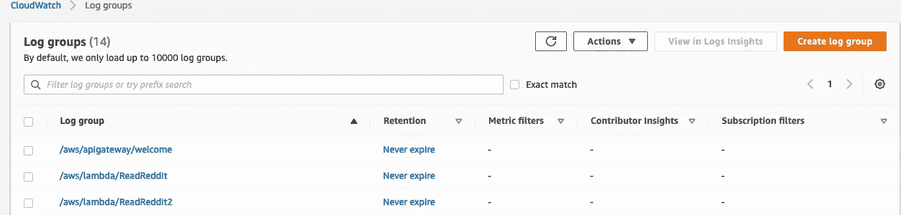
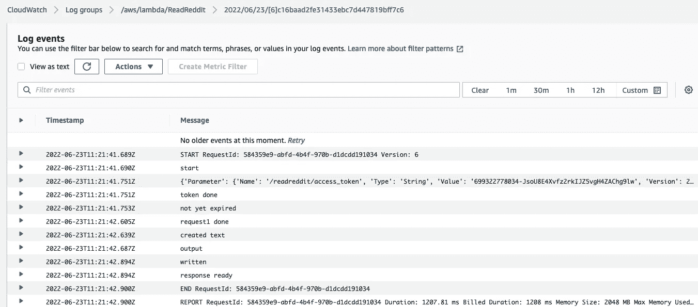
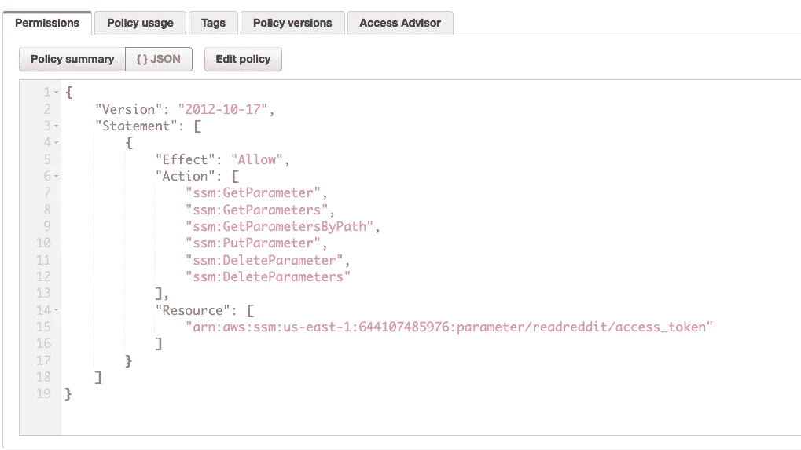
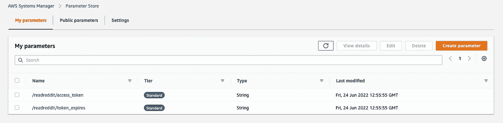
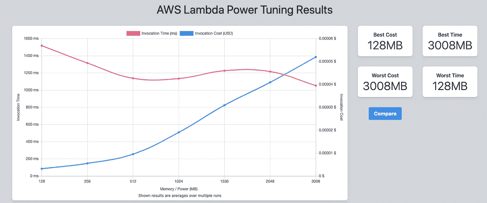
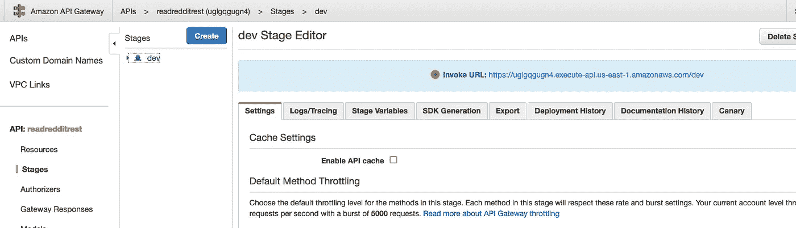
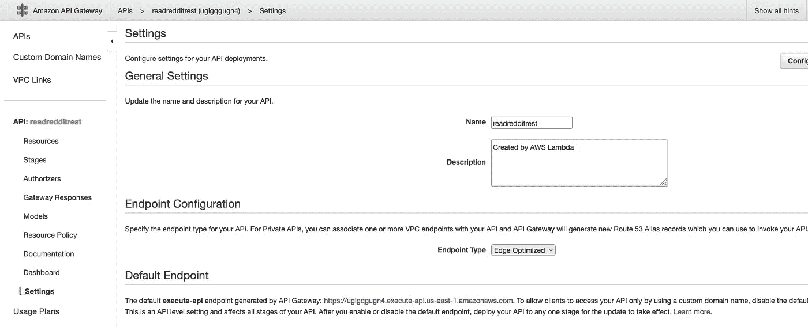
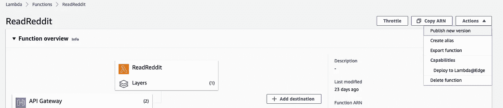
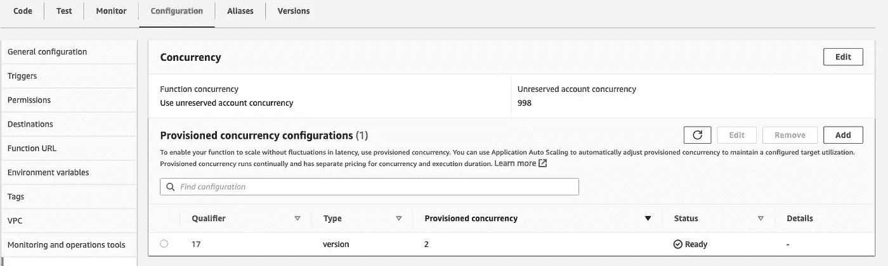

# 我如何制作一个应用程序来阅读 Reddit 上的热门帖子:审判日

> 原文：<https://medium.com/codex/how-i-made-an-app-to-read-me-the-top-posts-from-reddit-judgement-day-98387a192750?source=collection_archive---------7----------------------->


甲醇终止剂

在本系列的第 1 部分中，我使用 AWS Lambda、API Gateway 和 Adalao 创建了一个应用程序来朗读 Reddit 上的新帖子。

第一部分可以在这里阅读:

[](/codex/how-i-made-an-app-to-read-to-me-the-top-posts-from-reddit-with-aws-8acd067a6201) [## 我如何制作一个应用程序，用 AWS 为我朗读 Reddit 上的热门帖子

### 总结:

medium.com](/codex/how-i-made-an-app-to-read-to-me-the-top-posts-from-reddit-with-aws-8acd067a6201) 

在第 2 部分中，我将向您展示优化我们的应用程序的各种策略。

1.  Lambda 代码流的优化
2.  安全性-使用 AWS SSM 参数存储
3.  AWS 功率调谐
4.  API 网关优化
5.  供应的并发

**优化 Lambda 码流**

所有优化都必须是数据驱动的。所以我们查看了 API 网关和 Lambda 函数的 cloudwatch 日志。



马上，我们可以通过优化 lambda 代码获得更多的性能。

每次调用函数时，它都从 handler()函数开始执行。如果您的代码可以被调用一次，然后在下一次调用中重用，那么最好将它放在处理程序()之外。所以我们把一些初始化的东西，比如对 Reddit API 的认证，移到了处理程序之外。

所以我们在处理程序()之前定位所有的导入和初始化

```
import json
import boto3 
from botocore.exceptions import BotoCoreError, ClientError
from contextlib import closing
import sys 
import base64
import requests
from datetime import datetime,timedelta# Create a client using the credentials and region defined in the [adminuser]
session = boto3.Session(region_name=”us-east-1")
polly = session.client(“polly”)ssm_client = boto3.client(‘ssm’)def lambda_handler(event, context):
```

**安全性—使用 AWS SSM 参数存储**

我们真的不需要在每次调用函数时都生成一个新的 Reddit API 密匙，因为 API 密匙在 24 小时内有效(在这个特定的用例中。在标准的 oauth2 工作流中，它在较短的时间内有效),因此我们可以将令牌放在某个地方，如果到期时间还没有过去，就从那里获取它。为此，我选择使用 AWS SSM 参数存储。(AWS Secrets Manager 更适合存储这样的实际秘密值，但为了保持低成本，我选择了参数存储)

为 lambda 创建内联策略以访问参数存储。这将被添加到 Lambda 执行角色中，因此 Lambda 可以访问参数存储。



在 SSM 参数库中创建参数。



在 lambda 中进行必要的代码更改，以便在生成新的 API 密钥之前检查 SSM。我们还会将用于获取 API 密钥的凭证放在参数存储中。

```
token_parameter = ssm_client.get_parameter(Name='/readreddit/access_token')token_expires = ssm_client.get_parameter(Name='/readreddit/token_expires')# setup our header info, which gives reddit a brief description of our appheaders = {'User-Agent': 'catpostv1/0.0.1'}if datetime.now() < datetime.strptime(token_expires['Parameter']['Value'],"%Y-%m-%d %H:%M:%S.%f"):TOKEN = token_parameter['Parameter']['Value']headers = {**headers, **{'Authorization': f"bearer {TOKEN}"}}else:TOKEN = get_new_token()headers = {**headers, **{'Authorization': f"bearer {TOKEN}"}}# while the token is valid (~2 hours) we just add headers=headers to our requestsres = requests.get("https://oauth.reddit.com/r/popular/hot",headers=headers)
```

**AWS Lambda 功率调谐**

优化 lambda 的另一种方法是分析性能如何随着内存的增加而变化(lambda 中的内存设置=内存+分配的 CPU)。因为增加内存也会增加每秒 lambda 的定价，所以我们需要在增加成本和增加内存之间做一个权衡。幸运的是，有一个叫做 [aws lambda 功率调整](https://github.com/alexcasalboni/aws-lambda-power-tuning)的工具可以自动完成这种分析。它将使用不同的内存设置运行您的 lambda，并生成一个显示最佳选项的图表。

因为我们的 lambda 不是特别占用 CPU 资源，所以我们的结果基本符合预期。但比猜测要好。



**API 网关优化**

让我们抽象地考虑一下 API Gateway。用户将请求发送到 API 网关 URL。Gateway 将请求代理给 Lambda，Lambda 进行处理以创建响应。现在它从 Lambda 发送到网关，网关发送到用户。

我们可以解决 API Gateway 中的两个延迟来源。1)请求在不可靠的公共互联网上传输得越多，到达实际 API 端点所需的时间就越长。lambda 必须为每个请求做出响应。

API 网关缓存

如果 API 网关不需要做任何工作，Lambda 也不需要每次都运行来产生响应，那会怎么样？这就是缓存。第一次运行时，API Gateway 在网关上缓存响应。下一次请求到来时，响应将直接从缓存中提供。我们可以像这样打开 API 网关上的缓存:

API 网关→API→阶段→(选择阶段)→设置—启用 API 缓存



我启用了这个选项，响应非常快。问题？它一直给出相同的回应，即使 r/popular 中的 Reddit 帖子已经更改。

现在让我们解决第二个问题。我们可以通过使用边缘位置来最小化公共互联网遍历。

API 网关→API→设置->端点->边缘优化



现在，API 网关端点使用离用户最近的 AWS 边缘位置，这个请求在公共互联网上的传输被最小化。这使得请求更快。

**调配并发**

上面没有提到的一种方法是供应并发。因为 AWS Lambda 函数是按需调用的，所以可能存在一个问题，称为冷启动。这就像在寒冷的冬天早晨启动汽车引擎一样。供应并发通过预热执行环境并使其准备好立即执行来解决冷启动问题。比方说，如果你可爱的配偶在你离开前 10 分钟为你发动了汽车。在 AWS 上，自由层配置的并发不是现成可用的，但是您可以请求增加限制以获得配置的并发。这需要额外的费用。

如何知道自己的函数有没有冷启动？检查 Cloudwatch 中的 lambda 日志，查看给出持续时间和计费持续时间的最后一行。

```
Duration: 177.70 ms	Billed Duration: 200 ms Memory Size: 2048 MB
```

如果这些与上面给出的不同，这意味着准备执行环境花费了 3 秒钟的冷启动时间。当我们设置预配并发时，在您调用 lambda 之前，AWS 已经为您完成了这 3 秒钟的工作。

要为您的 lambda 设置提供的并发性，首先发布一个版本。操作→发布新版本



我们可以观察到，在使用供应的并发后，速度进一步提高了。延迟减少了 50%

性能提升从来都不是一劳永逸的活动，希望这些指点对你的旅途有所帮助。