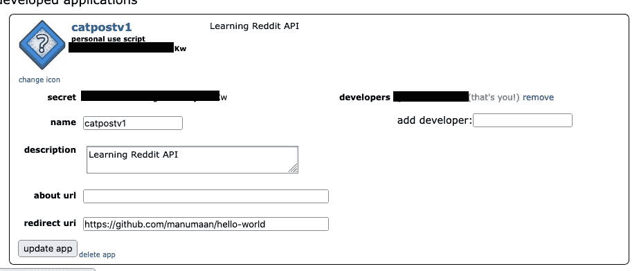
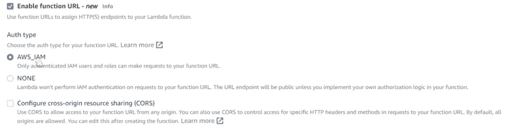
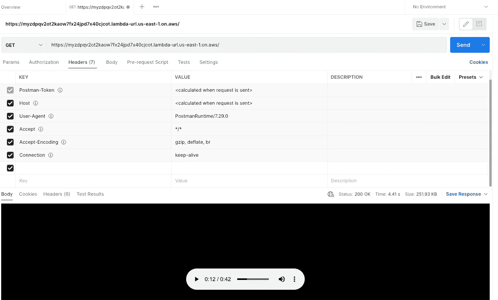
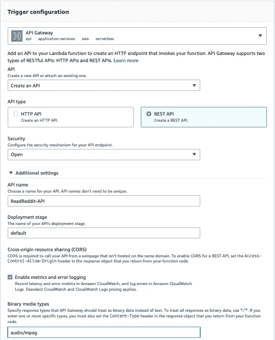
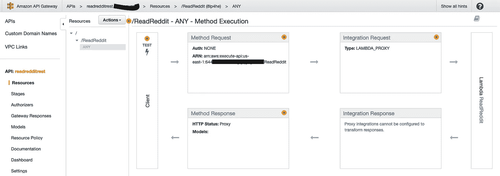
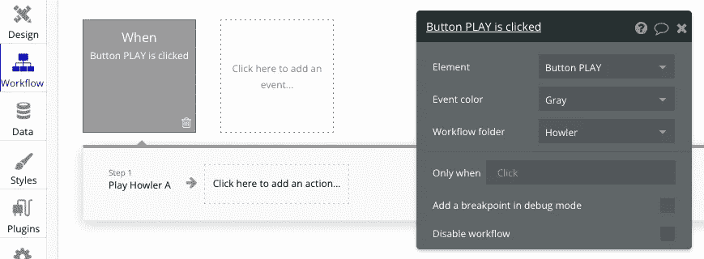
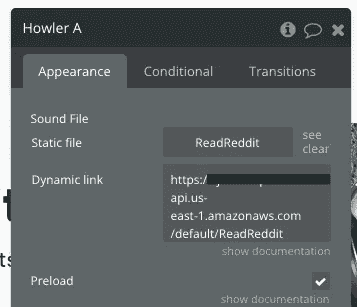

# 我如何制作一个应用程序，用 AWS 为我朗读 Reddit 上的热门帖子

> 原文：<https://medium.com/codex/how-i-made-an-app-to-read-to-me-the-top-posts-from-reddit-with-aws-8acd067a6201?source=collection_archive---------10----------------------->


总结:

1.  在 reddit 上创建一个应用程序帐户来调用 Reddit APIs(不是强制的，但是为定制提供了更多的可能性)
2.  使 AWS Lambda 函数从 reddit 获取基于文本或可以从标题理解的热门帖子(世界新闻、今日学习、笑话等)
3.  使用亚马逊 Polly 将文本转换为语音。
4.  使用 AWS API 网关公开 API。
5.  在 Bubble.io 做了一个微 app，作为 API 的前端客户端。
6.  优化 1) Lambda 代码，2)SSM 参数存储 3) API 网关以减少延迟
7.  利润？？

当然，这可能不是做这件事的最佳方式，但我在这个过程中学到了很多新东西，我只是在分享它。

**Reddit 上的应用账户**

1.进入[应用偏好](https://www.reddit.com/prefs/apps)，点击底部的 ***创建另一个应用……***。

2.填写所需的详细信息，确保选择**脚本** —并点击 ***创建 app*** 。

3.这将为您提供帐户详情。注意“个人使用脚本”下的客户端 ID 和标签“秘密”附近的密钥



现在开始编写您的函数。

**Lambda 函数获取帖子**

首先我们进行 HTTP 基本身份验证，然后进行 OAuth 2.0 密码授权(交换访问令牌的用户名和密码)

```
*# note that CLIENT_ID refers to 'personal use script' and SECRET_TOKEN to 'secret'* auth = requests.auth.HTTPBasicAuth('<CLIENT_ID>', '<SECRET>')

*# here we pass our login method (password), username, and password* data = {'grant_type': 'password',
        'username': 'USERNAME',
        'password': 'PASSWORD'}

*# setup our header info, which gives reddit a brief description of our app* headers = {'User-Agent': 'catpostv1/0.0.1'}

*# send our request for an OAuth token* res = requests.post('https://www.reddit.com/api/v1/access_token',
                    auth=auth, data=data, headers=headers)

*# convert response to JSON and retrieve access_token value* TOKEN = res.json()['access_token']

*# add authorization to our headers dictionary* headers = {**headers, **{'Authorization': f"bearer {TOKEN}"}}#This token is valid for 24 hours. You can check the validity from #res.json()['expires_in']
#Use the token in calls like below:res2 =requests.get('https://oauth.reddit.com/api/v1/me', headers=headers)
```

在我的例子中，我是从/r/popular 获取数据的，这是一个伪 subreddit，包含了当时最受欢迎的帖子。/hot 是子编辑上使用的排序顺序。

```
res = requests.get("https://oauth.reddit.com/r/popular/hot",
                   headers=headers)
```

响应是一个 JSON 文档，如果您要访问:

```
www.reddit.com[/r/popular](https://www.reddit.com/r/popular).json?sort=hot
```

我这样做有点困难，但当你想进行用户级定制时，这将是有用的。

下面是一些有趣的字段，用于在逻辑中创建文本以馈送给 Amazon Polly。

```
res.json()['data']['children'] - This contains all the posts. 
res.json()['data']['children']['data']['subreddit'] - subreddit name on the post
res.json()['data']['children']['data']['title'] - title of post 
res.json()['data']['children']['data']['selftext'] - selftext of post
```

一旦您创建了要转换为语音的全文内容，Polly 的时间到了。

**使用 Polly 将文本转换为语音**

亚马逊 Polly 是 AWS AI 解决方案的一部分。波利可以把任何给定的文本转换成语音。有两种类型的声音被创造出来，标准的声音是标准的声音，神经的声音是一种使用人工智能的更自然的声音。标准的声音可以使用 SSML(语音合成标记语言)定制，这意味着你可以使部分文本更加强调，或者让波利耳语，读 TIL 作为 TIL。神经语音提供了更自然的声音，但额外的定制是有限的(例如:不能添加强调标签)。神经引擎也需要更长的时间来处理文本。(在我的测试中，同样的内存大约多 5 倍。随着记忆的增加，神经系统将开始减少所需的时间，但标准系统不会。)

波利有很多声音，男性，女性，成人，儿童等等。语音有特定的口音(例如:印度英语)，双语能力和非英语语言。您可以使用哪些语言取决于 AWS 中设置的区域。例如，Aditi(印度英语、印地语)在美国东部 1 区不可用。我感觉这个应该更开放一些。

您可以在控制台中播放波利的声音:

```
[https://us-east-1.console.aws.amazon.com/polly/](https://us-east-1.console.aws.amazon.com/polly/)
```

一旦你的文本有了形状，你可以像这样调用 polly API:

```
from boto3 import Session
session = Session(region_name="us-east-1")polly = session.client("polly")
response = polly.synthesize_speech(VoiceId='Kimberly',
                                   OutputFormat='mp3',
                                   Text = text_content,
                                   TextType = 'ssml')
```

我已经为我的文本指定了 Kimberly voice，我正在创建一个 mp3 audiostream 对象，text_content 中给出的文本包含用于强调、中断等的 SSML 标签。

API 参考:

```
 [https://docs.aws.amazon.com/polly/latest/dg/API_SynthesizeSpeech.html](https://docs.aws.amazon.com/polly/latest/dg/API_SynthesizeSpeech.html)
```

可能是 AWS 库中最小的 API 参考！还有一种方法是将语音输出作为文件直接写入 S3 桶。这对于较长的语音任务很有用。

synthesize _ speech 方法将返回 boto core . response . streaming body 类型的 HTTP 响应体，我们使用上下文管理器来确保流是关闭的。该流被编码为 base64 编码的字符串。如果你愿意，你也可以把它写到一个. mp3 文件中，但是注意/tmp 是 Lambda 唯一可写的地方。

```
if "AudioStream" in response:
        with closing(response["AudioStream"]) as stream:
   try:
        encoded_string = base64.b64encode(stream.read())
```

然后我们创建这个 API 将返回的 HTTP 响应。需要注意的点:API Gateway 向调用者返回二进制文件需要 isBase64Encoded = true。还要适当地设置内容类型。我们还需要在下一步的 API 网关配置中设置这个值。

```
responseObject = {}
responseObject['statusCode'] = 200
responseObject['headers'] = {}
responseObject['headers']['Content-Type'] = 'audio/mpeg'
responseObject['isBase64Encoded'] = 'true'
response = encoded_string
response = response.decode('utf-8')
responseObject['body'] = response
```

此时，您可以通过在 Lambda 中创建一个测试事件来测试 Lambda。这可以捕捉你可能犯的任何错误，或超时问题等。如果您得到一个超时，这可能意味着 2 件事 1)您的函数花费了超过默认时间运行 2)您的函数没有访问 AWS 资源所需的功能，在我们的例子中，Polly。

我们可以创建如下所示的 IAM 策略，并将其添加到 Lambda 的执行角色中。这允许 Lambda 调用 Polly。

```
{
 “Version”: “2012–10–17”,
 “Statement”: [
 {
 “Effect”: “Allow”,
 “Action”: [
 “polly:DescribeVoices”,
 “polly:GetLexicon”,
 “polly:GetSpeechSynthesisTask”,
 “polly:ListLexicons”,
 “polly:ListSpeechSynthesisTasks”,
 “polly:SynthesizeSpeech”
 ],
 “Resource”: [
 “*”
 ]
 }
 ]
}
```

我们可以通过在 AWS 中创建一个函数 URL 来测试函数输出。函数 URL 为 Lambda 函数提供了一个专用的 HTTP(S)端点，可以通过 Postman 之类的工具进行测试。函数 URL 是免费使用的，你只需为 lambda 运行的额外时间付费。(API 网关提供了一些额外的功能，不仅限于:授权器、API 网关缓存、边缘优化等。)如果您想将一个功能 URL 添加到一个已经存在的功能，请转到您的功能的**配置**选项卡，并点击**功能 URL** 选项卡。



从 Postman 或浏览器调用函数 URL 进行测试。



现在我们继续为这个 API 创建 API 网关。在 Lambda 函数的控制台中，配置—触发器—添加触发器— API 网关—创建 API — REST API。其他设置—启用指标和错误记录(检查)—二进制媒体类型—输入音频/mpeg 以启用此媒体类型。(需要将 base64 字符串解码为音频二进制格式)。暂时不要关闭安全系统。在第 2 部分中，我们将添加一个 API 键。



从 API 网关控制台测试—单击 API 名称—资源—单击 API 名称—选择获取—单击测试按钮。



这应该很好。现在，您也可以尝试从 Postman 或浏览器调用 URL。

在这之后，我创建了一个微型网站作为前端，使用的是一个无代码/低代码平台来创建移动/网络应用程序。正如您在下面看到的，这是一个只有一个页面、一个图像、一个徽标和一个调用 API 的按钮的基本网站。


你可以很容易地找出前端设计，我相信你们比我更有创造力，让我告诉你按钮如何调用 API。

在“工作流”选项卡中，您可以为 UI 元素创建控制逻辑。我添加了一个 howler 插件(音频播放器的 JS 插件),并在按钮上添加了一个工作流，以播放 UI 中添加的 Howler 元素(不可见元素)



在 Howler 元素的设置中，我把 API URL 作为一个动态链接。



一旦您的网站准备就绪，您可以单击预览，它将在浏览器窗口中打开，并带有一个以 bubble.io 结尾的 URL，您可以单击该按钮并测试音频是否正在播放。

那不是很有趣吗？但是…

您注意到在您按下按钮和语音剪辑播放之间有大约 5-6 秒的延迟。似乎等待时间太长了。我们如何优化和减少这种延迟？

我们将在第 2 部分中看到:我如何制作一个应用程序来阅读 Reddit:审判日的热门帖子(我保证不会有抢现金的续集)