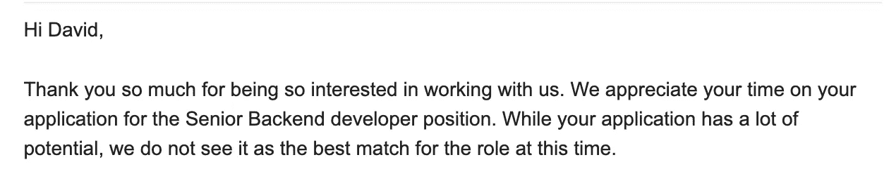

# 作为一名软件工程师，我如何从巨大的拒绝中恢复过来

> 原文：<https://medium.com/codex/how-i-recover-from-big-rejections-as-a-software-engineer-325ee9192ff4?source=collection_archive---------9----------------------->

## 我通过技术测试并继续生活的可靠技术

2021 年 4 月，在有了 11 年多的编程经验后，我被一份高级开发人员的工作拒绝了…然后是另一份，又一份，又两份。

从我生活中被拒绝的十次之一中捕捉。

> 失败是意料之中的。企业家不…