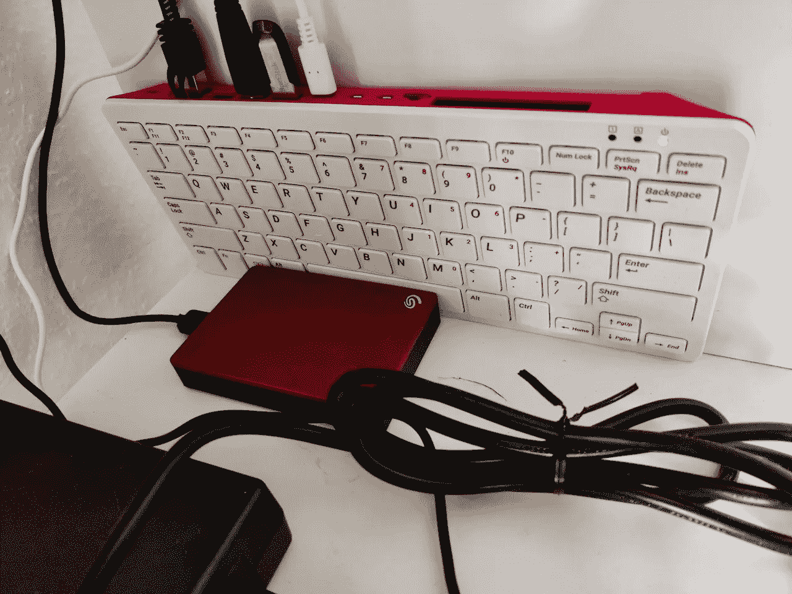

# 我如何设置 RaspberryPi 来共享我的文件和媒体

> 原文：<https://medium.com/codex/how-i-set-up-a-raspberrypi-to-share-my-files-and-media-3faf44912d07?source=collection_archive---------12----------------------->

在过去的几个月里，我一直在一个闪亮的新 RaspberryPi 400 上慢慢组装一套自托管工具和服务，最后，我想我已经完成并准备好写下我的经历。至少，这将有助于提醒我我有什么，但我希望它也可以帮助其他人进行类似的旅程。