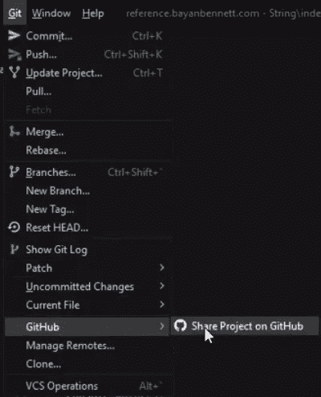
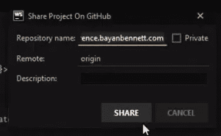

# 我如何分享我的网站代码

> 原文：<https://medium.com/codex/how-i-shared-my-websites-code-b35ae397ddfc?source=collection_archive---------11----------------------->


克里斯里德在 [Unsplash](https://unsplash.com?utm_source=medium&utm_medium=referral) 上的照片

## GitHub、语义版本控制和常规提交

[本帖视频版](https://www.youtube.com/watch?v=BpXyDn37sFI)

虽然人们可以阅读我的帖子和观看我的视频很好，但有时能够看到源代码本身更好。所以，我做了一个*理性的*决定，比平时更早一点在 GitHub 上分享我的代码。

这里不会有太多的编码，所以这将是一篇很短的帖子。

你会明白为什么…

# 从 WebStorm 创建 GitHub 项目

我想从我以前的 DevLog 中创建的网站创建一个新的 GitHub 项目:[https://bayanbennett . medium . com/how-I-started-a-website-d2a 34547 BC 57](https://bayanbennett.medium.com/how-i-started-a-website-d2a34547bc57)



在 **git** 菜单中，选择 **GitHub** ，然后**在 GitHub 上共享项目**。应该会出现如下所示的模式:



按照您的意愿命名存储库，然后单击**共享**按钮。

这就是从 WebStorm 把你的代码放到 GitHub 上有多容易。仓库在这里:[https://github.com/BayanBennett/reference.bayanbennett.com](https://github.com/BayanBennett/reference.bayanbennett.com)

如果有读者想要更具体的教程，请告诉我。

现在每个人都可以看到代码库的发展！

# 关于版本控制

我怀疑这篇文章的大多数读者已经对版本控制系统(VCS)和[语义版本化(SemVer)](https://semver.org/) 有所了解，但是对于那些不了解的人，这里有一个总结。

我有幸参与的大多数项目都存储在一个名为 [Git](https://git-scm.com/) 的 VCS 中。VCS 负责创建和管理代码快照之间的差异。

与其他状态相比，另一种表达代码状态的方式是 SemVer。通常，对每个 VCS 提交使用不同的 SemVers 并不理想。有时代码变化很小，对项目的运行没有影响。

[节点包管理器(NPM)](https://www.npmjs.com/) 的用户可能已经很熟悉 SemVer 了。下面是直接来自 NPM 文档的快速复习。

假设你的第一个版本是版本`1.0.0`:

*   修正(补丁)将增加最后一位数字(例如`1.0.1`)
*   不间断功能(次要修订)将增加中间数字(如`1.1.0`)
*   重大变更(主要修订)将增加第一个数字(例如`2.0.0`)

# 常规提交

使实现语义版本化变得容易的系统之一是所谓的[常规提交](https://www.conventionalcommits.org/)。几年前我接触到了这个，从那以后我再也没有用过其他的东西。

实现很简单，简化了管理版本的过程。常规提交提供了一种结构化提交消息的方式，该提交消息可用于自动化版本增量。当一批提交被推送到一个发布分支时(例如`master`、`main`、`next`等)。)，检查它们的消息，并确定适当的版本增量。

例如，下面是两个直接取自传统提交主页的提交消息:

> 特点:允许提供的配置对象扩展其他配置
> 
> 重大变化:配置文件中的“extends”键现在用于扩展其他配置文件

或者

> 文档:更改日志的正确拼写

除了语言上的差异之外，基于所使用的关键字类型，可以触发不同的动作。[下面是 CommitLint 使用的类型列表示例](https://github.com/conventional-changelog/commitlint/tree/master/%40commitlint/config-conventional):

```
build
chore
ci
docs
feat
fix
perf
refactor
revert
style
test
```

所有这些类型都可能触发不同的操作。其中一些可以配置为不对服务器进行更改。重构就是这种情况的一个例子，在重构中没有产生额外的特性或修复。

关键字及其操作是完全可配置的。可以添加、删除关键字，以及更改它们相应的操作。

# 何时实现常规提交

考虑到它甚至还没有发布，为 reference.bayanbennett.com 实现常规提交还为时过早。

最好的时机是当你的项目被其他人使用时，这可以帮助他们更好地了解你的项目的变化。

# TL；速度三角形定位法(dead reckoning)

使用 WebStorm 创建 GitHub 项目很容易。传统提交的语义版本化是一个强大的组合。