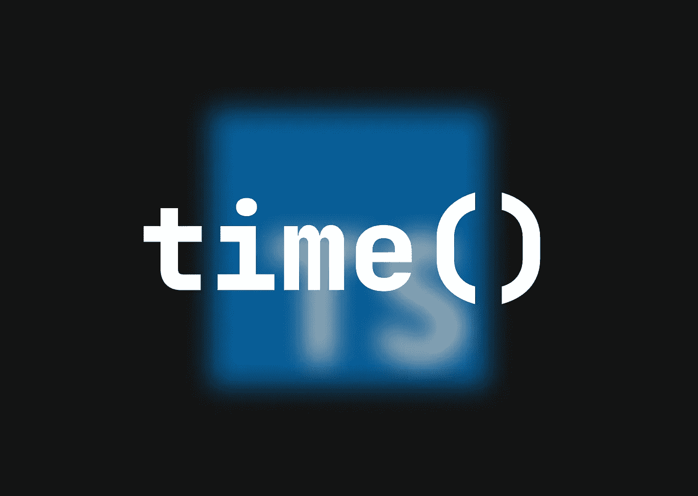

# 如何在 TypeScript 中跟踪 API 响应时间

> 原文：<https://medium.com/codex/how-i-track-api-response-times-in-typescript-73174cd69fca?source=collection_archive---------4----------------------->

应用程序加载所需的时间会显著影响用户体验，从而影响转化率。然而，你可以通过压缩图像、删除动画或者仅仅减少内容来加速你的 web 应用程序的进程，API 请求可能也会变慢；在本文中，我将描述我测量 API 响应时间的方法。



在 TypeScript 中有一个非常简单的时间跟踪方法，当然，它在`console`对象上是可用的。

```
💡 *console = An object that makes available the debug console of the browser running the application*
```

有许多`console`相关的方法可用于各种目的；正如我们使用`console.log()`在控制台简单记录一些东西一样，有三种方法可以用来跟踪时间:`time()`、`timeLog()`和`timeEnd()`。

使用它们很简单:用`time()`你可以启动一个定时器，用`timeEnd()`你可以停止它并记录从`time()`执行到控制台所花费的时间(以毫秒为单位);所以基本上我们可以在它们之间包装我们的 API 请求

```
⏱ **MEASURING TIME****console.time()**
const response = await fetch('...')
**console.timeEnd()***result in the console: 
default: xxx ms*
```

但是，如果我们需要确定应用程序中几个 API 调用中哪个处理得更慢，会发生什么呢？我们必须以某种方式给它们命名。

幸运的是`time()`和`timeEnd()`方法可以带一个参数:`label`。这是一个`string`值，我们可以用它将所有的`time()`和`timeEnd()`配对。例如

```
🏷 **LABELING TIMERS**console.time(**'Data fetch time'**)
const data = await fetch('...')
console.timeEnd(**'Data fetch time'**)console.time(**'Content fetch time'**)
const content = await fetch('...')
console.timeEnd(**'Content fetch time'**)*result in the console:
Data fetch time: xxx ms
Content fetch time: xxx ms*
```

对于更复杂的测量，我们可以使用`timeLog()`。它在一个`time()`和一个`timeEnd()`中记录部分结果，并且它可以接收带有附加信息的第二个参数

```
🏟 **COMPLEX MEASUREMENT**console.time('Loading time')
const data = await fetch('...')
**console.timeLog('Loading time', 'Data fetch time result')**
const content = await fetch('...')
**console.timeLog('Loading time', 'Content fetch time result')**
const pageData = { data, content, pages: content.pages.length }
console.timeEnd('Loading time')*result in the console:
Loading time: xxx ms Data fetch time result
Loading time: xxx ms Content fetch time result
Loading time: xxx ms*
```

👋我希望这在你寻找新的学习材料时对你有用。感谢您花时间阅读这篇文章！[订阅我的邮件列表](/@daanworks/subscribe)如果你想在以后读到更多这样的故事！