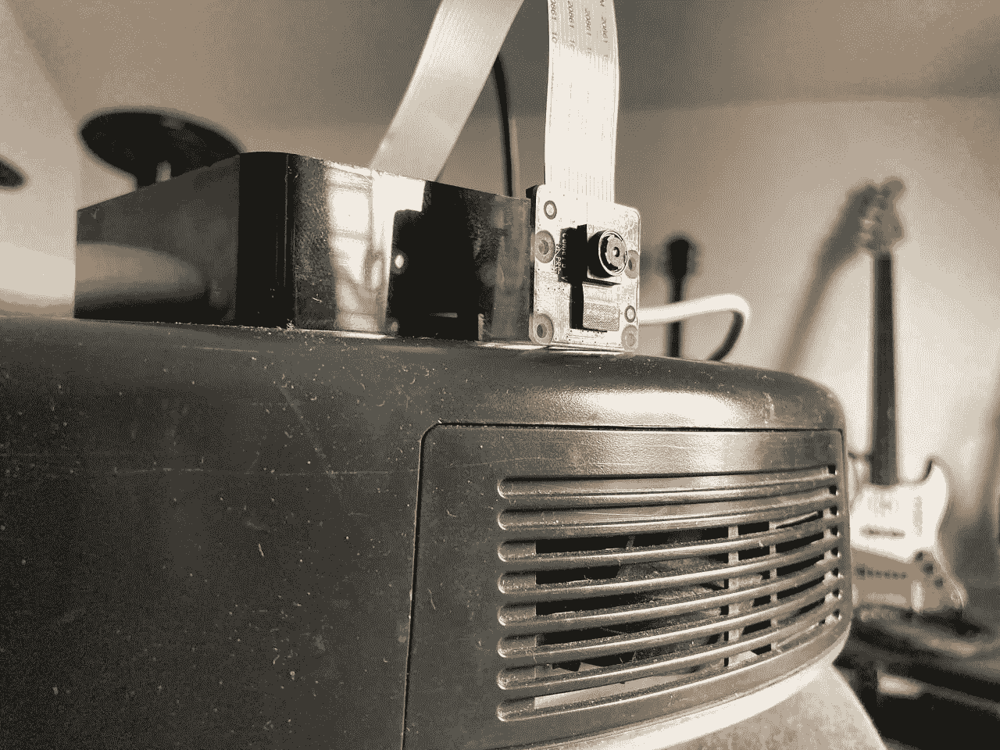
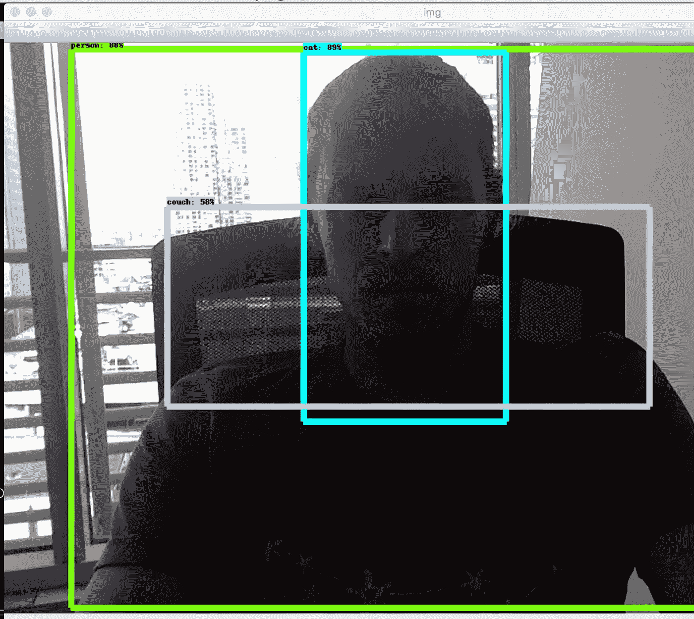
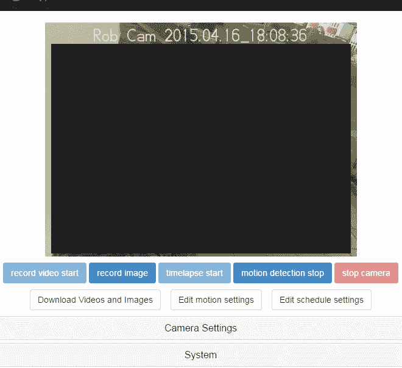
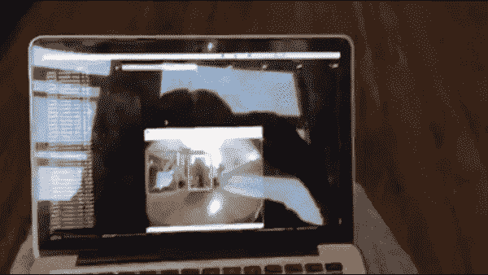
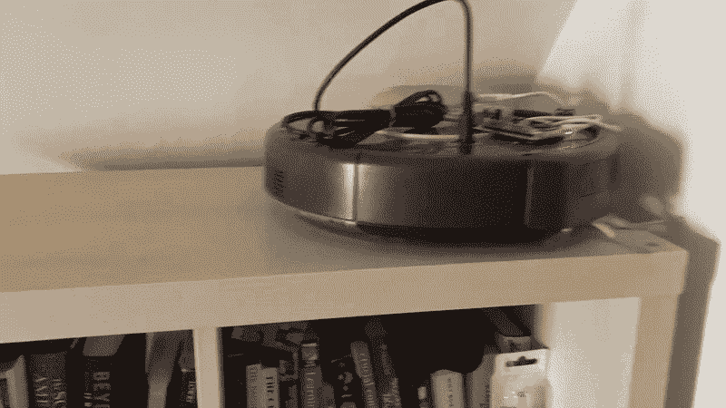
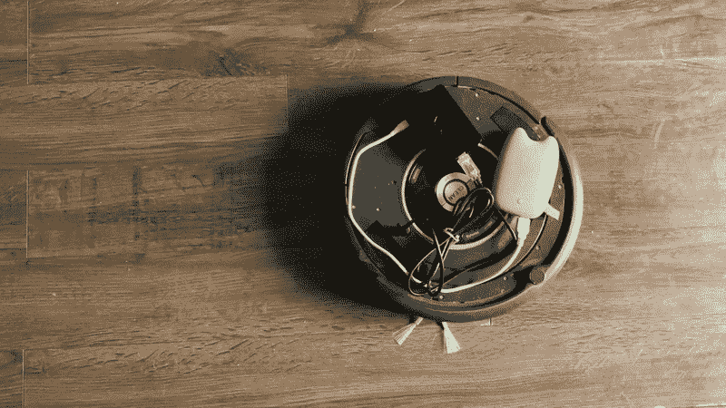

# 我是如何把我的吸尘器变成一个半自动相机操作者的。

> 原文：<https://medium.com/codex/how-i-turned-my-vacuum-cleaner-into-a-semi-autonomous-camera-operator-c54bb65fb12f?source=collection_archive---------13----------------------->

## [法典](http://medium.com/codex)

> 当导演是个酒鬼，音乐家是个瘾君子，程序员变得疯狂，而你的摄影师是个吸尘器。



接线员。

是的，不开玩笑——Roomba 确实被迫向我提供了一些原始视频资料，但首先要做的是。我怎么会变成那样？几年前，我熬过了最黑暗的时刻，所以我需要一些我能投入全部思想和精力的东西，而不是不停地胡思乱想。发现了 YouTube。

我从来没有计划或任何意愿成为一个 youtuber，但当我又发了一个我自己覆盖任何乐队的视频时，我的朋友们真的很生气。他们恳求要么停下来，要么开辟一条通道。我选择了后者，这最终迫使我提高了质量，所以我接受了挑战。无论有多少乐器，无论我演奏得有多糟糕，每次都让它活起来。独自完成:没有其他人参与(可能除了适量的酒精)。当然，从一个视频到另一个视频都要保持创意。所以在某个时候，我发挥了我的创作能力去做静态图片。在坚持自己动手的过程中，需要一些创造性的行动，Roomba 也是如此。

结果。

# 人工智能方法。

第一个使用人工智能的想法。为什么不呢？这个想法很简单——在我表演的时候强迫它跟着我。强迫生物移动没什么大不了的，但让它那样做..

首先，我研究了如何接近视频部分。结果我可以用 OpenCV +一些神经网络来解决这个问题。找到了一些我可以使用的简单例子，我自己尝试了一些，最终被认为更像猫而不像人。



你真好，OpenCV！

不太可靠，但是很好，很管用。那是我笔记本电脑的摄像头，但我需要分析 RPi 的摄像头流。让我们来看看您的第一订单中有哪些相机选项:

*   **拉斯皮维德**
*   **拉斯平佩格**
*   **RPi Cam Web 界面**

我最后用了后者。最终，它位于 ***raspimpeg*** 之上，但通过老式 PHP 提供给你的非常老式的用户界面，为你的相机提供了一套非常好的控制。



对于 millesimals 来说，这看起来可能很难看，但它确实有效。

不幸的是它没有 API，不是吗？如果你够固执的话，就一定会的！这就是[cam.php](https://github.com/silvanmelchior/RPi_Cam_Web_Interface/blob/master/www/cam_pic.php)里面的东西:

```
<?php  
  header("Access-Control-Allow-Origin: *");  
  header("Content-Type: image/jpeg");   
    if (isset($_GET["pDelay"]))   
    {      
        $preview_delay = $_GET["pDelay"];   
    } else {      
        $preview_delay = 10000;   
    }   
    usleep($preview_delay);   
    readfile("/dev/shm/mjpeg/cam.jpg"); 
?>
```

原来有一个端点，它实际上给了你存储在 **/dev/shm/mjpeg/cam.jpg** 中的当前帧。就像我之前说的，这个项目很好地位于***raspinpeg***的顶部，这是它存储从 RPi 的 cam 捕获的内容的地方。从某种意义上说，这是一个幻灯片。但是我不在乎它是什么，只要它可以通过 HTTP 到达。的确如此。太好了。非常合适。

下一件事是改变示例服务器的代码，以便它可以分析我的流，而不是捕获网络摄像头的流。简单地说，我明白了[这个例子](https://github.com/datitran/object_detector_app)是如何工作的:它从任何来源获取帧，并将它们放入一个队列中，另一个线程从这个队列中读取它们，并将其发送到一个神经网络，在这方面，神经网络会返回一个带有标签的地图以及它们可能出现在帧中的概率。神经网络是预先训练好的，所以我还没有在这个问题上做任何事情。我刚刚采用了 stream 类，它用于从网络摄像头捕捉帧，并模仿它，使它具有相同的接口，但会通过幸运地找到的端点从我的 RPi 的 cam 捕捉帧。

```
class RPIStreamInput: URL = "http://{rpi}:8083/html/cam_pic.php" def __get_frame(self):
        res = requests.get(self.URL)
        arr = numpy.asarray(bytearray(res.content), dtype="uint8")
        frame = cv2.imdecode(arr, -1)

        return frame def __init__(self):
        self.stopped = False
        self.frame = self.__get_frame()
        self.grabbed = self.frame is not None def start(self):
        # start the thread to read frames from the video stream
        Thread(target=self.update, args=()).start()

        return self def update(self):
        # keep looping infinitely until the thread is stopped
        # if the thread indicator variable is set, stop the thread
        while True:
            if self.stopped:
                return

        self.frame = self.__get_frame()
        self.grabbed = self.frame is not None def read(self):
        # return the frame most recently read
        return self.frame def stop(self):
        # indicate that the thread should be stopped
        self.stopped = True
```

它只是调用我的 RPi 来按需获取帧。其余的只是我能够谷歌的克隆，并被迫为我做正确的事情。

现在，强迫生物做它的事情意味着不仅能够在画面中认出我是一个人(不是一只猫！)，还要确定我有多远才能出招。或者不做——那要看情况。在这里，我回到了 OpenCV focuses。读了一些关于此事的论文，发现了[的方法](https://www.pyimagesearch.com/2015/01/19/find-distance-camera-objectmarker-using-python-opencv/)。让我现在假装聪明，那个狗屁叫做 ***一个* *的三角形相似度。*** 简而言之:如果你知道一个物体的大小，你提前知道了距离，你就能得出一个等式，最终会给你一个乘数，你将在计算中进一步使用它。

每次我试图计算到已知大小的物体的距离，并且网络能够识别这些物体，我都没有得到稳定的结果。我够固执的，转而采用 b 计划。

我知道框架的大小。我也知道我在画面中的位置。所以我有多远只不过是我在画面中的百分比有多小。也就是说，没有什么能阻止我把这个百分比的我放在画面中，如果，比方说，它达到了某个阈值——是时候行动了。



人工智能方法。

这最终奏效了！正如你所看到的，我离得越远，这个生物就越靠近我，反之亦然。

让我感到困扰的是，我的笔记本电脑在做人工智能的事情时会自己烧焦。我不骗你。它有一个储物柜的塑料支架，由于我的笔记本电脑底部温度过高，几乎完全熔化。不知道我是否能向我当时的雇主解释清楚为什么公司资产会熔化，这是怎么发生的？而且它仍然很难控制，因为缺乏更好的术语，相机运动的创造性。人们迫切需要不那么花哨但更简单易用的解决方案。

# Roomba 运动。

在我们继续我的思考过程之前，让我们先了解一下我们在硬件方面所处理的问题。这是一个 650 Roomba，幸运的是，它有一个串行端口，所以你最终可以进行一些控制。有一个奇特的机器人在那里为它编程，所以它有一个图书馆和一个巨大的支持。我的是一个农民，而不是一个爱好者，因此图书馆来自社区。感谢这个社区。我遇到的唯一恼人的问题是有一个 [USB 输入硬编码](https://github.com/pomeroyb/Create2Control/blob/ed84db37eebc4aa555f63c3ca697251e8beb1ecb/create2api.py#L110)，所以它会导致一些重启的问题，如果你的连接不知何故处于不稳定状态。

我想我知道如何修理它。或许你也知道。那个女孩和她的小伙子也是。不管怎样，到目前为止还没有人采取行动…

总之，你可以控制方向、速度和角度。那你还需要什么？嗯，读取一堆对任务至关重要的传感器。

# 创造性轨迹方法。

一旦我放弃使用人工智能方法..不，说真的。这不是一个选项——更大的想法是带来一些快乐，治愈需要治愈的东西，而不是增加痛苦。所以我决定将这种生物的自主性限制在特定的轨迹上，它会来回移动，记录路上的任何东西。

但是首先，让我们弄清楚有哪些接口在起作用。下面是一个如何初始化机器人并做一些琐碎动作的例子:

```
>>> import create2api
>>> bot = create2api.Create2()
/dev/ttyUSB0
opened port
Loaded config and opcodes
>>> bot.start()
>>> bot.safe()
>>> bot.drive_straight(20)
>>> bot.drive_straight(0)
>>> bot.destroy()
```

事情是这样的，我们创建了一个机器人，启动它，初始化安全模式(如果出现问题，如发现障碍或路上的深渊，立即停止)，以每秒 20 毫米的速度直线行驶，然后停止并摧毁一个机器人。

我们可能需要更多的 API:

*   **get_packet** —读取传感器
*   **逆时针**——名字很好听，就不多说了
*   **驾驶**——在考虑半径的情况下，更智能的驾驶方式

## 搭讪台词。

除非在宜家货架的顶部进行移动，否则直线移动毫无创意可言。没错。我需要一些好的角度，在某种程度上嘲笑人类。架子的高度刚刚好。唯一的问题是如何不崩溃。嗯，在现实世界的操作中，Roomba 以知道何时停止而闻名。怎么会？传感器。它配备了四个:两个在侧面，两个在前面。我是怎么学会的？通过在向后移动时折叠它——后面没有传感器，因为在现实世界中它是向前移动的。顺便说一句，这是我们所有人的好榜样。无论如何，为了不让它倒塌，我不能依靠我所做的距离计算(而且，它又一次倒塌了)。我必须依靠传感器。

如果四个“悬崖”传感器之一读取的值低于阈值，就会发生所谓的“发现悬崖”事件。我做了几轮实验，找到了最佳点，此时“悬崖”就要到了，但事件没有被触发，这就不会导致停止。然后我编写了一个小算法:它向前移动，如果“悬崖”是向左还是向右，它就修正方向，然后停下来，当找到“前面的悬崖”时，它就掉头，然后再来一遍。这种运动的副作用导致了一个非常好的拍摄，而它做它的转身。



这是一个小一点的架子，但是你明白了。

所以代码很简单:

```
import time
import create2apifrom datetime import datetimeCLIFF_LIMIT = 1550
CLIFF_LIMIT_FRONT = 2800def create_bot():
    bot = create2api.Create2()
    bot.start()
    bot.safe()
    return botdef destroy_bot(bot):
    bot.destroy()def pickup_line(timeout):
    bot = create_bot()
    start = datetime.now()
    diff = 0
    speed = 80
    while diff < timeout:
        bot.drive_straight(speed)
        time.sleep(0.01)
        bot.get_packet(100)
        if bot.sensor_state['cliff front left signal'] < CLIFF_LIMIT_FRONT or bot.sensor_state['cliff front right signal'] < CLIFF_LIMIT_FRONT:
            bot.drive_straight(-30)
            time.sleep(2)
            bot.turn_counter_clockwise(-40)
            time.sleep(6.5)
            bot.drive_straight(speed)
        elif bot.sensor_state['cliff left signal'] < CLIFF_LIMIT:
            bot.drive_straight(-25)
            time.sleep(2)
            bot.turn_counter_clockwise(-25)
            time.sleep(1)
        elif bot.sensor_state['cliff right signal'] < CLIFF_LIMIT:
            bot.drive_straight(-25)
            time.sleep(2)
            bot.turn_counter_clockwise(25)
            time.sleep(1)
        else:
            bot.drive_straight(speed) timediff = datetime.now() - start
        diff = timediff.total_seconds()
        if diff > timeout:
            bot.drive_straight(0)

    destroy_bot(bot)
```

所有的常数都是凭经验算出的。

## 曲线。

这个很简单，但还是能拍出好照片。只是一条曲线，随着时间改变角度，直到到达某一点。在我的例子中，我只是通过暂停强迫它做运动，所以每次的轨迹都不一样，这又一次以一种绝妙的方式嘲笑了人类。



曲线。

```
def curve(timeout):
    bot = create_bot()
    start = datetime.now()
    speed = 100
    radius = -450
    diff = 0
    iteration_time = 26
    while diff < timeout:
        bot.drive(speed, radius)
        time.sleep(26)
        timediff = datetime.now() - start
        diff = timediff.total_seconds()
        if diff > timeout:
            bot.drive_straight(0)
            speed = -speed
```

如上所述，所有的常数都是经验性的。

# 结果。

嗯，超出了我的预期。我不仅做了我想做的事情，还得到了我在接下来的视频中肯定会用到的工具。但是当我有了可以在地面上随意移动的东西时，我开始考虑飞行物体。敬请关注，感谢您的关注！

# 使用的链接:

1.  [https://towards data science . com/building-a-real-time-object-recognition-app-with-tensor flow-and-opencv-b 7 a2 B4 ebdc 32](https://towardsdatascience.com/building-a-real-time-object-recognition-app-with-tensorflow-and-opencv-b7a2b4ebdc32)
2.  【https://github.com/datitran/object_detector_app 号
3.  [https://www . pyimagesearch . com/2015/01/19/find-distance-camera-object marker-using-python-opencv/](https://www.pyimagesearch.com/2015/01/19/find-distance-camera-objectmarker-using-python-opencv/)
4.  [https://www . raspberrypi . org/documentation/raspbian/applications/camera . MD](https://www.raspberrypi.org/documentation/raspbian/applications/camera.md)
5.  https://elinux.org/RPi-Cam-Web-Interface