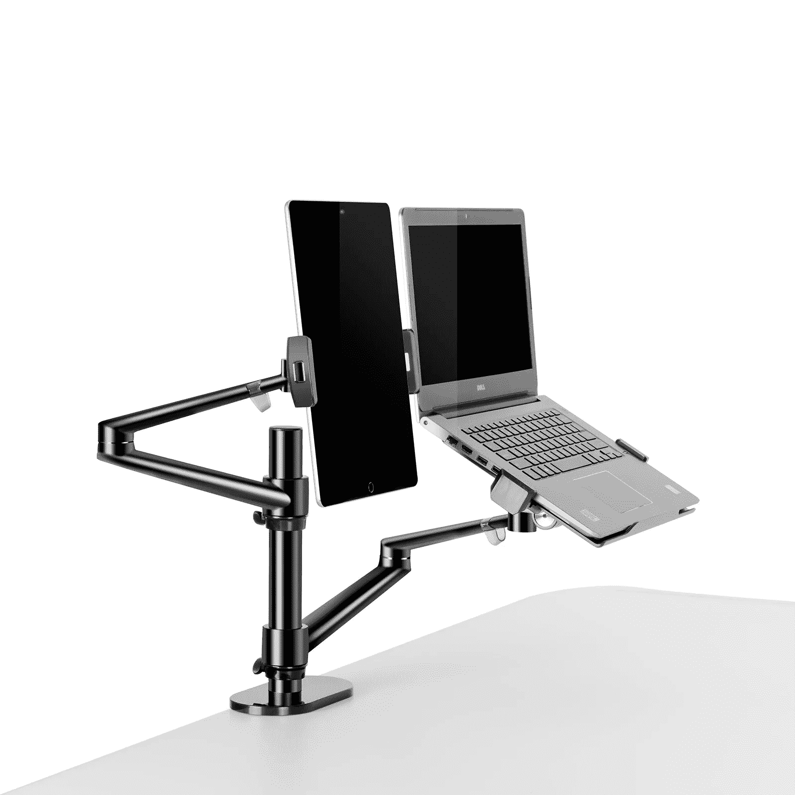

# 我如何从家庭环境中提升我的工作

> 原文：<https://medium.com/codex/how-i-upgraded-my-work-from-home-environment-528e93b43053?source=collection_archive---------8----------------------->

## Thingy Club 笔记本电脑和平板电脑支架

图片由 Thingy Club 提供

我提高注意力和工作效率的大部分努力都集中在应用程序和工作流程上。经过一番思考，我意识到这个等式不仅仅是我屏幕上的东西。我还需要考虑到*我是如何放置屏幕的(或者在这种情况下，屏幕。)*